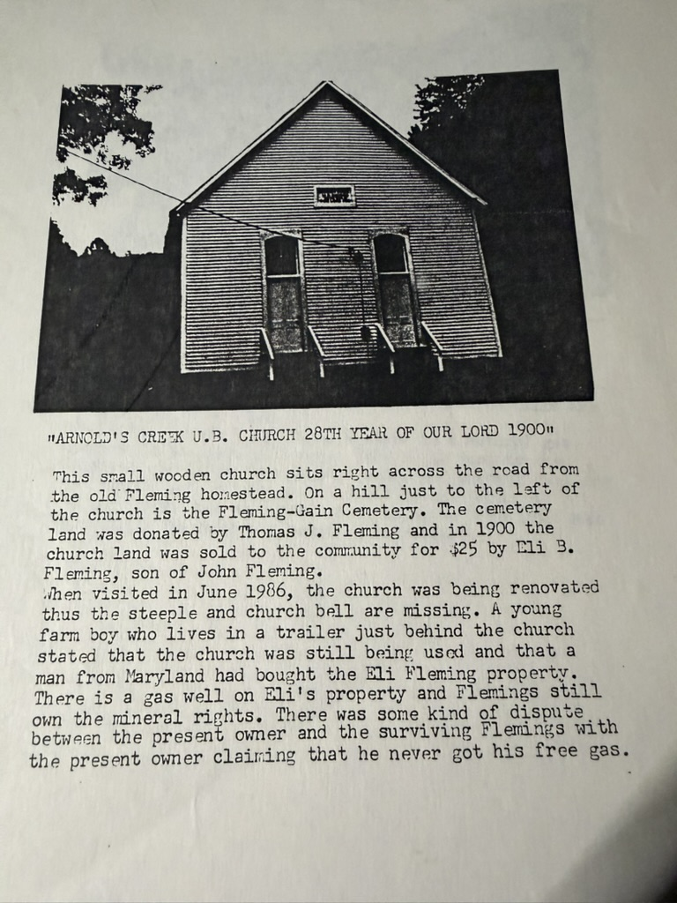
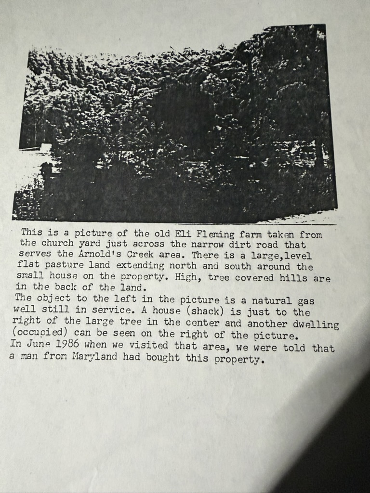

**He went and stood there.** In **June 1986** — three years before the memoir, twelve before the charts — Robert Earl Wildermuth drove into the Doddridge County hills, found the settlement his family came out of, and photographed it.

## The church

The caption on the photograph reads **"ARNOLD'S CREEK U.B. CHURCH 28TH YEAR OF OUR LORD 1900"** — a United Brethren congregation. His notes underneath:

> *"This small wooden church sits **right across the road from the old Fleming homestead**. On a hill just to the left of the church is the **Fleming-Gain Cemetery**. The cemetery land was **donated by Thomas J. Fleming** and in 1900 the church land was **sold to the community for $25 by Eli B. Fleming, son of John Fleming**."*

Three things there the archive did not have.

**"Eli B. Fleming, son of John Fleming"** — a local record, independent of any chart, making Eli the son of [John Fleming IV](/family/john-fleming-iv/). That was never the disputed part; [the argument with Charlotte Fleming](/archive/charlotte-fleming-correspondence-1995/) was about Eli's *mother*. But it is corroboration from the ground.

**The Fleming-Gain Cemetery**, and the name is a marriage. The typescript records that John Fleming IV's daughter **Susannah Agnes married Adam J. Gain**. The burying ground carries both surnames, which is what a hollow looks like after two families have been intermarrying in it for a century.

**Thomas J. Fleming gave the cemetery land** — another Fleming of the settlement, not yet placed in this archive.

When he arrived the church was **under renovation, the steeple and bell removed**, which is why the building in the photograph looks oddly bare.

## The farm

> *"This is a picture of the **old Eli Fleming farm** taken from the church yard just across the narrow dirt road that serves the Arnold's Creek area. There is a large, level flat pasture land extending north and south around the small house on the property. High, tree covered hills are in the back of the land."*

**This is the ground.** The level bottom with the wooded hills behind it is where [Lewis Fleming](/family/lewis-fleming/) settled after his 1827 marriage, where he ran up to several hundred acres, where **John Fleming IV died in 1853**, and where [Thomas Bailey Fleming](/family/thomas-bailey-fleming/) bought his [fifty acres on Burnt Cabin](/archive/fleming-marriage-record-and-deed/) and mortgaged them straight back out. [James Wesley Fleming was born on it in 1857](/archive/wesley-fleming-birth-certificate/) — *"Place of Birth: Arnolds Creek."*

The dark object at the left of the frame is **a natural gas well, still in service** in 1986.

## What the farm boy told him

The best part of the visit is not in either photograph. A young man living in a trailer behind the church came out and talked, and Robert Earl wrote down what he said:

- the church was **still in use**
- **a man from Maryland had bought the Eli Fleming property**
- there was a **gas well on it and the Flemings still held the mineral rights**
- and there was **a dispute** — the new owner *"claiming that he never got his free gas"*

A hundred and fifty years after the family came over the mountains from Maryland, **a man from Maryland bought the farm** — and fell out with the surviving Flemings over gas. Robert Earl set it down without comment.

*(Free gas to the surface owner is a common term in Appalachian oil-and-gas leases. That the Flemings had kept the minerals while selling the land is why any of them still had standing to argue about it.)*

> *Source: two photographs with typed captions from Robert Earl Wildermuth's June 1986 research visit to Arnold's Creek, Doddridge County, West Virginia; in his research papers, in Chuck's keeping. Re-photographed 2026.*
