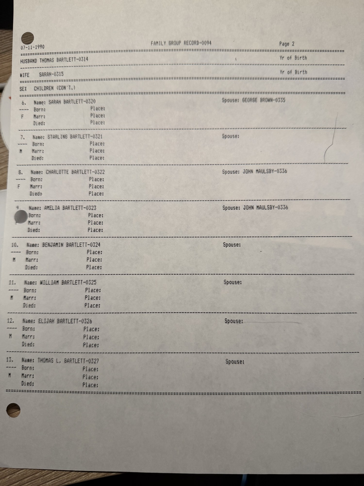

Three sheets from **[Robert Earl Wildermuth](/family/robert-earl-wildermuth/)**'s genealogical research: a two-page **LDS Family Group Record**, form number **0094**, printed **11 July 1990** and submitted from his address in **Casselberry, Florida**, together with a typed narrative **sketch** of the same ancestor.

Where the [Bailey Family Group Record (0019)](/archive/bailey-family-group-record-0019/) gave **[Thomas Bartlett](/family/thomas-bartlett/)** only as a name in a parent field, this record gives him a household, a death date, thirteen children, and — in the sketch, though not on the form — a father's name.

## The narrative sketch

> **THOMAS BARTLETT**
>
> Thomas Bartlett, one of seven sons of William Bartlett, came to Western Virginia shortly after the Revolutionary War. He was among the early pioneers west of the Alleghany Mountains. He settled in the Glades of what is now Preston County, West Virginia.
>
> Thomas married Sarah ( ) and to this union the following children were born:
>
> Nancy who married Thomas Bailey · Elizabeth who married David Cleavenger · Catherine who married Joab Wolverton · Edith who married ( ) Hopkins · Mary who married Thornsberry Bailey · Sarah who married George Brown · Starling · Charlotte who married John Maulsby · Amelia who married John Maulsby after Charlotte's death · Benjamin · William · Elijah · Thomas L.
>
> Little research has been done on this ancestor but the Bartlett records are said to be better than average.
>
> Thomas Bartlett died in Preston County, Virginia (West Virginia) in June 1836.

## The form

**Husband — Thomas Bartlett (0314).** Birth, christening and marriage lines are blank. **Died June 1836**, and **buried June 1836**, both at **Preston County, Virginia**. Father and mother fields are blank on the form — the father's name, **William Bartlett**, appears only in the sketch.

**Wife — Sarah (0315).** Every field blank. No surname, no dates, no parents.

**Children (0137, 0316–0327), in the order listed:**

| # | Child | Spouse | Marriage |
|---|---|---|---|
| 1 | **[Nancy Bartlett](/family/nancy-bartlett/)** (0137) | **[Thomas Bailey](/family/thomas-bailey/)** (0136) | 21 Oct 1803, Monongalia Co., Virginia |
| 2 | Elizabeth Bartlett (0316) | David Cleavenger (0331) | — |
| 3 | Catherine Bartlett (0317) | Joab Woolverton (0332) | — |
| 4 | Edith Bartlett (0318) | — Hopkins (0333) | — |
| 5 | Mary "Polly" Bartlett (0319) | Thornsberry Bailey (0334) | 24 Aug 1806, Glades, Preston Co., Virginia |
| 6 | Sarah Bartlett (0320) | George Brown (0335) | — |
| 7 | Starling Bartlett (0321), m. | — | — |
| 8 | Charlotte Bartlett (0322) | John Maulsby (0336) | — |
| 9 | Amelia Bartlett (0323) | John Maulsby (0336) | — |
| 10 | Benjamin Bartlett (0324), m. | — | — |
| 11 | William Bartlett (0325), m. | — | — |
| 12 | Elijah Bartlett (0326), m. | — | — |
| 13 | Thomas L. Bartlett (0327), m. | — | — |

*Page 1 — the household head, the blank line for Sarah, and children 1 through 5.*

*Page 2 — children 6 through 13. Charlotte and Amelia carry the same spouse ID (0336): John Maulsby married one sister after the other died.*

## What is new here

**A death, and a named piece of ground.** Thomas Bartlett **died June 1836 in Preston County**, and the family's land is named: **the Glades**, the upland wet meadows of what is now Preston County, West Virginia. He arrived in western Virginia **shortly after the Revolutionary War**, which puts his migration in the 1780s and makes him the earliest arrival documented anywhere in this archive.

**Twelve siblings for Nancy**, where the archive previously had none, and marriages for nine of them.

**Two Bartlett sisters married two Baileys.** [Nancy](/family/nancy-bartlett/) married **Thomas Bailey** in Monongalia County in **October 1803**; three years later, in **August 1806**, her sister **Mary "Polly"** married **Thornsberry Bailey** in the Glades. Robert Earl gave that Thornsberry a fresh ID (0334) rather than reusing the number he had assigned to **Thornsberry Bailey Jr. (0310)**, Thomas and Nancy's own son born in August 1804 — so he understood them as two different men, and the arithmetic agrees: a two-year-old cannot marry. FamilySearch independently dates Mary's husband to 1782–1853, near-contemporary with Thomas Bailey (b. c. 1780), which fits **brothers**. Neither source says so outright.

## Where it conflicts with the FamilySearch tree

The [family GEDCOM](/docs/dale-eesley-familysearch-tree/) already carried this household when these sheets came to light, under the name **Thomas L. Bartlett Jr.** It agrees on Sarah, on the Glades, on Preston County, and on all thirteen children. It disagrees on two things:

| | Wildermuth sheets, 1990 | FamilySearch, synced 2026 |
|---|---|---|
| **Father** | William Bartlett, *"one of seven sons"* | Thomas Bartlett (b. 1733) and Anne Settle |
| **Death** | June 1836, Preston County | 1832, Preston County |

FamilySearch also supplies what the sheets leave blank: **born 21 December 1756 in Fauquier County, Virginia**, **married Sarah about 1783 in Fauquier**, **buried at Union Baptist Church Cemetery, Simpson, Taylor County**. The Fauquier marriage answers a question the sketch raises without settling — where the family stood before it crossed the mountains: the Virginia Piedmont, east of the Blue Ridge.

Neither conflict is resolved here. See [Thomas Bartlett's page](/family/thomas-bartlett/) for the argument on each side; no father is assigned to him in this archive until one of them can be documented.

## What is still open

Sarah's surname. Thomas Bartlett's father and death year. Any dates at all for twelve of the thirteen children. And Robert Earl's own closing note — *"the Bartlett records are said to be better than average"* — reads as a research lead he never got to follow.

> *Source: Robert Earl Wildermuth's research papers, dated 11 July 1990; photographed 2026. Companion sheet: the [Bailey Family Group Record (0019)](/archive/bailey-family-group-record-0019/).*
