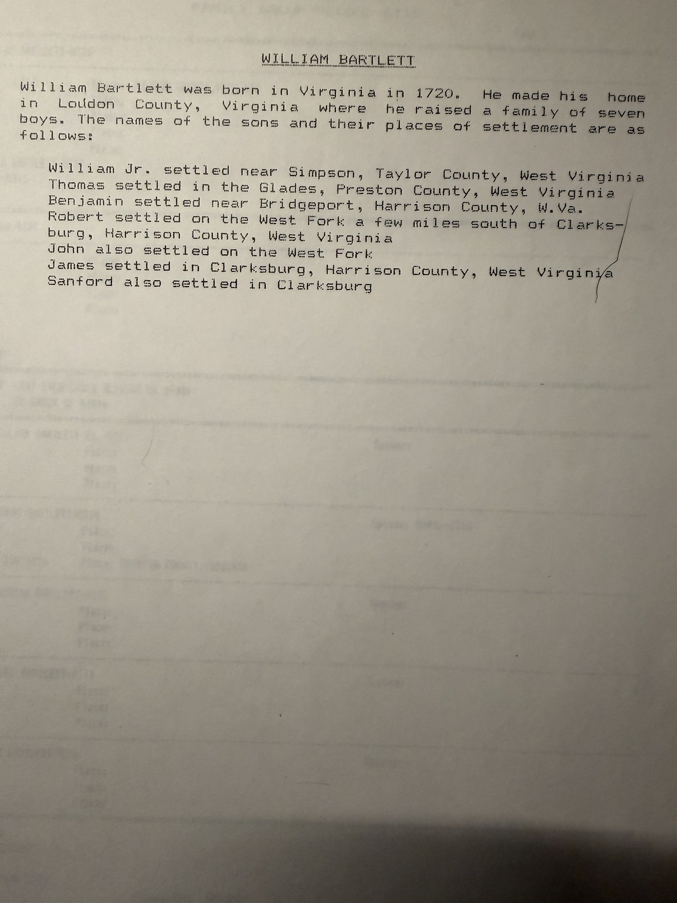

The sheet that answers the question the [Thomas Bartlett record](/archive/bartlett-family-group-record-0094/) left open. Printed the same day — **11 July 1990** — from the same research file, it is **[Robert Earl Wildermuth](/family/robert-earl-wildermuth/)**'s record of the generation above.

## The narrative sketch

> **WILLIAM BARTLETT**
>
> William Bartlett was born in Virginia in 1720. He made his home in Loudon County, Virginia where he raised a family of seven boys. The names of the sons and their places of settlement are as follows:
>
> **William Jr.** settled near Simpson, Taylor County, West Virginia
> **Thomas** settled in the Glades, Preston County, West Virginia
> **Benjamin** settled near Bridgeport, Harrison County, W.Va.
> **Robert** settled on the West Fork a few miles south of Clarksburg, Harrison County, West Virginia
> **John** also settled on the West Fork
> **James** settled in Clarksburg, Harrison County, West Virginia
> **Sanford** also settled in Clarksburg

This is the missing half of *"one of seven sons of William Bartlett."* It is not a bare assertion — it is a **settlement map**. Seven brothers left Loudoun County in northern Virginia and fanned out across the same corner of the trans-Allegheny frontier: four around Clarksburg and the West Fork in Harrison County, one at Bridgeport, one at Simpson in Taylor County, and **[Thomas](/family/thomas-bartlett/) in the Glades of Preston County** — Chuck's line.

That clustering is what makes the sketch credible. It is also why the Bailey, Bartlett and Fleming records in this archive keep circling the same four counties: **Monongalia, Harrison, Taylor and Preston** were where the brothers put down.

## The form

**Husband — William Bartlett (0325).** **Born 1720**, **Loudon County, Virginia**. Death, burial and marriage lines all blank.

**Wife — UNKNOWN (0339).** Not even a first name. Every field empty.

**Children listed on page 1:** William Bartlett Jr. (0371) · **Thomas Bartlett (0314)**, *died June 1836, Preston County* · Benjamin Bartlett (0372) · Robert Bartlett (0373) · John Bartlett (0376). Page 2, which would carry James and Sanford, is not in hand.

## A circular link on the form itself

The form contains an error worth recording, because it is the reason this parentage looked unreliable before the sketch turned up.

William Bartlett-0325's **Father** field reads **THOMAS BARTLETT-0314** and his **Mother** field **SARAH-0315** — which are the IDs of [Thomas Bartlett](/family/thomas-bartlett/) and [Sarah](/family/sarah-bartlett-wife/), the couple on [record 0094](/archive/bartlett-family-group-record-0094/). Thomas-0314 is listed on *this* sheet as William's **son**. The two men are each other's father.

The cause is visible in the ID numbers. On record 0094, **child 11 is "William Bartlett-0325"** — Thomas's son. Robert Earl had two different William Bartletts in his database, the 1720 patriarch and Thomas's boy, and **collapsed them into one record, 0325**. The patriarch then inherited his grandson's parents.

So the form's parent fields are wrong, and the sketch is right: **William (b. 1720) → Thomas (d. 1836) → William Jr. and twelve siblings.** Three generations, two of them sharing a name.

## What it settles, and what it does not

It settles the reading of the earlier sketch. *"One of seven sons of William Bartlett"* is now a documented household with a birth year, a county, and all seven sons placed on the map — not a stray clause.

It does not settle the disagreement with **FamilySearch**, which gives Thomas a different father entirely: Thomas Bartlett (b. 1733) of Richmond County and Anne Settle, a Northern Neck family with no Loudoun connection. The weight has shifted toward the sketch — Loudoun adjoins Fauquier, where FamilySearch itself places Thomas's 1756 birth and 1783 marriage, whereas Richmond County is ninety miles east; and FamilySearch has that alternative father marrying in 1748, at fifteen. The argument is laid out in full on [Thomas Bartlett's page](/family/thomas-bartlett/).

**Still open:** William's wife, who is literally "UNKNOWN" on the form. His death date and place. Page 2 of the form. And whether he is the William Bartlett of Loudoun County who appears in published Virginia genealogies — a lead, not a link.

> *Source: Robert Earl Wildermuth's research papers, dated 11 July 1990; photographed 2026. Companion sheets: [Bartlett Family Group Record 0094](/archive/bartlett-family-group-record-0094/) and the [Bailey Family Group Record 0019](/archive/bailey-family-group-record-0019/).*
