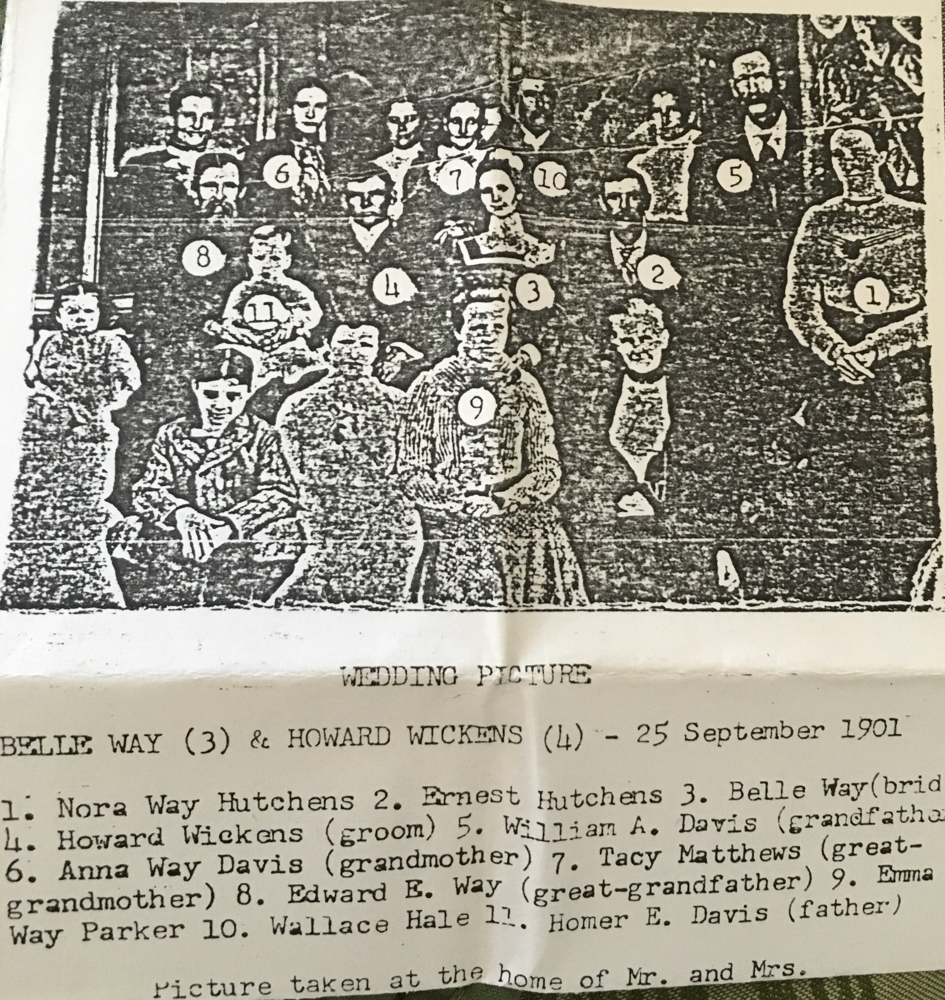

The **wedding portrait of [Belle (Belsora A.) Way](/family/belsora-way-wickens/) and [Howard Edward Wickens](/family/howard-edward-wickens/)**, taken on the day of their marriage at Noble County, Ohio &mdash; **25 September 1901**. The frame gathers the extended Way-Davis-Matthews family on the porch of the wedding home.

What the photograph carries that nothing else in the archive does: **five generations of Chuck's direct maternal Davis-Way line in one frame**, at a moment when all of them were still alive. Four months after this picture was taken, Tacy Matthews Way would die (29 January 1902). Twenty-one months after it, Victoria Anna Way Davis would die (26 June 1903). Within a decade, the bride herself &mdash; Belle Way &mdash; would also be gone (1912). The wedding is, in retrospect, the **last family gathering** that held the Way grandparents, the Way-Davis daughters, and the toddler Homer (Chuck's great-grandfather) together in the same place.

## The numbered identification legend

A separate paper legend accompanies the photograph in the family papers, with eleven figures numbered and named. The annotation is most plausibly in the hand of [Dorothy Marie Davis Wildermuth](/family/dorothy-davis-wildermuth/) (Chuck's maternal grandmother), since the relational labels read from her father Homer's perspective:

The legend reads:

1. **[Nora Way Hutchens](/family/nora-angie-way/)** &mdash; Belle's older sister
2. **Ernest Hutchens** &mdash; Nora's husband
3. **[Belle Way](/family/belsora-way-wickens/)** &mdash; the bride (Belsora A. Way, 1880-1912)
4. **[Howard Wickens](/family/howard-edward-wickens/)** &mdash; the groom (Howard Edward Wickens, 1880-1964)
5. **[William A. Davis](/family/william-armstrong-davis/)** &mdash; labeled *"(grandfather)"* &mdash; husband of Anna, father of Homer
6. **[Anna Way Davis](/family/victoria-anna-way-davis/)** &mdash; labeled *"(grandmother)"* &mdash; Victoria Anna Way Davis, Belle's older sister, the line that brings this photo into Chuck's direct ancestry
7. **[Tacy Matthews](/family/tacy-elizabeth-matthews/)** &mdash; labeled *"(great-grandmother)"* &mdash; mother of Belle and Anna
8. **[Edward E. Way](/family/edward-e-way/)** &mdash; labeled *"(great-grandfather)"* &mdash; father of Belle and Anna
9. **Emma Way Parker** &mdash; another Way relative
10. **Wallace Hale** &mdash; relationship not yet researched
11. **[Homer E. Davis](/family/homer-davis/)** &mdash; labeled *"(father)"* &mdash; Belle's nephew, 20 months old at this wedding, Chuck's great-grandfather as a toddler

The annotation closes with *"Picture taken at the home of Mr. and Mrs. ____"* &mdash; trailing off; the rest is illegible.

## The five-generation line, traced through the frame

Reading the photograph as a genealogical document, **Chuck's direct line runs through five figures here**:

- **Edward E. Way** (#8) &mdash; great-great-great-grandfather
- **Tacy Elizabeth Matthews** (#7) &mdash; great-great-great-grandmother
- **Victoria Anna Way Davis** (#6) &mdash; great-great-grandmother
- **William Armstrong Davis** (#5) &mdash; great-great-grandfather
- **Homer Edward Davis** (#11) &mdash; great-grandfather (as a toddler)

Four of the five (#5, #6, #7, #8) are seated as senior figures at the wedding; the fifth (#11) is held or sat near them. The Way-Davis line that runs forward seventy-eight years to Chuck's December 1979 birth is, on this porch in Noble County in September 1901, **standing and seated together in a single photographic instant**.

## A correction the photograph forced

This portrait is also the document that closed a generational error in this archive. Earlier passes had placed Victoria Anna Way as the *daughter* of Edward Taylor Way (1812-1879, the English immigrant of the Way newspaper clipping). The ID legend &mdash; with Edward E. Way as *"great-grandfather"* and Victoria as *"grandmother"* from Dorothy's perspective &mdash; is unambiguous: Edward E. Way is Victoria's *father* (one generation below the immigrant Edward Taylor). The GEDCOM trace confirms it. **Edward Taylor Way and Anna Ellison are Victoria's grandparents, not her parents.**

The wedding portrait corrected the line.
