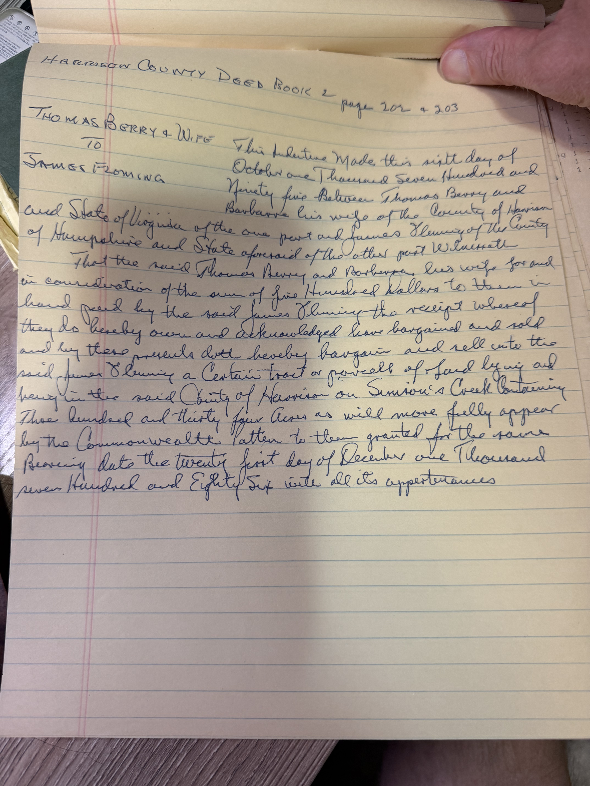
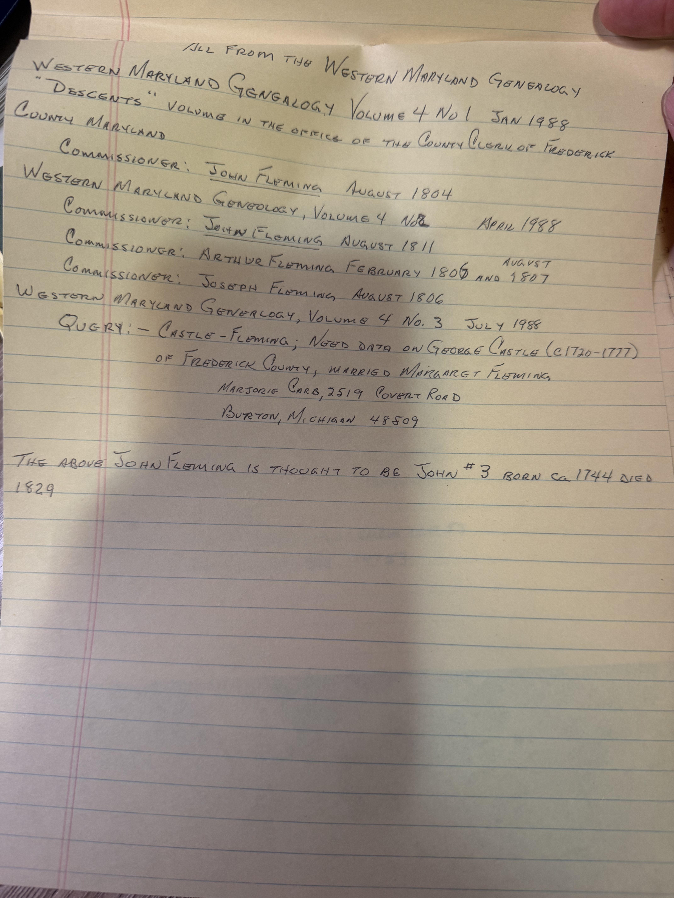

**This may be the document the whole Fleming question turns on**, and Robert Earl transcribed it in full by hand without ever saying so in as many words.

**Harrison County Deed Book 2, pages 202–203.** Made **6 October 1795**, between **Thomas Berry and Barbara his wife** of Harrison County, Virginia, of the one part, and — the phrase that matters —

> **"James Fleming of the County of Hampshire and State aforesaid of the other part"**

For **five hundred dollars** paid in hand, the Berrys sell him

> *"a Certain tract or parcell of Land lying and being in the said County of Harrison on **Simson's Creek** Containing **Three hundred and thirty four Acres**"*

held under a Commonwealth patent dated **21 December 1786**.

## Why this is the important one

**Two facts sit in that sentence, and they are the two facts the archive has been circling all day.**

**1. James Fleming was "of the County of Hampshire."**

[John Fleming IV's 1853 death register entry](/archive/john-fleming-death-record-1853/) gives his birthplace as **Hampshire County** — and Robert Earl **starred it as erroneous**, substituting Montgomery County, Maryland from the pedigree he had then adopted. He later [retracted that entire Maryland pedigree](/archive/fleming-retraction-1998/).

So the archive currently carries a starred "error" that came from a **civil record**, overridden by a lineage its own author withdrew. **This deed puts a James Fleming in Hampshire County in 1795** — the same county the death register names for a boy born there in 1781.

**2. The land is on Simpson's Creek.**

[Lewis Fleming was born about 1807](/family/lewis-fleming/) *"on his father's farm on Simpson's Creek in the eastern sector of Harrison County."* Here is the Simpson's Creek land being bought in 1795, by a James Fleming, in a single tract of 334 acres.

## The sequence that follows from it

Set beside the other land records in the papers, a coherent story appears — **and this archive states it as an inference, not a finding:**

| Year | Record | Source |
|---|---|---|
| **1795** | **James Fleming of Hampshire Co. buys 334 acres on Simpson's Creek, $500** | *this deed* |
| 1798 | Ann Fleming → James Fleming Jr., 215 acres | [deed index](/archive/doddridge-registers-deeds-and-eli-fleming-service/) |
| c. 1803 | **John Fleming buys a 168½-acre farm from James Fleming for one dollar** | [1998 email](/archive/wildermuth-email-bartlett-researcher-1998/) |
| c. 1807 | **Lewis Fleming born on his father's farm, Simpson's Creek** | [typescript](/docs/john-fleming-family-legacy/) |
| 1827 | **A James Fleming witnesses John's consent for Lewis's marriage** | [the note](/archive/john-fleming-consent-note-1827/) |
| 1833 | Ann & Fleming → James Fleming, 127 acres, Simpson Ck | deed index |

A man buys a large tract, and over the next forty years pieces of it pass to Flemings — including **168½ acres to John for a nominal dollar**, which is what a father does for a son on his marriage. **That is now seven separate contacts** between a James Fleming and this household.

**It is still not proof.** The deed does not say James was John's father, or John's anything. But Robert Earl concluded in [November 1998](/archive/fleming-retraction-1998/) that *"James Fleming was indeed the progenitor of our line of Flemings"* and never showed his reasoning. **This transcription, in his own hand, is very likely the reasoning.**

**What would settle it:** the **c. 1803 Harrison County deed** for the 168½ acres — a one-dollar conveyance normally states the relationship between the parties — and any Hampshire County record for a James Fleming before 1795.

## And a complication, on the same batch of notes

A second sheet abstracts *Western Maryland Genealogy*, volume 4 (1988), from the "Descents" volumes in the **Frederick County, Maryland** clerk's office. It records Flemings acting as **land commissioners** there:

- **John Fleming** — August 1804 and August 1811
- **Arthur Fleming** — February 1806, August 1807
- **Joseph Fleming** — August 1806

And Robert Earl's note beneath: ***"The above John Fleming is thought to be John #3 born ca 1744 died 1829."***

**That is John Fleming III — of the retracted line — sitting as a commissioner in Maryland in 1804 and 1811.** Which does not fit the [typescript's account](/docs/john-fleming-family-legacy/) of that man moving to Washington County, Pennsylvania in 1781 and dying at Pike Run Township in 1829.

So the papers hold **two incompatible Fleming families**: a Maryland one at Frederick County, and a Virginia one out of Hampshire County onto Simpson's Creek. Robert Earl worked on both, tried to join them, and in November 1998 concluded he had joined them wrongly. **The Hampshire–Simpson's Creek thread is the one with a deed behind it.**

*(The sheet also copies a reader's query about a George Castle who married a Margaret Fleming in Frederick County — one of the many loose Fleming connections he collected and never resolved.)*

> *Source: handwritten transcription of Harrison County Deed Book 2, pp. 202–203 (Thomas Berry and wife to James Fleming, 6 October 1795), and abstract notes from* Western Maryland Genealogy *vol. 4 (1988); both from Robert Earl Wildermuth's research papers, in Chuck's keeping. Photographed 2026.*
