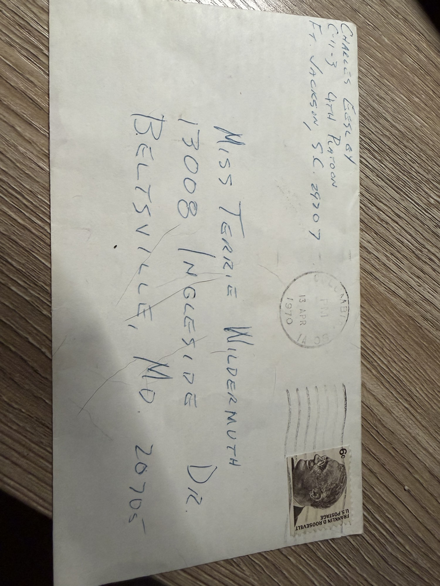
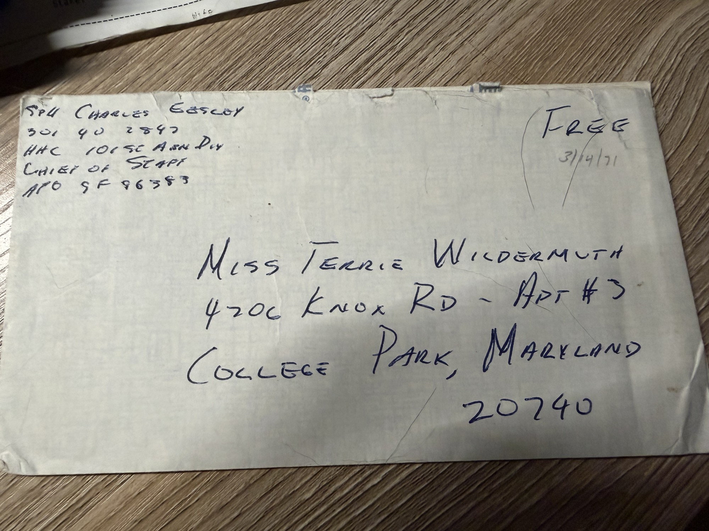
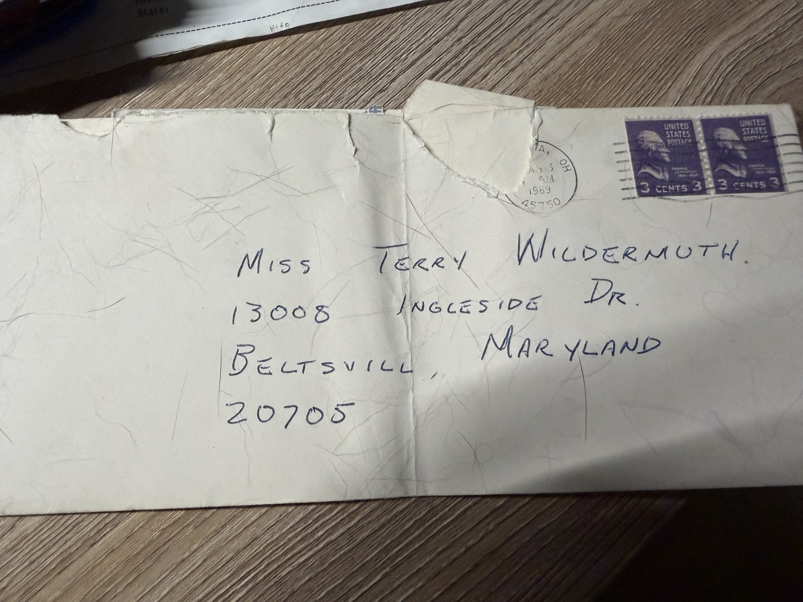

Three surviving envelopes from **[Charlie](/family/charles-eesley/)**'s letters to **[Terrie](/family/terrie-lee-eesley/)**, spanning the arc from college through basic training to Vietnam. The letters themselves are transcribed in the [Vietnam letters collection](/docs/letters-from-vietnam/); **these three envelopes have not been matched to specific letters** in that collection, and are catalogued here on their own for the addresses, units, and postmarks they carry.

## 1. Fort Jackson, South Carolina — postmarked 13 April 1970

Return address: **CHARLES EESLEY · C-11-3 · 4TH PLATOON · Ft. Jackson, S.C. 29207.** Addressed to *Miss Terrie Wildermuth, 13008 Ingleside Dr., Beltsville, MD. 20705.* Franked with a 6¢ **Franklin D. Roosevelt** stamp, postmarked **Columbia, S.C., 13 APR 1970**.

This is Charlie in **basic training** — company C-11-3, fourth platoon — in the spring before deployment. It is close in date to his letter of [12 April 1970](/docs/letters/charlie-to-terrie-1970-04-12-orders-on-my-mind/), written while he was waiting on his orders, but the envelope has not been confirmed as that letter's.

## 2. Vietnam — 101st Airborne Division, marked 3/4/71

Return address: **SP4 Charles Eesley · 301 40 2843 · HHC 101st Abn Div · Chief of Staff · APO SF 96383.** Addressed to *Miss Terrie Wildermuth, 4706 Knox Rd — Apt #3, College Park, Maryland 20740.* In place of a stamp, the corner is marked **"FREE"** — the free-mail privilege for service members in a combat zone — and dated **3/4/71**.

Two details here are new to the archive in this form: Charlie's **service number (301 40 2843)**, and his posting to the **Chief of Staff section, Headquarters and Headquarters Company, 101st Airborne Division** — the rear-area assignment he moved into after the field, at the rank of **SP4**. Terrie has by now moved from her parents' house in Beltsville to an apartment on **Knox Road in College Park**, beside the University of Maryland.

## 3. Marietta, Ohio — 1969

Addressed to *Miss **Terry** Wildermuth, 13008 Ingleside Dr., Beltsville, Maryland 20705* — her name spelled here with a **y**. Franked with two 3¢ **Washington** stamps and postmarked **Marietta, Ohio 45750, 1969**; no return address on the face.

This is the earliest of the three and the only pre-Army one: Charlie writing from **Marietta** during his college years, to Terrie at her parents' house. It belongs with the [1969 letters](/docs/letters-from-vietnam/) but has not been matched to a particular one.

## The three addresses, in order

The envelopes trace both of them at once — Charlie moving **Marietta → Fort Jackson → Vietnam**, and Terrie moving **her parents' house in Beltsville → her own apartment in College Park**. The correspondence that runs across those moves is the [Vietnam letters](/docs/letters-from-vietnam/); these are the covers that carried it.

> *Source: Terrie's kept correspondence, in Chuck's keeping; photographed 2026. The pairing of each envelope to a specific letter is unresolved.*
