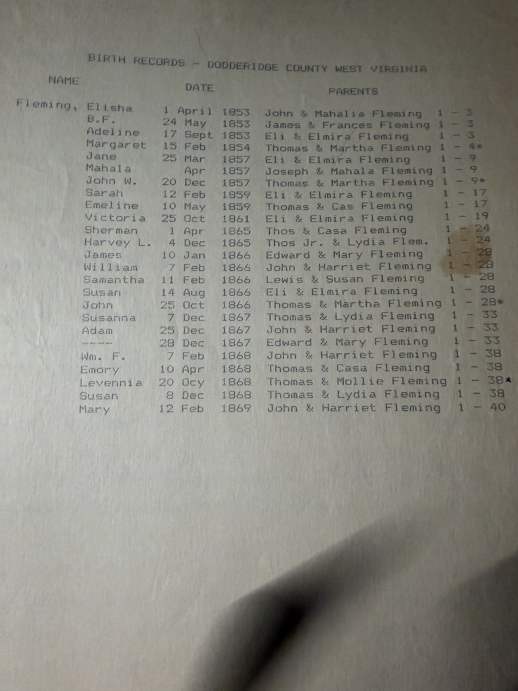
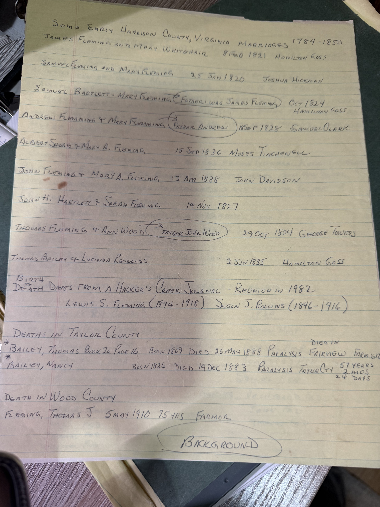
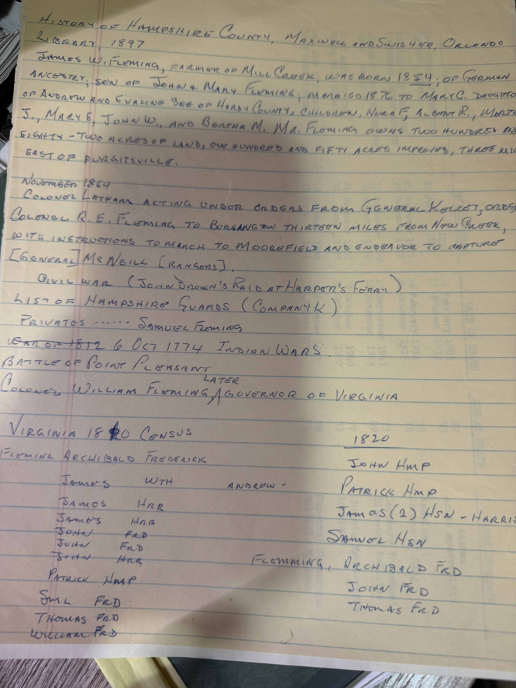

Three sheets. The first settles a question this archive raised only hours ago.

## "John W." — the birth certificate was right

The **Doddridge County birth register**, transcribed by name, date and parents. Robert Earl starred the entries belonging to his own line — **Thomas & Martha Fleming**:

| Child | Born | Parents |
|---|---|---|
| **Margaret** | 15 Feb 1854 | Thomas & Martha Fleming ★ |
| **John W.** | **20 Dec 1857** | Thomas & Martha Fleming ★ |
| **John** | 25 Oct 1866 | Thomas & Martha Fleming ★ |
| **Levennia** | 20 Oct 1868 | Thomas & **Mollie** Fleming ★ |

**The child born 20 December 1857 was registered "John W."**

When [his certified birth certificate](/archive/wesley-fleming-birth-certificate/) turned up earlier today it read **"Jno. Wesley Fleming,"** and this archive flagged it as an open question — *Jno.* being the standard abbreviation for John, against every other source calling him **James** Wesley. **The register settles it: the clerk who issued that certificate in 1984 was reading the book correctly.** He was entered as **John W. Fleming**, and *James* is a later family usage that stuck.

Which also explains why **two sons were registered as John** — John W. in 1857 and John in 1866. The family called the first one **Wesley** and the second one **John**, and the register keeps no such distinction.

*And "Mollie" for Martha* on the 1868 entry — a pet form of Mary, used loosely for Martha, and Robert Earl starred it rather than silently correcting it.

**Other Fleming households in the same register** include **Eli & Elmira Fleming** with five children between 1853 and 1866 — [Eli B. Fleming](/archive/doddridge-registers-deeds-and-eli-fleming-service/) and Elmira Anna Kinney, raising a family on Arnold's Creek — plus a **Lewis & Susan Fleming** (daughter Samantha, 1866), **Thomas & Cassandra**, **Thomas & Lydia**, **John & Harriet**, and **Edward & Mary**. Nearly every couple in [John Fleming IV's child list](/family/john-fleming-iv/) appears here with children of their own.

## A candidate for the death record nobody could find

At the foot of the marriage sheet, under **"Death in Wood County"**:

> **FLEMING, THOMAS J — 5 May 1910 — 75 yrs — Farmer**

[Thomas Bailey Fleming](/family/thomas-bailey-fleming/) is one of the few direct ancestors here with a documented life and **no documented end** — *"No death record could be found for Thomas,"* as Robert Earl wrote and as this archive has repeated.

**This may be it.** He was last seen in **Wood County** at the 1900 census, aged seventy, **renting a farm**. Here is a Fleming dying in Wood County in 1910, described as a **farmer**.

**Two things don't match**, and both are recorded rather than explained away:

- **The age.** 75 in May 1910 implies a birth about 1835. His birth is February 1830, which would make him **80**.
- **The middle initial.** *Thomas **J.***, where he is *Thomas **B.*** in every county record — though the initials in this family wander freely (the informant on [Martha's death record](/archive/thomas-martha-fleming-wood-county-records/) is *F. T.* Fleming where the typescript calls him Floyd **B.**), and a **Thomas J. Fleming** donated the [Fleming-Gain Cemetery](/archive/arnolds-creek-visit-1986/) land.

**A five-year error in a stated age is entirely ordinary** in this family's records — the same archive holds an "age 84" for a man of 82 and an "age 40" for a man of 72. **Worth ordering the full Wood County entry.** If it names a father or a spouse, it closes a gap Robert Earl left open for twenty years.

## Early Harrison County marriages, and a circled note

From *Some Early Harrison County, Virginia Marriages 1784–1850*:

- **James Fleming & Mary Whitehair** — **8 Feb 1821** *(the archive has had 1820 and 13 Feb 1821 for this; the index gives the 8th)*
- **Samuel Bartlett & Mary Fleming** — Oct 1824 — with Robert Earl's own circled annotation: ***"father was James Fleming"***
- **Samuel Fleming & Mary Fleming** — 25 Jan 1820
- **Andrew Flemming & Mary Flemming** — 18 Sep 1828 — *"father Andrew"*
- **John Fleming & Mary A. Fleming** — 12 Apr 1838 ✓
- **John H. Bartlett & Sarah Fleming** — 19 Nov 1827
- **Thomas Fleming & Ann Wood** — 29 Oct 1804 — *"father John Wood"*
- **Thomas Bailey & Lucinda Reynolds** — 2 Jun 1835

Two **Bartlett–Fleming** marriages, in 1824 and 1827, on top of the Bartlett–Bailey marriage the archive already has. And the circled *"father was James Fleming"* is him marking the James Fleming connection as significant, years before he acted on it.

Also here, from a **Hacker's Creek Journal** reunion in 1982: **Lewis S. Fleming (1844–1918)** and **Susan J. Rollins (1846–1916)** — matching [Lewis Simpson Fleming](/family/lewis-fleming/) exactly.

And two starred Taylor County deaths: **Thomas Bailey, b. 1809, d. 26 May 1888** of paralysis at Fairview, a farmer; and **Nancy Bailey, b. 1826, d. 19 Dec 1883**, aged 57 years 2 months 24 days. These are a generation *below* [the Thomas Bailey who married Nancy Bartlett in 1803](/family/thomas-bailey/) — most likely a son and daughter-in-law carrying the same two names forward.

## The Hampshire County thread

Notes taken from **Maxwell and Swisher's *History of Hampshire County* (1897)** — read, he records, at the **Orlando library**, the same [SAR collection](/archive/fleming-roe-marriage-banns-1803/) that supplied his Maryland material.

**This is him working the Hampshire County angle**, and it matters because [the 1795 deed](/archive/berry-to-james-fleming-deed-1795/) has a **James Fleming "of the County of Hampshire"** buying the Simpson's Creek land, and because John Fleming IV's death register gives **Hampshire County** as his birthplace.

What he pulled out:

- A **1820 Virginia census list of Flemings by county**, and it includes **John — HMP** and **Patrick — HMP**: Flemings still in **Hampshire County** in 1820, alongside clusters in Frederick and Harrison.
- **Samuel Fleming**, private, among the **Hampshire Guards (Company K)** at the time of John Brown's raid on Harper's Ferry.
- **Colonel R. E. Fleming**, ordered in November 1864 to march from Burlington to Moorefield to try to capture **McNeill's Rangers**.
- **Colonel William Fleming**, at the **Battle of Point Pleasant, 6 October 1774**, *"later Governor of Virginia."*
- A **James W. Fleming** of Mill Creek, born 1854, farming 282 acres three miles east of Purgitsville — described in the county history as *"of German ancestry,"* which for a Fleming is odd enough to be worth a note. Almost certainly a different family.

**None of that is his line**, and he does not claim it is. But the 1820 census entries are the point: **Flemings were in Hampshire County across exactly the years that matter**, which is what you would expect if a James Fleming came from there to Harrison County in 1795 and a son of his was born there in 1781.

> *Sources: typed transcript of the Doddridge County, West Virginia birth register; handwritten abstracts of* Some Early Harrison County, Virginia Marriages 1784–1850*, of Taylor and Wood County death records, of a Hacker's Creek Journal (1982), and of Maxwell and Swisher's* History of Hampshire County *(1897) — all from Robert Earl Wildermuth's research papers, in Chuck's keeping. Photographed 2026.*
