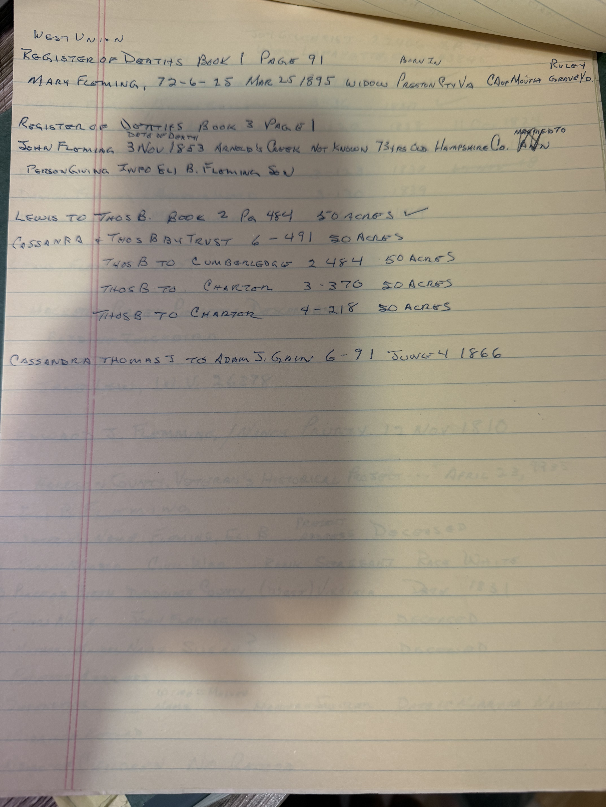
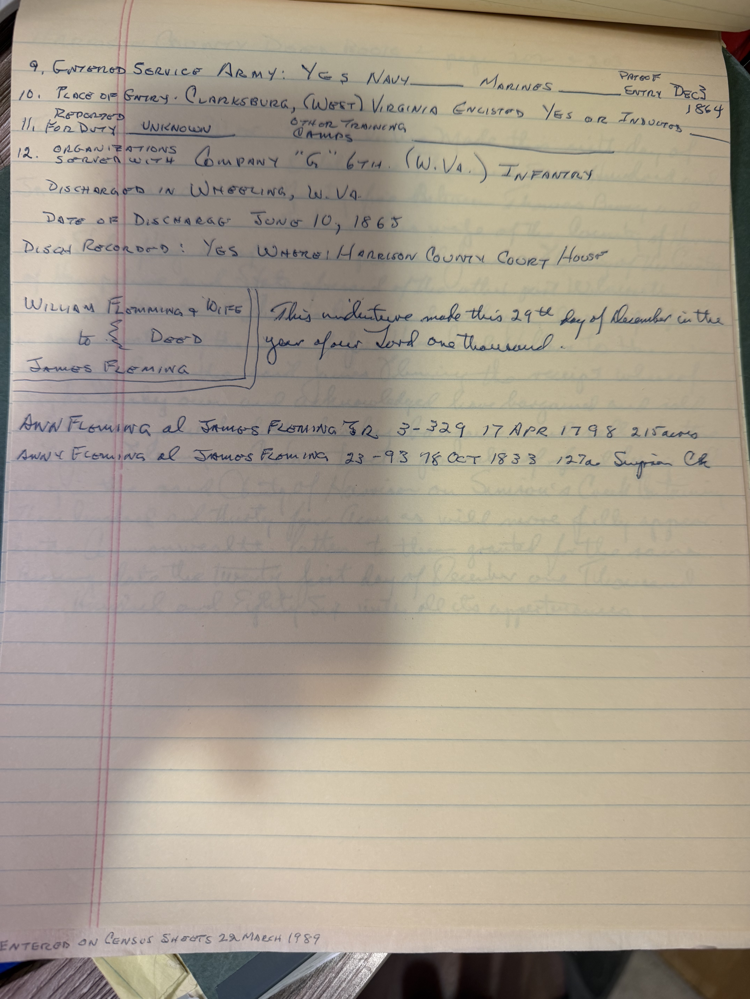

Courthouse notes, taken at **West Union** and **Clarksburg** and dated at the foot *"Entered on census sheets 22 March 1989."* Three separate things.

## A death record that may be Mary Lake

> *West Union — Register of Deaths, Book 1, page 91:*
> **MARY FLEMING** — **72-6-25** — **25 March 1895** — **widow** — born **Preston County, Va.** — **Cancer of the mouth** — Grave Yd: **Ruley**

[Lewis Fleming](/family/lewis-fleming/)'s second wife was **Mary Lake**, a widow with three children whom he married after Synthia's death, and about whom this archive holds almost nothing — she appears in [the 1854 deed](/archive/fleming-marriage-record-and-deed/) as *"Mary his wife"* and in the 1860 census, and then vanishes.

This is a Mary Fleming, a **widow**, dying in the right county at the right sort of date, with a birthplace and a cause of death and a burying ground. **It is very likely her.**

**But the arithmetic does not agree.** An age of 72 years 6 months 25 days on 25 March 1895 gives a birth about **30 August 1822**. The [1860 Taylor County census abstract](/archive/fleming-taylor-county-census-abstracts/) puts **Mary (Lake) at 56**, i.e. born about **1804** — eighteen years earlier. One of the two is wrong, or these are two different women. **Recorded, not adopted.** *Ruley* is a Doddridge County locality, and the graveyard there is where to look.

## The John Fleming death entry, in his own hand

> *Register of Deaths, Book 3, page 1:*
> **JOHN FLEMING** — died **3 Nov 1853** — **Arnold's Creek** — cause **not known** — **73 yrs old** — **Hampshire Co.** — married to **Ann**
> *Person giving info:* **ELI B. FLEMING, SON**

His handwritten note of the same entry [already filed as a typed abstract](/archive/john-fleming-death-record-1853/), and it matches in every particular — including the Hampshire County birthplace he elsewhere marked as erroneous, and the unidentified wife **Ann**.

## The deed index — where the fifty acres went

A column of Doddridge County deed-book references, tracking one parcel:

| Grantor → Grantee | Book–page | Acres |
|---|---|---|
| **Lewis to Thos B.** | 2–484 | **50** |
| Cassandra & Thos B. by trust | 6–491 | 50 |
| Thos B. to Cumberledge | 2–484 | 50 |
| Thos B. to Charton | 3–370 | 50 |
| Thos B. to Charton | 4–218 | 50 |
| Cassandra & Thomas J. to **Adam J. Gain** | 6–91 | *4 June 1866* |

The first line is [the 1854 deed the archive already holds](/archive/fleming-marriage-record-and-deed/) — Lewis to his son Thomas B., fifty acres on Burnt Cabin. The rest is what happened next: **the same fifty acres conveyed away again and again**, to Cumberledge (the creditor named in the 1855 deed of trust), then twice to a Charton.

**[Thomas Bailey Fleming](/family/thomas-bailey-fleming/) did not keep the land.** He bought it in 1854, mortgaged it the day the purchase was recorded, and it moved out from under the family. By 1880 he was renting in Wood County, and by 1900 renting still. This index is the paper trail of that slide, and it is worth reading in full at the courthouse.

The last line brings in **Adam J. Gain** — the name on the [Fleming-Gain Cemetery](/archive/arnolds-creek-visit-1986/), and the man who married John Fleming IV's daughter Susannah Agnes.

## Eli B. Fleming's war

A **Harrison County Veteran's Historical Project** form, dated **23 April 1955**, for **Eli B. Fleming** — born 1831, Harrison County, race white, rank **Sergeant**, deceased:

> **Entered service:** Army · **Place of entry:** Clarksburg, (West) Virginia · **enlisted**
> **Date of entry:** **December 1864**
> **Organization:** **Company "G", 6th (W.Va.) Infantry**
> **Discharged** in **Wheeling, W.Va.**, **10 June 1865**
> Discharge recorded at the **Harrison County Court House**

So the son who [reported his father's death in 1853](/archive/john-fleming-death-record-1853/), and who [sold the Arnold's Creek church land for twenty-five dollars in 1900](/archive/arnolds-creek-visit-1986/), **enlisted in the Union army at thirty-three in the last winter of the war** and came out a sergeant six months later.

[Lewis Fleming's page](/family/lewis-fleming/) records that his sons split Union and Confederate. Eli was Lewis's **half-brother** — of the same generation, in the same hollow — and he went Union.

## More James Fleming deeds — and Simpson Creek

At the foot of the same sheet, three more land records:

> **William Flemming & wife to James Fleming** — Deed — *"This indenture made this 29th day of December in the year of our Lord one thousand…"*
> **Ann Fleming to James Fleming Jr.** — 3–329 — **17 April 1798** — **215 acres**
> **Ann & Fleming to James Fleming** — 23–93 — **8 October 1833** — **127 acres, Simpson Ck**

**Simpson Creek** is where [Lewis Fleming was born](/family/lewis-fleming/), *"on his father's farm."* And here is a **James Fleming** taking 127 acres there in 1833, and 215 acres from an **Ann Fleming** in 1798.

That is now **five** separate places a James Fleming touches this family's land and business — [the 168½-acre farm sold to John for a dollar](/archive/wildermuth-email-bartlett-researcher-1998/), [the 1827 consent he witnessed](/archive/john-fleming-consent-note-1827/), his daughter's 1824 marriage to a Samuel Bartlett, and these two Simpson Creek deeds. Robert Earl [named a James Fleming as the family's true progenitor in November 1998](/archive/fleming-retraction-1998/) and never showed why. **The deeds may be the why.**

*Note also the recurring **Ann Fleming** — the name on John Fleming IV's 1853 death record as his consort, and here a grantor in 1798 and 1833.*

> *Source: handwritten abstracts of the Doddridge County registers of deaths and deed index at West Union, and of a Harrison County Veteran's Historical Project form of 23 April 1955, from Robert Earl Wildermuth's research papers; in Chuck's keeping. Photographed 2026.*
