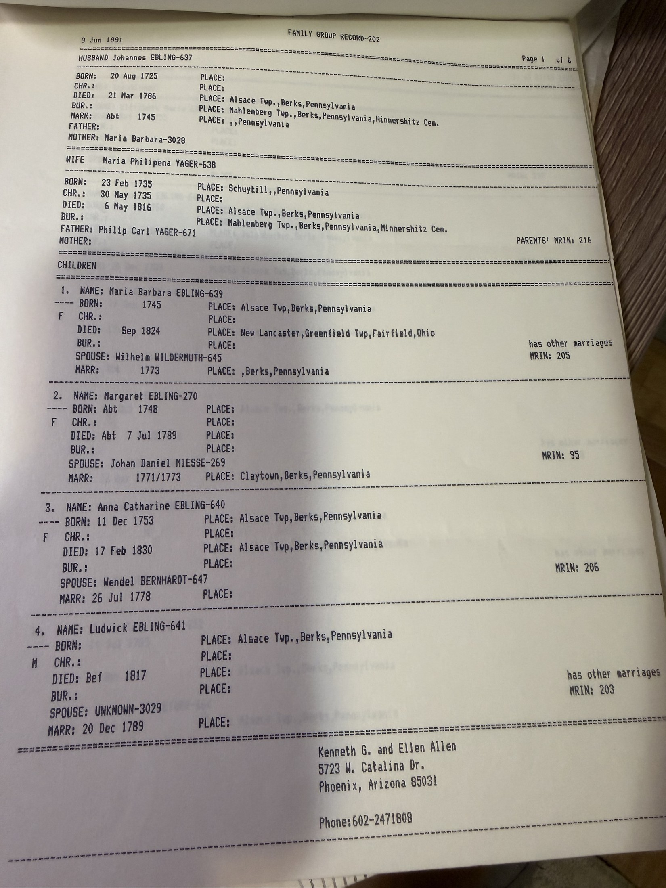
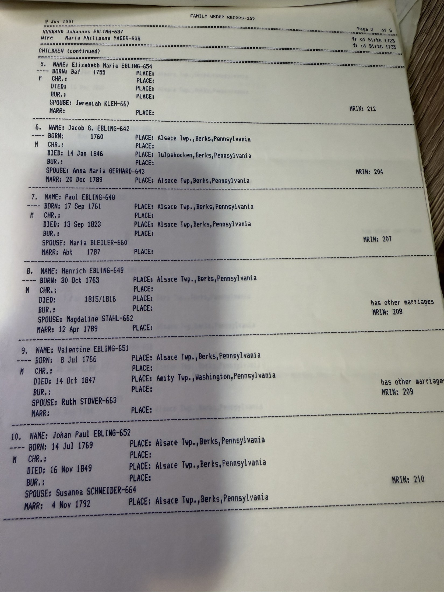
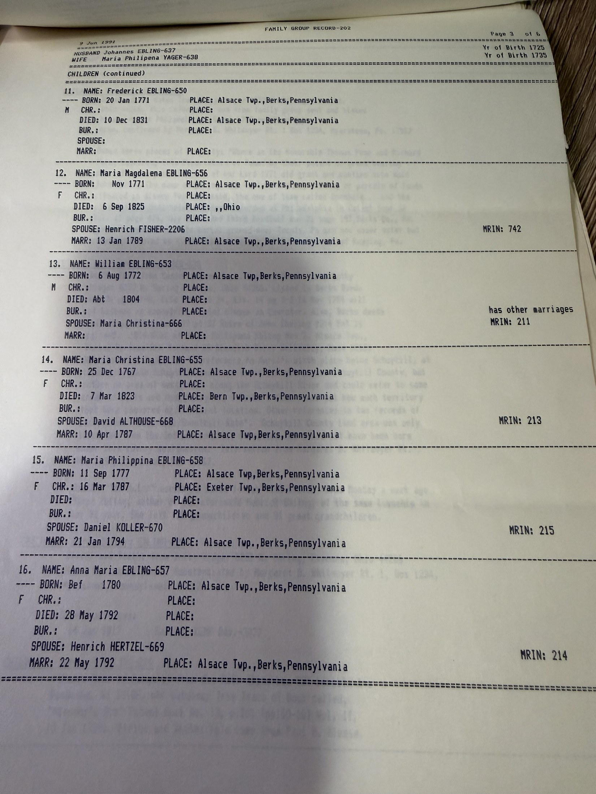
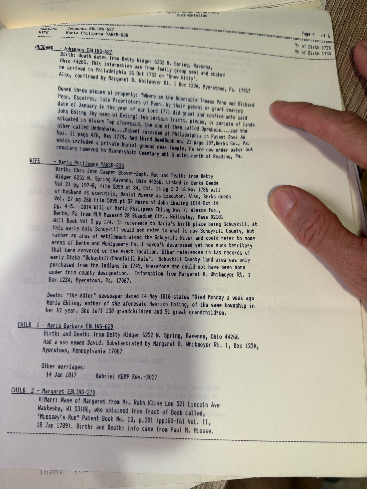
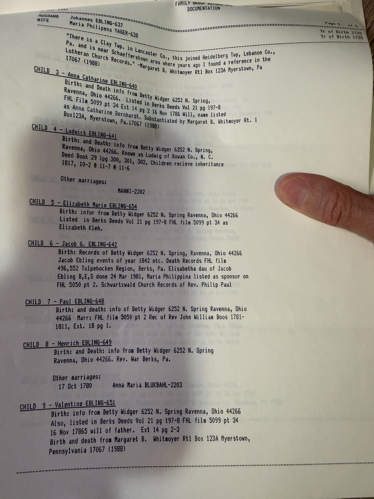
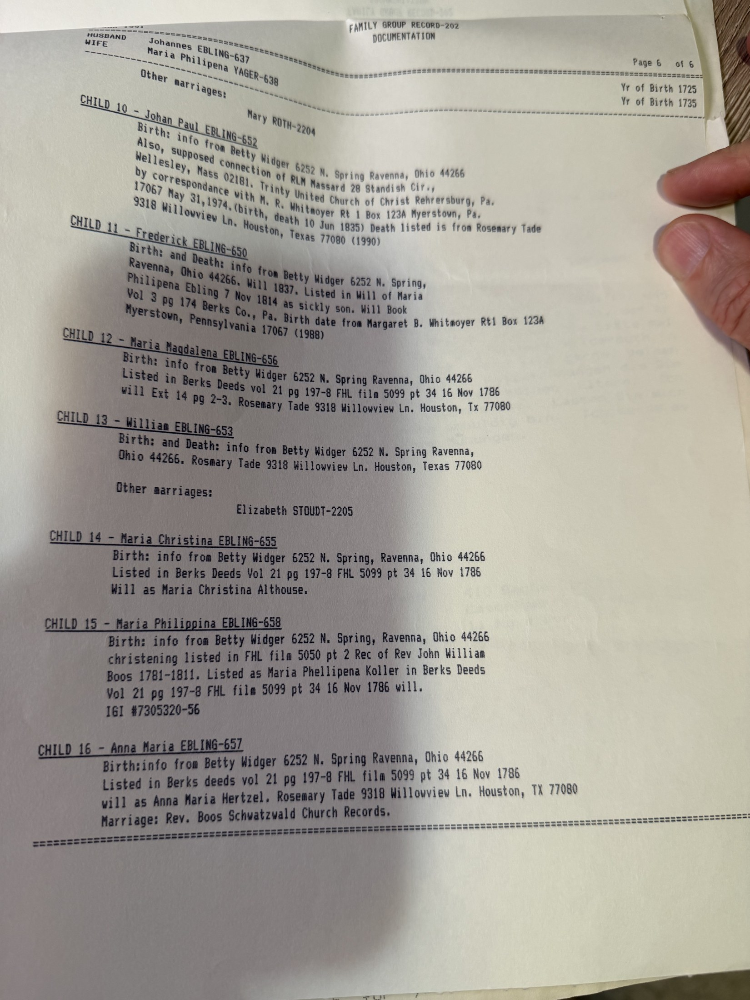

> **This family is not known to be related to this one.** No Erling, Ebling or Yager appears anywhere in the family tree. The pages are filed here because they were in [Robert Earl Wildermuth](/family/robert-earl-wildermuth/)'s research file and because they document how amateur genealogists found each other before the internet — **not** because a connection was ever established. His own conclusion, five days after receiving them: *"Sorry we didn't tie in."*

## How it arrived

**Mrs. Ellen B. Allen** of Phoenix, Arizona found Robert Earl's card in the Family Registry at her local Family History Library, saw what she took to be a link to her direct ancestor **Johannes Ebling**, and mailed him six pages of her research. The [full exchange is here](/archive/wildermuth-genealogy-letter-campaign/).

The likely basis for her guess is visible in his reply: **Johann David Wildermuth's** clan — a different Wildermuth line from Robert Earl's — had settled for a time in **Berks County, Pennsylvania**, which is exactly where these Erlings were. A Wildermuth/Ebling overlap in Berks County would not touch the Württemberg Wildermuths of Rielingshausen and Großaspach at all.

## What the record contains

**Family Group Record 203** — **Johannes Erling** (b. 20 August 1725, Alsace Township, Berks County, Pennsylvania) and **Maria Philippina Yager** (b. 23 February 1735, Schuylkill Township, Pennsylvania), submitted by **Kenneth G. and Ellen B. Allen**, 5723 W. Catalina Drive, Phoenix.

**Sixteen children**, born in Alsace Township between 1745 and 1780.

Three further pages carry unusually detailed **documentation notes** — land grants from *"the Honorable Thomas Penn and Richard Penn, Esquires, Late Proprietors of Penn,"* patent references, Berks County deed volumes, and Schuylkill County land *"purchased from the Indians in 1749, therefore she could not have been born under this county designation."*

One entry is worth reading whatever the connection turns out to be — a death notice from the German-language newspaper **Der Adler**, 14 May 1816:

> *"Died Monday a week ago … in her 82 year. She left **128 grandchildren and 91 great grandchildren**."*

## If anyone ever wants to test it

The claim to check is not Erling-to-Wildermuth directly. It is whether the **Berks County Wildermuths** descending from Johann David Wildermuth (see *"Johann David Wildermuth and His Descendents — 1752–1964,"* Ohio State Library) connect to the **Württemberg Wildermuths of Rielingshausen** — and separately, whether any of them married an Ebling. Dr. Hans Wildermuth's appendix puts both groups' origin in **Pleidelsheim and Rielingshausen**, which is suggestive and nothing more.

Until that is done, this record stays where it is: a courtesy from a stranger, filed and unattached.

> *Source: Kenneth G. and Ellen B. Allen, Phoenix, Arizona, June 1991, in Robert Earl Wildermuth's research papers; photographed 2026.*
