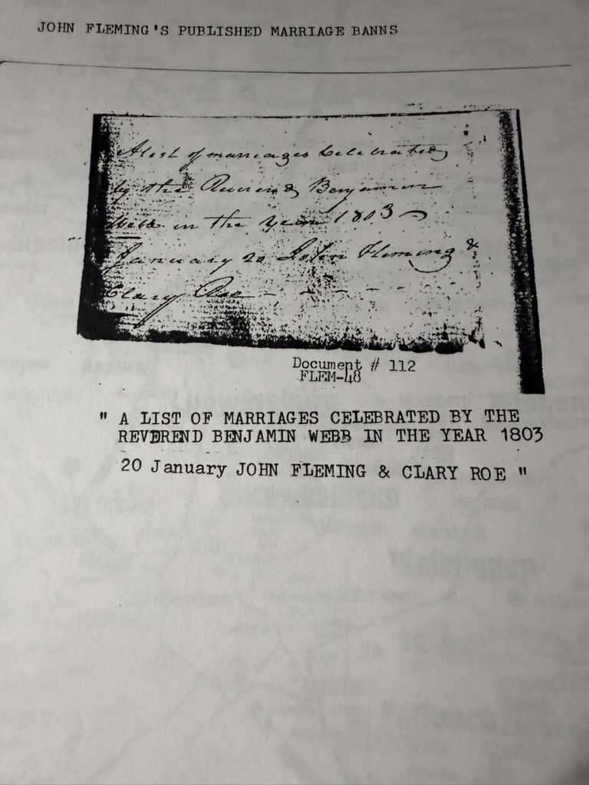

Small, and about as good as this line gets: **a photograph of the actual manuscript**, in the minister's own hand, recording the marriage of Chuck's 5×-great-grandparents.

Robert Earl filed it under the heading **"John Fleming's Published Marriage Banns,"** as Document #112, and typed the reading out beneath the image:

> *"A LIST OF MARRIAGES CELEBRATED BY THE REVEREND BENJAMIN WEBB IN THE YEAR 1803*
> ***20 January JOHN FLEMING & CLARY ROE***"

The manuscript is legible in the photograph and supports that reading.

## Why it matters

**It is contemporary.** Not a chart, not a family recollection, not a typescript written 195 years later — a **minister's own return of the marriages he performed**, made in the year it happened. Almost everything else this archive holds about [John Fleming IV](/family/john-fleming-iv/) and [Clarissa Roe](/family/clarissa-roe/) is downstream of Robert Earl's database. This is not.

It confirms:

- **The date: 20 January 1803**, exactly as the [Family Legacy typescript](/docs/john-fleming-family-legacy/) and the [1998 charts](/archive/pedigree-charts-1998/) give it.
- **"Clary Roe"** — the familiar form of Clarissa, used in the record itself. The charts' *"Clarissa (Clary) Roe"* was not a modern gloss; it is what she was called.
- **The officiant: the Reverend Benjamin Webb** — a name the archive did not have.

Four years later this couple had **[Lewis Fleming](/family/lewis-fleming/)**, and in 1827 John signed [the note](/docs/john-fleming-family-legacy/) letting Lewis marry in his turn.

*Robert Earl mentioned this document in his [September 1998 letter](/archive/fleming-dear-cousins-1998/) — "I've got copies of wedding bans between John Fleming and John Roe where John and Clarissa were planning a wedding" — and used it to argue that Clarissa never lived in Barbour County. This is the item he meant.*

## Where the will actually is

The reverse of the sheet carries his source note, and it corrects the provenance this archive recorded for [the 1795 will](/archive/john-fleming-will-1795/):

> **SOURCES:** *John Fleming's Will, probated on **17 January 1797**. Will on file in the **Hall Of Records, Annapolis, Maryland**.*
>
> *Pennsylvania Society, **Sons of the American Revolution**, Genealogy Department, **Orlando Library**, Orlando, Florida*

Two useful things. The will is at the **Maryland State Archives** in Annapolis, not in a county courthouse — findable today by anyone who wants it. And a good deal of the Pennsylvania research was done not by correspondence but **at a Sons of the American Revolution genealogy collection in the Orlando public library**, a half-hour from his house. It explains how a man in Casselberry, Florida assembled a Maryland-and-Pennsylvania colonial pedigree without ever visiting either state.

*(He writes the probate as **17 January 1797** here; the will transcript itself says the witnesses appeared on the **16th**. A one-day discrepancy in his own notes, recorded and not resolved.)*

> *Source: photographic reproduction of the marriage return of the Rev. Benjamin Webb for 1803, marked Document #112 / FLEM-48, with the accompanying sources page; from Robert Earl Wildermuth's research papers, in Chuck's keeping. Photographed 2026.*
