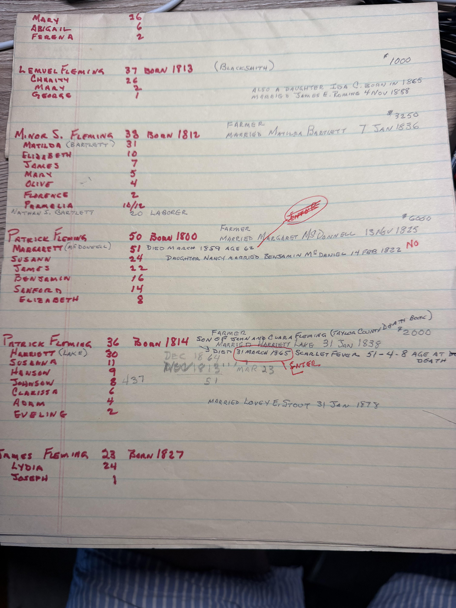
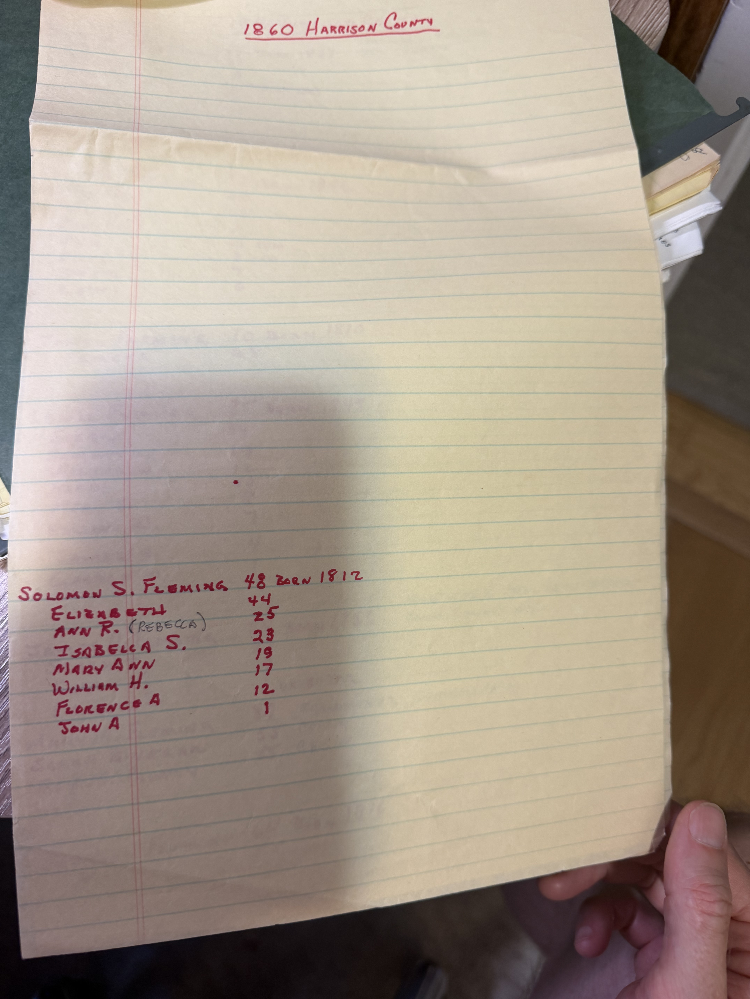

Sheet after sheet of yellow legal pad in red ink: **every Fleming household in Taylor and Harrison Counties across four censuses — 1850, 1860, 1870 and 1880** — copied out by hand, with property values, occupations, marriage dates and his own notes squeezed into the margins. This is the raw research behind the finished charts, and it is more useful than they are.

He was not tracing his own line through these. He was **copying down every Fleming in two counties** and then working out which ones were his — which is why the sheets carry stars, question marks, crossings-out and the occasional **"ENTER"** ringed in red.

## The line that matters

On the 1860 sheet, one household is marked with a **star**, and the key at the foot of the page reads **"✱ GREAT-GREAT GRANDFATHER."**

> **✱ LEWIS FLEMING** — 53, born 1807 — **Gentleman** — $100
> Mary (Lake) 56 · Nancy A. (Mary A.?) 16 · Susanna (Luvania?) 18
> *"Married Synthia Bailey 14 March 1827. **Son of John Fleming.** Mary Lake is Lewis Fleming's second wife"*

**"Son of John Fleming,"** written on his own working notes. Not on a printed chart, not in a narrative composed years later — on the sheet where he was reading the census. Together with [the consent note](/archive/john-fleming-consent-note-1827/) and the Taylor County death-book entry below, the attribution is about as settled as this line gets.

**"Gentleman" with one hundred dollars.** The [typescript](/docs/john-fleming-family-legacy/) explains it: *"In 1860, Lewis sold his property, moved back to Taylor County and the 1860 census lists his occupation as 'gentleman'. This was the term used to indicate retired."* Set against the other Fleming households on the same page — Johnson C. at $7,000, Minor at $5,000, Emory at $4,280 — **Lewis is the poorest Fleming in the county.** He had sold up and was living on the proceeds at fifty-three.

*That figure bears on [the open slave-schedule question](/family/lewis-fleming/).* A man returned at **$100** in 1860 is not a slaveholding planter. It is suggestive rather than decisive — the schedule is still the record that would answer it — but it points one way.

## Patrick Fleming, and a second civil record naming Clara

The 1850 sheet carries the other important annotation. Against one household:

> **PATRICK FLEMING** — 36, born 1814 — Farmer — $2,000
> *"**Son of John and Clara Fleming** (Taylor County Death Book)"*
> *"Married Harriett Lake 31 Jan 1838"* · *"Died **31 March 1865**, scarlet fever, **51-4-8 age at death**"*
> Susanna 11 · Henson 9 · Johnson 8 · **Clarissa 6** · Adam 4 · Eveline 2

**The Taylor County Death Book names John and Clara Fleming as Patrick's parents.** That is a civil record, independent of every chart, confirming [John Fleming IV](/family/john-fleming-iv/) and [Clarissa Roe](/family/clarissa-roe/) as a couple with a documented family — and the [typescript's list](/family/john-fleming-iv/) includes *"Patrick Fleming born 23 Nov 1813; married Harriet Lake."* The wife matches exactly.

**And the arithmetic checks.** An age at death of **51 years, 4 months, 8 days** on 31 March 1865 works back to a birth around **23 November 1813** — precisely the date the typescript gives. Two independent records agreeing to the day.

Patrick named a daughter **Clarissa**, for the grandmother she was born too late to know.

*A family echo:* Patrick married a **Lake**, and his father's second wife was **Mary Lake**. Two Lake women into the same family.

A second photograph of the same sheet, taken flatter, carries the foot of the page that the first frame cuts off &mdash; the household of **James Fleming, 23, born 1827**, with Lydia, 24, and Joseph, 1:

## What else is on the sheets

The 1850 and 1860 abstracts together are a census of the whole Fleming settlement, and the recurring surnames are the archive's own:

- **Minor S. Fleming** married **Matilda Bartlett** on 7 January 1836, with **Nathan S. Bartlett**, 20, living in as a labourer — the Bartletts marrying Flemings a generation after [Nancy Bartlett married Thomas Bailey](/family/nancy-bartlett/)
- **Emory Fleming** married a **Margarett Prunty**, with a **John Prunty** in the household in 1860 — and [John Fleming IV's second wife was Susannah Prunty](/archive/charlotte-fleming-correspondence-1995/)
- **Mary M. ("Polly Whitehair") Fleming**, 60 in 1860, noted as *"second wife of James Fleming, married 13 Feb 1821"*
- **Patrick Fleming** (a different, older one), b. 1800, m. Margaret McDonnell 13 Nov 1825 — with a claim about a daughter Nancy marrying in 1822 that Robert Earl struck through and marked ***"NO"***, since it predates the parents' marriage
- Jonathan (b. 1789), George, Johnson B., Johnson C., Lemuel the blacksmith, Benjamin, James

The working marks are all over the pages — **"ENTER"** circled in red where something needed keying into the database, dates crossed out and rewritten, question marks against names he could not read twice the same way. One household appears twice under different readings, as *"Minor S. Fleming / Matilda"* and *"Alan S. Fleming / Amalia"*, with the same six children — the same family, transcribed on two different days.

**The continuation sheet is where that doubling is visible.** Headed *"1850 Taylor (continued)"*, it carries **Jonathan Fleming, 61, born 1789** with Nancy, Isiah, Emry and Cornelius — and directly beneath him *"Alan S. Fleming, 38, born 1812"* with *Amalia*, 31, and Elizabeth, James, Mary, Alice, Florence and Pamela. Set that against Minor S. Fleming, 38, born 1812, with Matilda, 31, and Elizabeth, James, Mary, Olive, Florence and Parmelia on the first sheet: same ages, same children, two readings of one household.

## The Kelley sheets — his own stars again

The 1860 Taylor sheets carry the **Kelley** side as well, and he marked those the same way:

> **JOHNSON KELLEY** — 50, born 1810 — with **Nancy**, 35, noted as *"second wife"*, and children **California**, 13, and one more
>
> *✱ **Martha Kelley** — GREAT GRANDMOTHER*
> *✱✱ **Johnson Kelley** — GREAT-GREAT GRANDFATHER*

[Johnson Kelley](/family/johnson-kelley/)'s page already records him as widowed with ten children at the 1850 Barbour County census; here he is ten years on with a **second wife, Nancy**, and the daughter named **California** still at home. A struck-through line beside the Kelleys touches [Verona Belle's parentage](/family/verona-sheppard-fleming/) — he was working that question on the same page.

## 1870 — where Patrick's daughters went

One sheet in the run is headed **"1870 Taylor County (continued)"** — a census this archive had not previously credited to the abstracts, and the reason the run is four censuses rather than three. It is a short page, and two of its lines follow the family forward past a death.

Patrick Fleming's household appears at the top: **70, farmer, Flemington Township, $6,800**, with Mary C., James, Cladius and Loretta at home. That is the **older** Patrick, born 1800 — the one whose 1822 daughter-marriage claim Robert Earl struck through. His property has gone from $6,000 in 1850 to $6,800.

Then, in the Clay District:

> **WILLIAM B. C. SILVER** — 33 — Farmer
> Susanna Fleming, 30 — *"Patrick Jr.'s daughter"*
> Harrison, 5
>
> **HENRIETTA FLEMING** — 13 — *"Patrick Jr.'s daughter"*

**"Patrick Jr."** is the Patrick born 1814 who died of scarlet fever on 31 March 1865 — the one the Death Book calls the son of John and Clara. Five years on, Robert Earl found two of his daughters and wrote the relationship in beside each: Susanna, who was 11 on the 1850 sheet, now married to a farmer in another district; and Henrietta, 13, born after 1850 and so not on it at all, living in a household of her own listing. The annotations are him doing exactly the work these sheets were for — not copying a census, but keeping hold of people across one.

A separate note in black ink at the foot records another death from the same period: ***"James and Mary M. Fleming (Polly Whitehair) had daughter Mary Fleming who died 21 October 1865 of typhoid fever age 44-9-12."*** Scarlet fever in March, typhoid in October — 1865 took more than one adult out of this settlement.

*One caution on this sheet:* a **Mary Fleming, 67, "keeping house"** with a **Phoebe A., 31**, appears in the middle of the page. Age 67 in 1870 implies a birth about 1803, which is close to but not the same as the *"Mary M. (Polly Whitehair) Fleming, 60"* of the 1860 sheet, and further still from the **Mary M. Fleming, 87** on the 1880 Harrison page below. Three sheets, three ages that will not sit on one birth year. **Recorded, not reconciled.**

![A short sheet headed 1870 Taylor County continued in red ink, with the household of Patrick Fleming aged 70, farmer of Flemington Township, valued at 6,800 dollars; a Lee Swearingen household in Grafton Township; Mary Fleming aged 67 keeping house with Phoebe A aged 31; the farmer William B. C. Silver of Clay District with Susanna Fleming aged 30 annotated Patrick Jr.'s daughter and a child Harrison; Henrietta Fleming aged 13 also annotated Patrick Jr.'s daughter; and a note in black ink that James and Mary M. Fleming, Polly Whitehair, had a daughter Mary Fleming who died 21 October 1865 of typhoid fever.](../../assets/family/originals/fleming-1870-taylor-census-abstract.jpeg)

## Harrison County, and another James Fleming

The Harrison County sheets run 1850, 1860 and 1880 and are dominated by Flemings this archive has no place for yet — **Marshall T.**, **Solomon**, **William H.**, **Zachariah**, **Henry T.** the railroad engineer, **Benjamin** the conductor at West Grafton. The 1850 sheet is headed, in the corner, **"ABSOLUTE."**

![A sheet headed 1850 Harrison County in red ink with the word ABSOLUTE written in the top right corner, listing the household of John Fleming aged 37 born 1813 annotated married Mary A. Fleming 12 April 1838 with children Lewis G., Martin V., Susannah, Virginia and Robert; the Marshall T. Fleming household with nine children; the Solomon Fleming household with each child's later marriage written in beside the name; and at the foot, in blue ink, a note that James Fleming had a daughter named Mary who married Samuel Bartlett 16 April 1824.](../../assets/family/originals/fleming-1850-harrison-census-abstract.jpeg)

Two entries reach the documented line:

**John Fleming, 37, born 1813, "married Mary A. Fleming 12 Apr 1838."** That is [John Fleming IV's son John](/family/john-fleming-iv/) — the twin of Patrick — and the typescript's puzzling entry *"John Fleming born 23 Nov 1813; married **Mary A. Fleming**"* turns out to be exactly what the census says. A Fleming married a Fleming. Their children in 1850: Lewis G., Martin V., Susannah, Virginia, Robert.

**And in blue ink at the foot of the 1850 Harrison sheet, a note in a different session:**

> ***"James Fleming had daughter named Mary who married Samuel Bartlett 16 Apr 1824"***

A third James Fleming datum, and it runs into the Bartletts — the family that also gave [Nancy Bartlett](/family/nancy-bartlett/) to Thomas Bailey and Matilda Bartlett to Minor S. Fleming. Between this, [the 168½-acre farm sold for a dollar](/archive/wildermuth-email-bartlett-researcher-1998/) and [the 1827 consent witness](/archive/john-fleming-consent-note-1827/), **a James Fleming keeps appearing at the edge of this family's business** — which is the claim the [1998 retraction](/archive/fleming-retraction-1998/) makes and never proves.

### The 1860 Harrison sheet is nearly empty

He started it, headed it, and wrote down **one household**:

> **SOLOMON S. FLEMING** — 48, born 1812
> Elizabeth 44 · Ann R. (Rebecca) 25 · Isabella S. 23 · Mary Ann 19 · William H. 17 · Florence A. 12 · John A. 1

Then he stopped. Whatever took him away from the page, he never came back to it — which is itself worth seeing, because the finished charts show none of this.

### 1880 — the same families thirty years on

Two sheets. The first picks up the households from 1850 a generation later: **James A. Fleming**, 29; **Johnson Fleming**, 38; **Lemuel Fleming**, 66, still there with Charity and their daughter **Ida C.**, 18 — the same Ida C. whose 1888 marriage to James E. Romine he had already pencilled onto the 1850 sheet, thirty years early in the reading and thirty years late in the writing.

**Solomon Fleming appears again, 68, and the household has turned over completely:** Elizabeth, 62, and then *"Mary Ann (Davis), 39 — **daughter**"*, *"Samuel B. Davis, 6 — **grandson**"*, and *"Dora I. Forenson, 16 — **granddaughter**."* The Mary Ann who was 19 on the abandoned 1860 sheet is home again with a married surname and a child; the granddaughter's surname is a version of the **Foreman** that the 1850 sheet records one of Solomon's daughters marrying in December 1862.

The second 1880 sheet is the one with the occupations, and it is the most vivid page in the set:

- **Benjamin Fleming**, 27, ***"conductor on rail road, West Grafton"*** — with **Amanda Costello**, 42, *"sister-in-law"*, and an **Eli Fleming**, 27, *"cousin, **works in saw mill**"*
- **James H. Fleming**, 24, *"works on farm, Flemington district,"* noted as ***"Emory Fleming's son"*** — and living with him, **Mary M. Fleming, 87, "grandmother,"** annotated ***"controls farm"***
- **James Fleming**, 70, born 1810, with Frances, 68 — and **Lewis Fleming**, 35, born 1845, with Susan and seven children
- Two cousins in the James H. household, **Sarah Binegar** and **Evy M. Prunty** — the Prunty surname again, a generation on from the Margarett Prunty who married Emory Fleming on the 1850 sheet

**"Controls farm," at eighty-seven.** Of everything in these sheets that is the line most worth having: a woman old enough to have been born in the 1790s still named as the one who runs the place, with her grandson and his young family working it. *(Her age is the one on this page that does not reconcile with the other sheets — see the caution on the 1870 page above.)*

**And a second Eli.** The Eli Fleming here is 27 in 1880, so born about 1853, and is a **cousin lodging in a railway conductor's house and working a saw mill** — *not* the [Eli B. Fleming who informed his father's 1853 death record](/archive/john-fleming-death-record-1853/), born about 1822, whose [Civil War service and Doddridge County records](/archive/doddridge-registers-deeds-and-eli-fleming-service/) this archive holds. Two Elis, a generation apart, in the same set of sheets. The habit of reusing names is the thing that defeated everyone who worked on this family, and it did not stop with the Johns.

![A sheet headed 1880 Harrison County in red ink listing Benjamin Fleming aged 27 born 1857, conductor on the railroad at West Grafton, with his wife Mary, four children, a sister-in-law Amanda Costello aged 42 and a cousin Eli Fleming aged 27 who works in a saw mill; the James B. Fleming household with seven children; James Fleming aged 70 born 1810 with Frances aged 68; Lewis Fleming aged 35 born 1845 with Susan and seven children; James H. Fleming aged 24 born 1856, annotated Emory Fleming's son, working on a farm in Flemington district, with Mary M. Fleming aged 87 recorded as grandmother and annotated controls farm, plus two cousins Sarah Binegar and Evy M. Prunty; and Johnson Fleming aged 64 born 1816 with Mary.](../../assets/family/originals/fleming-1880-harrison-census-abstract-p2.jpeg)

> *Source: handwritten census abstracts for Taylor and Harrison Counties, Virginia (West Virginia), 1850, 1860, 1870 and 1880, from Robert Earl Wildermuth's research papers; in Chuck's keeping. Photographed 2026. The 1870 Taylor sheet reached this archive filed as a second page of the 1860 abstract; its own heading reads 1870, and the ages on it agree, so it is catalogued here as 1870.*
