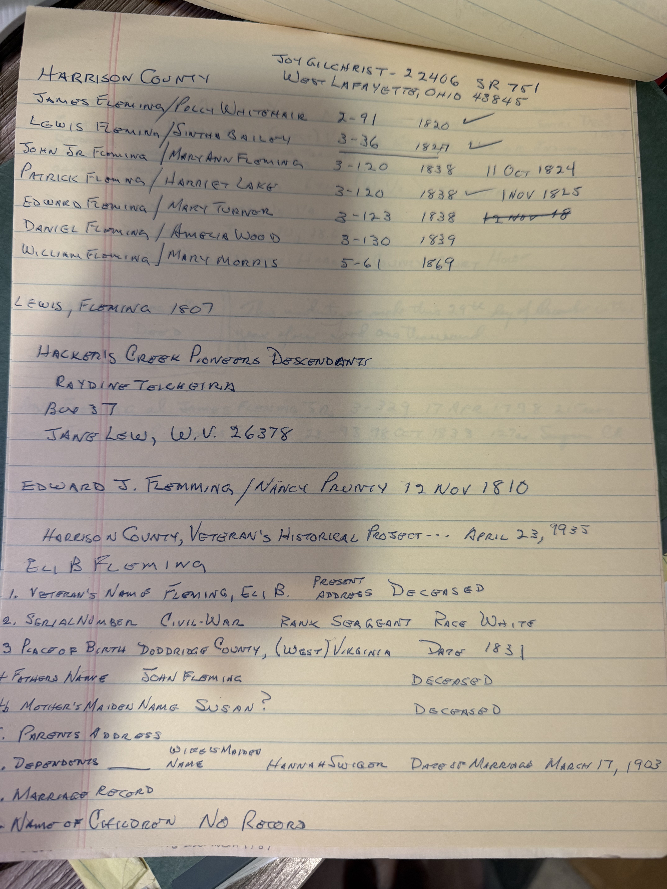

One sheet, two halves, and both matter. The top is his abstract of the **Harrison County marriage index**; the bottom transcribes a **1955 veteran's questionnaire** for Eli B. Fleming.

Written at the very top is a research address: **Joy Gilchrist, 22406 SR 751, West Lafayette, Ohio** — the author of *The Squires Family*, and [the origin of the "Edward Fleming" this archive followed for years](/family/lewis-fleming/) before the consent note corrected it. He had her address.

## The marriage index

| Couple | Book–page | Year |
|---|---|---|
| **James Fleming / Polly Whitehair** | 2–91 | **1820** |
| **Lewis Fleming / Sintha Bailey** | 3–36 | **1827** ✓ |
| **John Jr. Fleming / Mary Ann Fleming** | 3–120 | 1838 |
| **Patrick Fleming / Harriet Lake** | 3–120 | 1838 ✓ |
| **Edward Fleming / Mary Turner** | 3–123 | 1838 |
| **Daniel Fleming / Amelia Wood** | 3–130 | 1839 |
| **William Fleming / Mary Morris** | 5–61 | 1869 |

Three of these are [John Fleming IV's children](/family/john-fleming-iv/), and the index confirms the typescript's spouses exactly — **Patrick with Harriet Lake**, **Edward with Mary Turner**, and **John marrying a Mary Ann Fleming**, a Fleming wedding a Fleming. **Lewis and "Sintha Bailey," 1827**, sits at book 3 page 36 with a tick beside it.

Also on the sheet, separately: **Edward J. Flemming / Nancy Prunty, 12 November 1810** — a second Prunty marriage into the Flemings, decades before John IV's own, and a second Edward.

And another **James Fleming** record: his 1820 marriage to **Polly Whitehair**, who appears in the 1860 census as *"Mary M. (Polly Whitehair) Fleming, 60, second wife of James Fleming."* **A sixth sighting** on [the James Fleming trail](/archive/fleming-taylor-county-census-abstracts/) — and this one has a book and page.

*A research contact is noted too: the **Hackett's Creek Pioneers Descendants**, Jane Lew, West Virginia.*

## Eli B. Fleming's questionnaire — and the mother's name again

The **Harrison County Veteran's Historical Project** form of **23 April 1955**. Its service half [is already filed](/archive/doddridge-registers-deeds-and-eli-fleming-service/); this is the family half:

| Field | Answer |
|---|---|
| Veteran's name | **Fleming, Eli B.** — present address: *deceased* |
| War / rank / race | Civil War · **Sergeant** · White |
| Place and date of birth | **Doddridge County, (West) Virginia** — **1831** |
| **Father's name** | **JOHN FLEMING** — deceased |
| **Mother's maiden name** | **SUSAN ?** — deceased |
| Wife's maiden name | **Hannah Swiger** — married **17 March 1903** |
| Children | **No record** |

**The father is John Fleming.** Third independent statement of that, after the 1853 death register and the Arnold's Creek church history.

## I closed the "Susan" question too firmly

Earlier this session the archive recorded Robert Earl's reversal on Eli's mother: he searched the Doddridge marriage books, found that a **Susanna Bee married David Jacobs** in 1847 and stayed married to him, and concluded *"I cannot support a John Fleming/Susanna Bee marriage"* — putting **Clarissa Roe** back as Eli's mother. [That reasoning still stands.](/archive/charlotte-fleming-correspondence-1995/)

**But the name "Susan" is better attested than the archive implied.** It appears in two places:

- **Eli's own 1903 marriage certificate**, which Charlotte Fleming held — parents *John F. Fleming and **Susan** Fleming*
- **This 1955 form** — mother's maiden name **"Susan?"**, question mark and all

*The two are probably not independent* — a 1955 compiler may well have worked from that same 1903 record — so this is one claim attested twice rather than two witnesses. And the question mark shows the 1955 compiler was no more certain than anyone since.

**What it changes:** Robert Earl disproved a **Susanna *Bee***. He did not disprove a **Susan**. The distinction is real, and the archive should hold it open rather than treating Clarissa as settled. **A mother named Susan, surname unknown, remains possible.**

**One point in his favour, though.** The form gives Eli's birthplace as **Doddridge County, 1831** — and Doddridge County did not exist until 1845, so that is a retrospective description of *western* Harrison County. Robert Earl's objection was geographic, not nominal: he held the [1838 land-sale record](/archive/wildermuth-email-bartlett-researcher-1998/) showing John still farming in **eastern** Harrison until 1838, which puts an 1831 birth on the eastern side, not the western. **That objection survives the form.**

*And a small closed loop:* the form's **Hannah Swiger, married 17 March 1903** matches Charlotte's marriage certificate to the day — the same document, reached from two directions fifty years apart.

> *Source: handwritten abstracts of the Harrison County marriage index and of a Harrison County Veteran's Historical Project form of 23 April 1955, from Robert Earl Wildermuth's research papers; in Chuck's keeping. Photographed 2026.*
