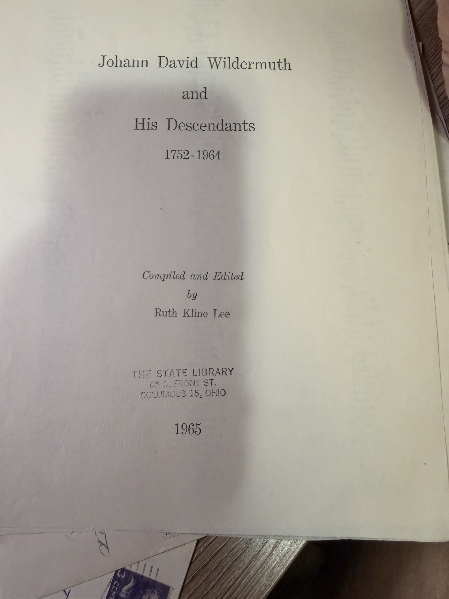
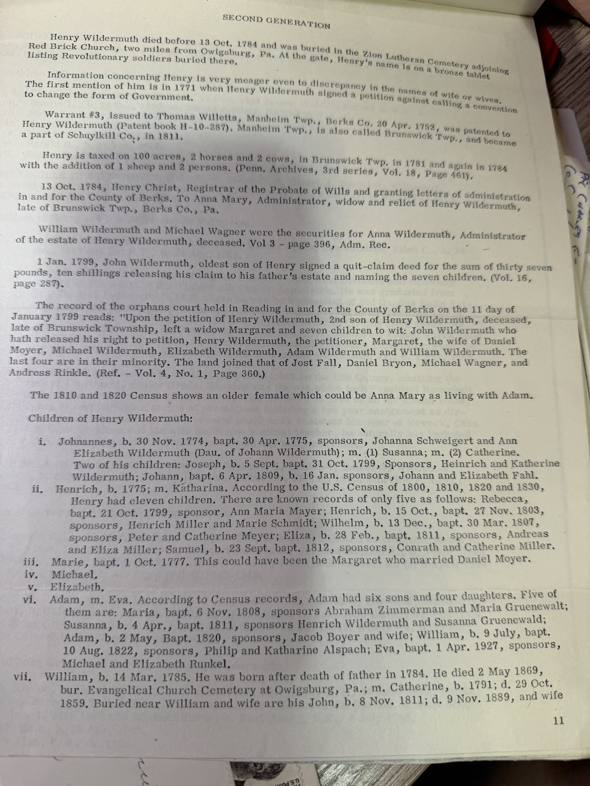

> **This is not Chuck's line.** The Wildermuths in this book descend from **Johann David Wildermuth**, who landed at Philadelphia on the ship *Halifax* in **1752** and settled in **Berks County, Pennsylvania** — ninety-five years and one state away from [Johann Michael](/family/johann-michael-wildermuth/), who landed at New York in 1847 and went to Ohio. The book is here because [Robert Earl](/family/robert-earl-wildermuth/) used it, quoted from it, and it answers questions the archive has been carrying.

> **Johann David Wildermuth and His Descendants, 1752–1964**
> *Compiled and Edited by* **Ruth Kline Lee**
> The State Library, 65 S. Front St., Columbus 15, Ohio · **1965**

In his [1991 letter to Mrs Allen](/archive/wildermuth-genealogy-letter-campaign/) Robert Earl described this as *"Appendix A, Notes on the Ancestry of Johann David Wildermuth, a part of a book titled 'Johann David Wildermuth and His Descendents — 1752–1964' on file in the Ohio State Library, 65 South Front Street, Columbus, Ohio."* Exactly right, down to the street address — he had the pages in his file. The compiler was **Ruth Kline Lee**; Dr Hans Wildermuth is quoted *inside* it.

## Appendix A — the source of the Pleidelsheim quotation

The line Robert Earl quoted for thirty years turns out to be a **letter from Dr Hans Wildermuth**, reproduced here:

> *"The Wuerttemburg Wildermuths have their origin in the village of Pleidelsheim and Riedenshausen [Rielingshausen] near the small town of Marbach (where the poet Schiller was born) in the North East of Stuttgart."*

And the appendix explains who he was. There is a **Wildermuthstrasse in Tübingen** named for **Ottilie Wildermuth, the poetess** — wife of **Dr Johann David Wildermuth**, a high-school professor who *"originated from Pleidelsheim."* **Dr Hans Wildermuth, born 1897, was the professor's grandson**, and he told the American researchers he *"knew of no one named Johann David who emigrated to America."*

## Somebody wrote to Rielingshausen thirty years before Robert Earl did

The appendix prints two replies, and the first is remarkable in this archive's context:

> *"(1) Ev. Pfarramt – Rielingshausen, **2 Apr. 1957**: 'Unfortunately I could not find the name of Johann David Wildermuth and his father Daniel in the old records of the Parish Rielingshausen. **The Wildermuths have their origin in our village** but Johann David Wildermuth and his wife were probably living in another village.' Signed, **Herman Seeger**."*

A different family, a different continent's worth of researchers, writing to **the same parish office** — and getting the same shape of answer Robert Earl would get in [1987](/archive/rielingshausen-parish-correspondence/): *not this man, but the Wildermuths are ours.*

A second reply, from **Martin Benzing**, reports that neither Johann David nor a Daniel nor a Ludwig can be found in the Rielingshausen marriage registers 1670–1752 or the baptismal registers 1724–52: *"The Wildermuths of those years have all other names."*

## What the book documents about that line

- **Arrived 22 September 1752** aboard the **ship *Halifax***, out of **Rotterdam**, master **Thomas Coatam**, and *"signed the oath of allegiance the same day."* A facsimile of the signature list is reproduced.
- **13 March 1755** — paid fifteen pounds for a warrant to take up **100 acres in Bern Township, Berks County**, adjoining Peter Robinson and Bernard Zweizig. The warrant is transcribed in full, signed **Robt. H. Morris**, and the clerk spelled him **"David Wildermood."**
- Tax records track the clearing of that land: 40 acres in 1767, 55 in 1768, **75 acres by 1779**.
- No family appears with him on the passenger list, and the book reasons from a newspaper death notice that his son William was born before 1749 — so he probably **did** bring a family.

The second generation runs through **Henry Wildermuth**, dead before 13 October 1784 and buried at the **Zion Lutheran Cemetery** by the Red Brick Church; the book works him out of Berks County orphans'-court and probate records. From there it descends through seven numbered generations to Wildermuths serving in the Second World War.

## Why it matters here

**It closes a loop with the Erling material.** When [Mrs Ellen Allen wrote from Phoenix in 1991](/archive/erling-family-group-record-203/) about an Ebling connection, her family was **Berks County, Pennsylvania** — and *this* is the Berks County Wildermuth line. Robert Earl told her so in his reply: *"the Johann David Wildermuth cited above settled for awhile in Berks County, Pa."* Her guess was reasonable; it just pointed at the wrong Wildermuths.

**And it shows what he was up against.** Ruth Kline Lee's researchers had already, by 1957, established that Johann David could not be found in the Rielingshausen registers. Robert Earl read that, understood that his own family *could* be — because his grandfather's line ran back to Rielingshausen and Großaspach — and wrote to the parish anyway. He was right.

**Still open:** whether the Berks County Wildermuths and the Württemberg Wildermuths of Rielingshausen meet anywhere. Dr Hans Wildermuth's letter puts both groups' origin in **Pleidelsheim and Rielingshausen**, which is suggestive and nothing more. Nobody has tested it.

> *Source: Ruth Kline Lee (comp. and ed.), "Johann David Wildermuth and His Descendants, 1752–1964," The State Library, Columbus, Ohio, 1965; pages photocopied for Robert Earl Wildermuth and filed by him as DOCUMENT 4, "Background." Photographed 2026.*
