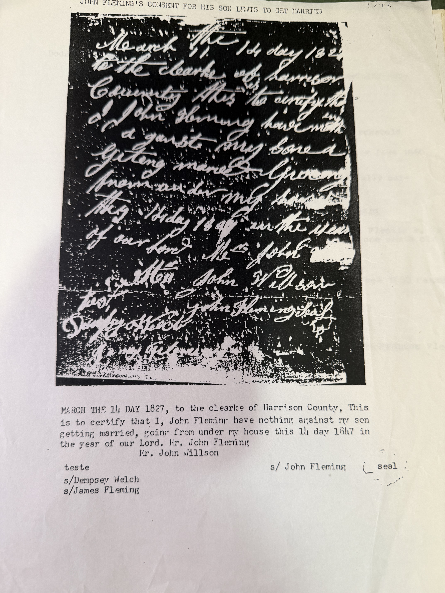

**The document, not the transcription.** This archive has been working from Robert Earl Wildermuth's typed version of this note and saying so as a caveat. Here is a photograph of the manuscript, with his heading across the top:

> **JOHN FLEMING'S CONSENT FOR HIS SON LEWIS TO GET MARRIED**

His typed reading, printed beneath the image:

> *"MARCH THE 14 DAY 1827, to the clearke of Harrison County, This is to certify that I, **John Fleming** have nothing against my son getting married, going from under my house this 14 day 18[2]7 in the year of our Lord. **Mr. John Fleming** / Mr. John Willson*
>
> *teste — s/**Dempsey Welch**, s/**James Fleming** — s/ **John Fleming** (seal)"*

The manuscript is heavily contrasted in reproduction but the signature line and seal are visible, and the reading is consistent with what can be made out.

## What this adds

**The caveat comes off.** [Lewis Fleming's page](/family/lewis-fleming/) and [John Fleming IV's](/family/john-fleming-iv/) both carried a note that only a transcription survived here. The image is now in the archive. The name in the body and the name on the signature line are both **John Fleming** — not Edward.

**It is dated the day of the wedding.** *March the 14 day 1827* — and Lewis married [Synthia Bailey](/family/synthia-bailey/) on **14 March 1827**. The consent was not obtained in advance and lodged; it was written, witnessed and produced the same day. Someone rode to the courthouse with it.

**There is a seal.** A signature with a seal, from a man whose son needed written permission — consistent with the *"land baron"* [described elsewhere](/family/john-fleming-iv/) rather than with a subsistence farmer.

## And a James Fleming witnessed it

The two witnesses are **Dempsey Welch** and — the name worth stopping on — **James Fleming**.

In November 1998 Robert Earl [withdrew the whole line above John Fleming IV](/archive/fleming-retraction-1998/) and concluded that **a James Fleming** was the family's actual progenitor, instructing that James be inserted where two Johns had been. He never left the chart that showed how.

**Here is a James Fleming, in 1827, standing as witness while John Fleming signs consent for his son.** A man close enough to the household to be asked. That is not proof of anything — James was among the commonest names in these Fleming families, and [he warned about exactly that](/archive/fleming-dear-cousins-1998/) — but if the retraction is right, this witness line is the sort of place the connection would show.

*(A third name, **Mr. John Willson**, appears above the witnesses. Whether he is the clerk, a second consenting party, or the bondsman is not clear from the reproduction.)*

**Also in the papers:** [his 1850 and 1860 Taylor County census abstracts](/archive/fleming-taylor-county-census-abstracts/) note beside Lewis, in his own hand, *"Married Synthia Bailey 14 March 1827. **Son of John Fleming**"* — and mark Lewis with a star: ***"great-great grandfather."***

> *Source: photographic reproduction of the marriage consent of John Fleming, 14 March 1827, Harrison County, Virginia, found by Robert Earl Wildermuth filed with Lewis Fleming's marriage banns at the Harrison County Court House; copy in his research papers, in Chuck's keeping. Photographed 2026.*
