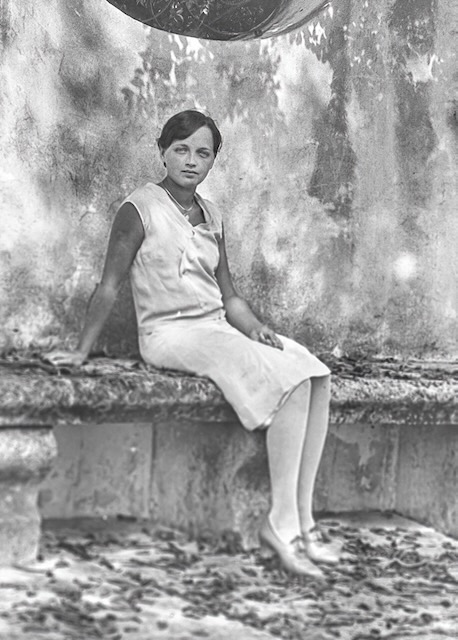

A matched pair of close-up portraits from a **Miami trip in April 1930** — [Leonard David Eesley](/family/leonard-david-eesley/) and his wife [Helen "Big Helen" (Alspach) Eesley](/family/helen-bernadine-alspach-eesley/), each photographed on the same weathered stone bench against a sunlit plaster wall. Married in 1925, the couple were in their twenties here (Leonard about twenty-five, Big Helen about twenty-eight), a few months before their son [Tommy](/family/tommy-eesley/)'s December 1930 birth.

Leonard is above; Big Helen is below, in a light sleeveless dress on the same bench.

*Big Helen (Alspach) Eesley, Miami, April 1930 — the source of her page portrait.*

> *Source: Eesley family archive, from Roberta Burnes Walker's keeping.*
