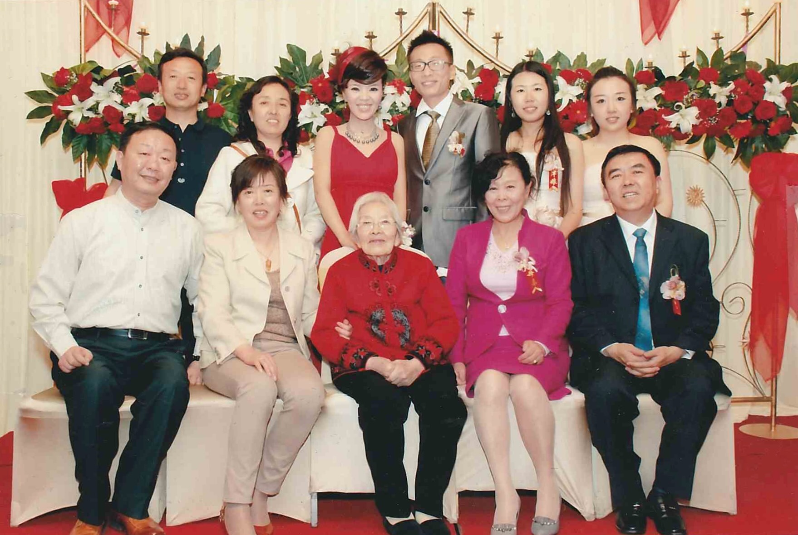

<strong>📖 本页含中文版本 — <a href="#zh">点此跳至中文 ↓</a></strong> &nbsp;·&nbsp; <em>This page has a Chinese version below.</em>

A three-generation family group at the wedding of **[Li Bei](/family/li-bei/)** and **[Hong Bin](/family/hong-bin/)**, Qingdao, c. late 2000s — from [Lijie](/family/lijie-zhou/)'s maternal side. The framed print carries a typed caption card that names everyone with birth years; the identifications below follow it. Because [Shang Yaozhen](/family/yaozhen-shang/) (1921–2013) is seated at the center, the photograph predates 2013.

**Back row, left to right:**

- **[De Chang Ding](/family/de-chang-ding/)** (b. 1956) — husband of Bo Li.
- **[Li Bo](/family/bo-li/)** (b. 16 July 1957) — Li Xun's younger sister (Lijie's maternal aunt).
- **[Li Bei](/family/li-bei/)** (b. 1981) — the bride; Lijie's cousin.
- **[Hong Bin](/family/hong-bin/)** (b. 1980s) — the groom; Li Bei's husband.
- **[Zhou Lijie](/family/lijie-zhou/)** (b. 1983).
- **[Ding Lijun](/family/ding-lijun/)** (b. 1987) — "Junjun," Bo Li's daughter; Lijie's cousin.

**Front row (seated), left to right:**

- **[Zhou Ling](/family/ling-zhou/)** (b. 1 December 1955) — Lijie's father.
- **[Li Xun](/family/xun-li/)** (b. 20 June 1956) — Lijie's mother.
- **[Shang Yaozhen](/family/yaozhen-shang/)** (1921–2013) — Lijie's maternal grandmother.
- **[An Qin Teng](/family/an-qin-teng/)** (b. 1953) — Li Mengling's wife.
- **[Li Mengling](/family/mengling-li/)** (b. 1952) — Li Xun's elder brother (Lijie's maternal uncle).

This photograph is the single richest key to the living Zhou–Li generations in the archive: it supplied the exact birth dates now recorded for Lijie's parents, her aunt and uncle, and her cousins.

*A second frame from the same wedding; the people are as identified in the group above.*

## 中文

**李蓓与洪彬婚礼上的家族合影，青岛，约2000年代末**

出自[Lijie](/family/lijie-zhou/)母系的一张三代同堂合影，摄于**[李蓓](/family/li-bei/)与[洪彬](/family/hong-bin/)的婚礼**，青岛，约2000年代末。相框内附有一张打印的说明卡，注明每个人的姓名与出生年份；以下辨认即依此卡。因[尚耀真](/family/yaozhen-shang/)（1921–2013）坐于正中，此照当摄于2013年之前。

**后排，自左至右：**

- **[丁德昌](/family/de-chang-ding/)**（1956年生）&mdash; 李勃之夫。
- **[李勃](/family/bo-li/)**（1957年7月16日生）&mdash; 李恂的妹妹（Lijie的姨妈）。
- **[李蓓](/family/li-bei/)**（1981年生）&mdash; 新娘；Lijie的表姊妹。
- **[洪彬](/family/hong-bin/)**（1980年代生）&mdash; 新郎；李蓓之夫。
- **[周丽婕](/family/lijie-zhou/)**（1983年生）。
- **[丁丽珺](/family/ding-lijun/)**（1987年生）&mdash; 小名"珺珺"，李勃之女；Lijie的表姊妹。

**前排（坐），自左至右：**

- **[周凌](/family/ling-zhou/)**（1955年12月1日生）&mdash; Lijie的父亲。
- **[李恂](/family/xun-li/)**（1956年6月20日生）&mdash; Lijie的母亲。
- **[尚耀真](/family/yaozhen-shang/)**（1921–2013）&mdash; Lijie的外祖母。
- **[滕安琴](/family/an-qin-teng/)**（1953年生）&mdash; 李孟令之妻。
- **[李孟令](/family/mengling-li/)**（1952年生）&mdash; 李恂的兄长（Lijie的舅舅）。

这张照片是本档案中厘清周—李两家在世各代关系最重要的一份材料：Lijie的父母、舅姨、表亲等确切出生日期，皆据此卡补入。

> *Source / 来源：Zhou–Li family photograph with a typed caption card; provided by Lijie's family, 2026.*
