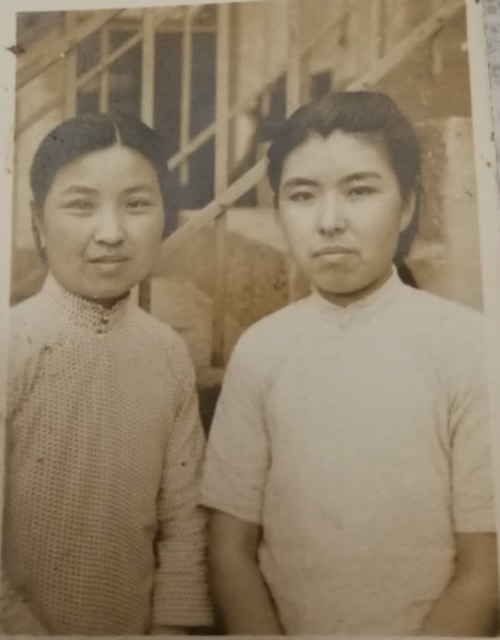

Two black-and-white photographs of young women in **qipao** (旗袍), c. 1940s, from [Lijie](/family/lijie-zhou/)'s maternal side. Identified by **Lijie's mother, [Li Xun](/family/xun-li/), in 2026** — these are the **earliest young-adult likenesses of Lijie's maternal grandmother [Shang Yaozhen](/family/yaozhen-shang/) in the archive.**

**First photograph (above):** on the **right** is **[Shang Yaozhen](/family/yaozhen-shang/)** (Lijie's maternal grandmother); on the **left** is **Hou Wuxun (侯吾迅)**, a classmate of Yaozhen's (not a family member).

**Second photograph (above):** on the **right** is again **[Shang Yaozhen](/family/yaozhen-shang/)**; on the **left** is her elder sister **[Shang Yaoxiang](/family/yaoxiang-shang/)** (b. 1911).

An earlier version of this entry guessed the pictures showed "one of Lijie's grandmothers with a sister," with identities unconfirmed. Li Xun's 2026 identification settles it: both frames are of Shang Yaozhen — once with her schoolmate Hou Wuxun, once with her sister Yaoxiang.

> *Source: Zhou–Li family photographs; identified by Li Xun (Lijie's mother), 2026.*
