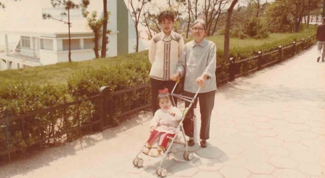

Three color photographs from [Lijie](/family/lijie-zhou/)'s early childhood in [Qingdao](/places/qingdao/), mid-1980s — the first images of both her grandmothers in this archive.

The photograph above is a family dinner with **both of Lijie's grandmothers**: at the left of the frame, in a dark Mao-style jacket and round glasses, is **[Shang Yaozhen](/family/yaozhen-shang/)** (Lijie's maternal grandmother, 1921&ndash;2013); at the right, in a dark coat, is **[Sun Yunzhe](/family/yunzhe-sun/)** (Lijie's paternal grandmother, d. 2023), with a young Lijie between them. It is the first clear photograph of Sun Yunzhe in the archive. Lijie's grandfathers are absent — her maternal grandfather [Li Zhongchu](/family/zhongchu-li/) had died in 1982, the year before she was born — so it was the two grandmothers who anchored her early childhood, Shang Yaozhen especially appearing again and again in these photographs.

*Lijie's mother **[Li Xun](/family/xun-li/)** with her mother **[Shang Yaozhen](/family/yaozhen-shang/)** and baby Lijie in a Qingdao park, c. 1984 — three generations of the maternal line.*

*Shang Yaozhen with two of her grandchildren, c. mid-1980s — young Lijie at left, with a cousin (not yet named).*

> *Source: Zhou–Li family photographs; the two grandmothers (Shang Yaozhen in glasses, Sun Yunzhe in the dark coat), Li Xun, and Lijie identified by Chuck and Lijie, 2026.*
