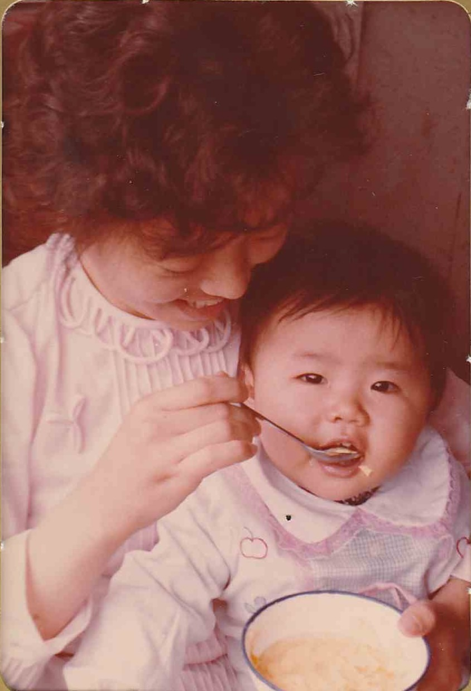

<strong>📖 本页含中文版本 — <a href="#zh">点此跳至中文 ↓</a></strong> &nbsp;·&nbsp; <em>This page has a Chinese version below.</em>

Color photographs from [Lijie](/family/lijie-zhou/)'s early childhood in [Qingdao](/places/qingdao/), on the maternal side (c. 1984–88).

Above: Lijie's mother **[Li Xun](/family/xun-li/)** with her own mother, **[Shang Yaozhen](/family/yaozhen-shang/)** (Lijie's maternal grandmother, c. 1925&ndash;2013), and baby Lijie in a Qingdao park. Because Lijie's maternal grandfather [Li Zhongchu](/family/zhongchu-li/) had died in 1982 — the year before she was born — the widowed Shang Yaozhen is the grandparent who appears again and again through Lijie's childhood.

*Left: **[Lijie](/family/lijie-zhou/)** (b. 1983) as a young girl. Right: her maternal great-aunt **[Shang Yaoxiang](/family/yaoxiang-shang/)** holding the baby **[Ding Lijun](/family/ding-lijun/)** ("Junjun," b. February 1987), Lijie's cousin. Per [Li Xun](/family/xun-li/)'s July 2026 note, the woman holding the baby is **Yaoxiang, not Yaozhen** — so the photo dates to about **1988**, when Junjun was an infant.*

For the family-dinner frame with **both** of Lijie's grandmothers together, see [Lijie with both grandmothers, c. 1986–87](/archive/lijie-with-two-grandmothers-c1986/).

> *Source: Zhou–Li family photographs; Shang Yaozhen, Li Xun, and Lijie identified by Chuck and Lijie, 2026.*

*A young woman spoon-feeding a baby, c. mid-1980s. Best guess (to be confirmed by [Li Xun](/family/xun-li/)): [Li Xun](/family/xun-li/) feeding baby [Lijie](/family/lijie-zhou/).*

## 中文

**幼时的Lijie与母亲、外祖母 &mdash; 青岛，约1984年**

Lijie在[青岛](/places/qingdao/)幼年时的彩色照片，出自母系（约1984&ndash;88年）。

上图：Lijie的母亲**[李恂](/family/xun-li/)**与她自己的母亲**[尚耀真](/family/yaozhen-shang/)**（Lijie的外祖母，c. 1925&ndash;2013）及襁褓中的Lijie，摄于青岛某公园。因Lijie的外祖父[李仲初](/family/zhongchu-li/)已于1982年（她出生前一年）辞世，寡居的尚耀真便是贯穿Lijie童年、屡屡出现的祖辈。

第二张：左侧为幼时的**[Lijie](/family/lijie-zhou/)**（1983年生）；右侧其姨外祖母**[尚耀香](/family/yaoxiang-shang/)**怀抱婴儿**[丁丽珺](/family/ding-lijun/)**（小名"珺珺"，1987年2月生），即Lijie的表亲。据[李恂](/family/xun-li/)2026年7月手记，抱婴孩的是尚耀香，**并非尚耀真** &mdash; 故此照约摄于**1988年**，珺珺尚在襁褓。

两位祖母同框的家宴照，另见[Lijie与两位祖母，约1986&ndash;87年](/archive/lijie-with-two-grandmothers-c1986/)。
