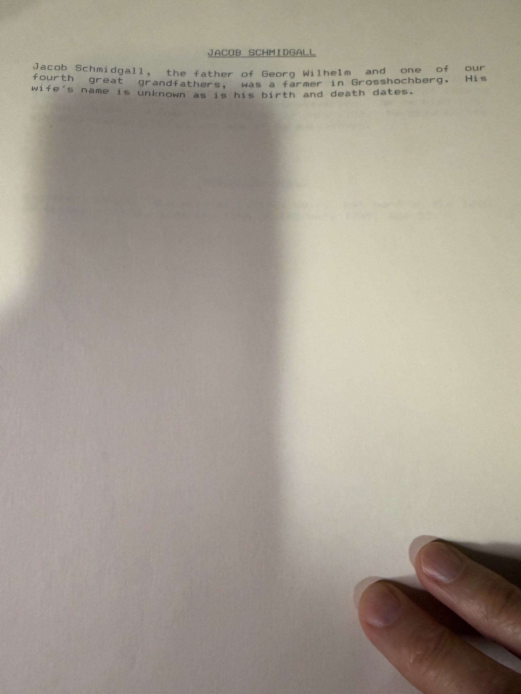
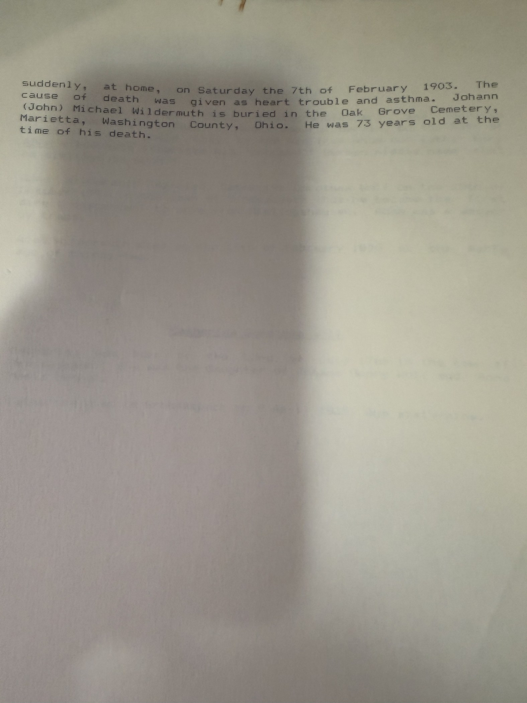

The archive already held the **[Little Histories](/docs/robert-earl-wildermuth-little-histories/)** — the one-page ancestor sketches [Robert Earl Wildermuth](/family/robert-earl-wildermuth/) wrote after retiring, transcribed from an OCR'd scan of his memoir. These are **the pages themselves**, photographed from his file. They add two ancestors the archive never had, correct several OCR readings, and include a research essay the transcription did not cover.

## Die Familien Wildermuth — the research essay

His account of the German search, in his own voice — and it contains the single most useful correction in the batch.

> *"Dr. Andreus, our fourth great-grandfather, was the father of Adam Wildermuth and … he was a **Weingartner (vineyard gardener)** in Rielingshausen where his son Adam was born in 1768."*

**Weingärtner**, not *Gärtner*. [Andreas's page](/family/andreus-wildermuth/) has long described him as a *Gartner* glossed as vineyard gardener. The word Robert Earl actually used is the precise Württemberg term for a **vine-dresser** — a man who worked vines, not gardens. The gloss was right; the word was imprecise.

The essay also records:

- **How the German breakthrough happened.** *"These small towns … were the centers of my queries to the burgermeisters (mayors) of each city. **Only from Grossaspach did I get a positive answer** concerning great-grandfather Johann Michael."* Four town halls written to; one answered usefully. That is where the [Familienregister](/archive/wildermuth-familienregister-grossaspach/) came from.
- **Dr. Hans Wildermuth's line**, quoted directly: the Württemberg Wildermuths originate *"in the villages of Pleidelsheim and Riedenshausen (Rielingshausen) near the small town of Marbach in the North East of Stuttgart."*
- **The Wildermuthstrasse in Tübingen**, named for **Ottilie Wildermuth**, *"quite a famous poetess"* — wife of Dr Johann David Wildermuth, a high-school professor.
- And an honest note on method: *"One must keep in mind that doing research in Germany when one doesn't read or write the language is a slow and difficult task."*

## Two ancestors the archive did not have

**[Balthus Wolf](/family/balthus-wolf/)** — *"our great, great, great, great, great-grandfather (that's our fifth great-grandfather)"* — born **1710 in Grossaspach**, married **[Magdalena Ubele](/family/magdalena-ubele/)** *"a home town girl"* on **27 July 1733**, died **6 December 1787** at seventy-seven. Magdalena was born **10 August 1717** and died **13 February 1769**, aged fifty-two.

They are the parents of Johann Georg Wolf, and they push the Wolf line back a generation.

## Where the shoemaking actually started

> *"Johann Georg Wolf, a fourth great grand-father, was born in Rohrbach on the 20th day of June 1742. **Johann was an early German shoemaker.**"*

The archive has treated shoemaking as a Wildermuth trade running from [Johann Christian](/family/johann-christian-wildermuth/) (b. 1794) to his emigrant son. It goes back further and enters from the other side: **[Johann Georg Wolf](/family/johann-georg-wolf/)** (b. 1742) was a shoemaker, and his daughter [Catharina Dorothea Wolf](/family/catharina-dorothea-wolf/) married [Adam Wildermuth](/family/adam-wildermuth/) the weaver. Their son Johann Christian took up his **maternal grandfather's** trade, not his father's — and his son carried it to Ohio, where he worked at it for fifty years.

Four generations of shoemakers, and the line runs **Wolf → Wildermuth**.

## The other sketches

**Adam Wildermuth** — *"Adam was a weaver by trade"*, confirming what the Familienregister says, and *"thus he became the first direct descendent to move from Rielingshausen."* Robert Earl also asks a question worth keeping: *"Could this be the man from whom our father Earl Adam Wildermuth inherited his 'uncommon' German middle name that he disliked so much?"*

*One conflict:* he gives the marriage as **25 October 1797**. The [annotated chart](/archive/rielingshausen-parish-correspondence/) and the FamilySearch tree both say **1791** — which must be right, since Johann Christian was born in 1794.

**One spelling settled.** Johann Christian's marriage place is typed **"Ristenau"** on his sheet and **"Rietenau"** on Georg Wilhelm Schmidgall's — both in the same hand, days apart. **Rietenau** is the real village, and the Familienregister confirms it. "Ristenau," which the archive carried for years, was his own typo.

## The John Michael sketch, in an earlier draft

This is an **earlier draft** of [the finished account](/docs/john-michael-wildermuth-sketch/), and its dates are different again. Across his drafts the two Philadelphia court appearances drift:

| Draft | Declaration | Petition and oath |
|---|---|---|
| This one | 1 Nov **1850** | 1 Nov **1852**, *"after waiting two years"* |
| The finished account | 1 Nov 1852 | 1 Nov 1852 *(second date a slip)* |
| **The documents** | **1 Nov 1852** *(index)* | **1 Nov 1853** *(the petition itself)* |

He had the *structure* right from the start — declaration, wait, petition and oath the same day — and never quite pinned the years. The [documents settle them](/archive/wildermuth-philadelphia-index-records/).

This draft also gives his age at death as **73**; the finished one says 72. Born 23 August 1830 and dead 7 February 1903, he was **72**.

Two details here are better than the transcription the archive was working from: the marriage application is dated **September 3** (matching [the application itself](/archive/wildermuth-marriage-and-census-records/), where the OCR'd text had "September 6"), and the minister is **the Reverend A. H. Seipels**. And Robert Earl is more careful about Frederika than later summaries suggest — *"she may have been an older sister, cousin or aunt."*

> *Source: Robert Earl Wildermuth's genealogical research papers, c. 1988–93; photographed 2026. Transcribed text: [the Little Histories](/docs/robert-earl-wildermuth-little-histories/).*
