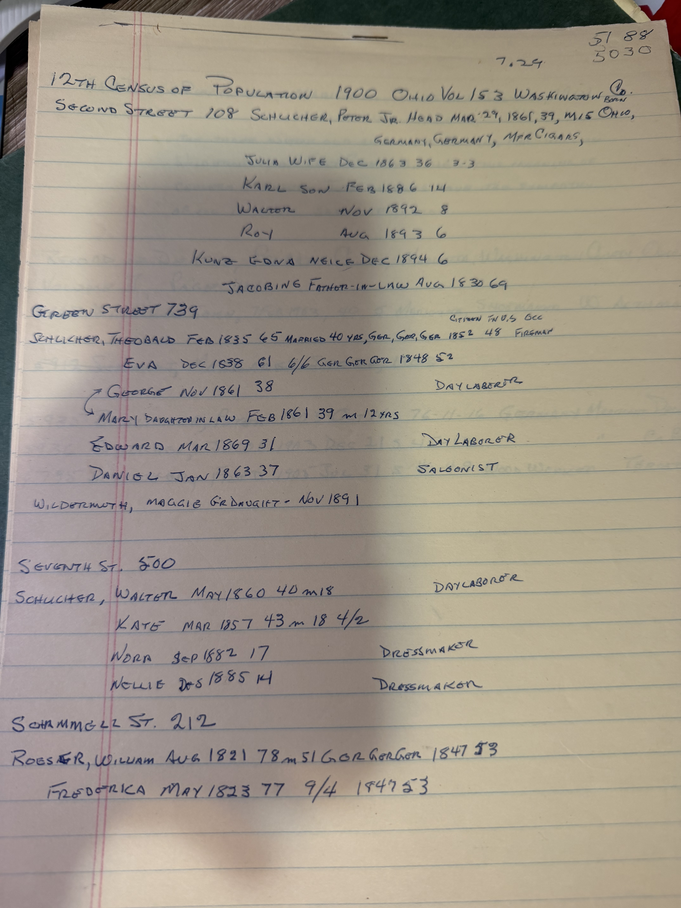

Two sheets in blue ink: the **1900 federal census for Marietta**, household by household, and a page of **Washington County probate death records**. Between them they add an immigration year the archive never had, confirm a family size exactly, and record a death nobody here knew about.

## 739 Green Street

> **SCHLICHER, THEOBALD** — Feb 1835, 65, **married 40 yrs** · Ger/Ger/Ger · **citizen, in U.S. 1852, 48 [years]** · **Fireman**
> **Eva** — Dec 1838, 61 · **6/6** · Ger/Ger/Ger · **1848**, 52
> **George** — Nov 1861, 38 · Day Laborer
> **Mary**, daughter-in-law — Feb 1861, 39, m. 12 yrs
> **Edward** — Mar 1869, 31 · Day Laborer
> **Daniel** — Jan 1863, 37 · **Saloonist**
> **WILDERMUTH, MAGGIE, granddaughter** — Nov 1891

**Theobald came over in 1852.** [His page](/family/theobald-david-schlicher/) has said only that he must have arrived "before 1861," because that is when he married. The census asks the question directly and he answered it: **1852**, forty-eight years in the country, and naturalised. He was seventeen.

**Eva came in 1848** — four years ahead of her future husband, as a girl of nine or ten with [her Bavarian family](/family/john-jacob-schmidt/). The archive dated the Schmidt emigration to "the late 1840s"; this fixes it.

**"6/6" settles the family.** Six children born, six living. The archive lists exactly six — George, Daniel, David F, Edward, Flora, Emma — from the GEDCOM. Their mother confirmed the count to an enumerator in 1900.

**And Theobald was a fireman**, not a labourer. His sons at home were day labourers, except **Daniel, a saloonist**.

### The granddaughter in the house

**Maggie Wildermuth, born November 1891, was living with her Schlicher grandparents in 1900.** She is [Flora](/family/flora-schlicher-wildermuth/) and [William Clifford](/family/william-wildermuth/)'s daughter Margaret, aged eight — the "Margaret 28" of 1919.

The address matters too. **739 Green Street is the Schlicher house in 1900** — and by the [1914–15 city directory](/archive/marietta-city-directories-wildermuth/) it is **William Clifford Wildermuth's address**. The Wildermuths moved into Flora's parents' house.

## The child who lived three weeks

The second sheet copies a notice from **the Marietta *Daily Register*, Tuesday 2 July 1901**:

> *"**WILDERMUTH CHILD.** The three week old child of Mr. and Mrs. William Wildermuth, on East Greene, died this morning of **cholera infantum**. The parents have the sympathy of all in their sad affliction."*

**A child of William Clifford and Flora, born about 11 June 1901, dead on 2 July.** The archive has never held this baby — not in the nine children, not anywhere. *Cholera infantum* was the summer diarrhoeal disease that killed infants in American towns by the thousand before refrigeration and clean milk; July was its season.

It also means Flora's nine children are **at least ten births**, and that the ninth child arrived and died in the same month her sister-in-law's household was three doors along.

## Deaths in the probate record

*Record of Deaths, Probate Court, Marietta, Washington County, Ohio — Volume II, page 144:*

| No. | Entry |
|---|---|
| 5467 | **Wildermuth, John** — 7 Feb 1903 — Marietta — **Shoemaker** — **Asthma** |
| 5917 | Schmidt, Margaret — 26 Sep 1903 *(struck through)* |
| 5935 | **Schlicher, Peter** — 16 Oct 1903 — 76-11-16 — Germany — **Merchant** — Dropsy of Chest |
| 5936 | **Schlicher, Jacob** — 21 Dec 1903 — 45-13 — Germany — Ca. Bowels |
| 6795 | **Schlicher, Fred** — 31 Jul 1905 — 46-4-9 — **Wood Worker** — Throat & Lungs |

Entry 5467 is **[Johann Michael Wildermuth](/family/johann-michael-wildermuth/)** — the record whose famously wrong age of forty [he caught and challenged in 1977](/family/johann-michael-wildermuth/). What the abstract adds is the cause: **asthma**, with his trade given as **shoemaker** to the end.

The three Schlicher deaths are men this archive has no place for — a **Peter Schlicher**, merchant, born in Germany about November 1826, and a **Jacob** and a **Fred**. The 1900 census sheet also carries two more Schlicher households:

- **108 Second Street** — **Peter Schlicher Jr.**, born 29 March 1861 in **Ohio** to German parents, a **manufacturer of cigars**; wife **Julia** (Dec 1863, 3 children/3 living); sons **Karl** (1886), **Walter** (1892) and **Roy** (1893); a niece **Edna Kunz** (Dec 1894); and **Jacobine**, aged 69, born August 1830, entered as **father-in-law** — a female name against a male relationship, so one or the other is a slip of the enumerator's pen.
- **500 Seventh Street** — **Walter Schlicher**, day labourer, with **Kate** (4 children born, 2 living) and daughters **Nora** and **Nellie**, both **dressmakers** at seventeen and fourteen.

**Marietta held several Schlicher households and the archive is connected to only one of them.** Peter Jr., born in Ohio in 1861, is of Flora's generation exactly — a cousin, most likely, and the cigar trade would be worth following.

## And the Röesers

> **ROESER, WILLIAM** — Aug 1821, 78, **married 51 yrs** · Ger/Ger/Ger · **1847**, 53
> **Frederica** — May 1823, 77 · **9/4** · **1847**

This is the **William Röeser** whose [1847 naturalization papers](/archive/william-roeser-naturalization-papers-1847/) settled the question of Johann Michael Wildermuth's own naturalization, and in whose household the [1860 census](/archive/wildermuth-marietta-censuses-1860-1880/) found the young shoemaker living.

**He and Frederica arrived in 1847 — the same year as Johann Michael.** Whether they crossed together is not shown by anything here, but the coincidence is worth having: the boy of sixteen who came in 1847 was boarding thirteen years later with a couple who had made the same crossing in the same year.

**Nine children born, four living.** Five of the Röesers' children were dead by 1900.

> *Source: handwritten abstracts of the 12th Census of Population, 1900, Ohio Vol. 153, Washington County; the Marietta* Daily Register*, 2 July 1901; and the Record of Deaths, Probate Court, Washington County, Ohio, Vol. II p. 144 — from Robert Earl Wildermuth's research papers, in Chuck's keeping. Photographed 2026.*
