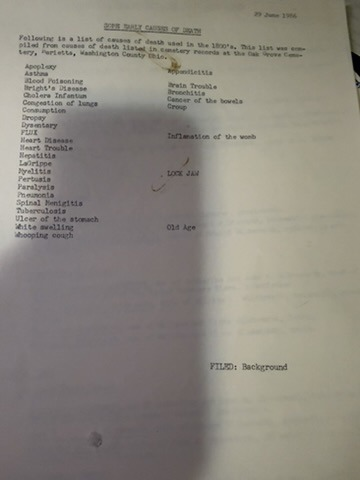
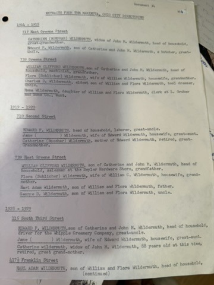
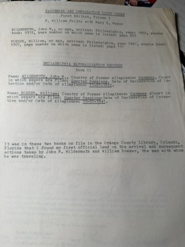

City directories are the closest thing genealogy has to a moving camera. [Robert Earl Wildermuth](/family/robert-earl-wildermuth/) worked through the Marietta volumes on file at the **Marietta College Library** and copied out every Wildermuth entry he could find. The result tracks four generations from address to address across fifty-six years — and it pins down two things the archive had only vaguely.

> *"This collection of directories is not complete in that years are missing."* — his own caveat

## Johann Michael, shoemaker

| Directory | Shop | Residence |
|---|---|---|
| **1873–74** | **50 Front Street** | Sixth Street, between Warren and Montgomery |
| **1897–98** | **134 Front Street** | **708 Sixth Street** |
| **1899–1900** | *(shoemaker, no shop given)* | **611 Washington Street** |
| **1902–03** | *(shoemaker)* | **611 Washington Street** |

**The shop moved.** His [finished narrative](/docs/john-michael-wildermuth-sketch/) says he *"had his own shop at 134 Front Street"* for thirty years — but in 1873–74 the directory puts him at **50 Front Street**. Two premises on the same street, a quarter-century apart. The 1978 letter's vaguer *"a shop on lower Front Street"* covers both.

**And the house on Washington Street now has a number.** The [1903 obituary](/archive/john-michael-wildermuth-obituary-1903/) says only that he *"died at his home on Washington Street."* The 1899–1900 and 1902–03 directories both give it: **611 Washington Street**. He moved there from Sixth Street some time in the late 1890s, and that is the house he died in on 7 February 1903.

## William Clifford — turner, then salesman

**[William Clifford](/family/william-wildermuth/)** is a **Turner** in 1897–98 and 1899–1900, living at **627 Seventh Street**. Robert Earl explains the word:

> *"William Wildermuth, my grandfather, occupation was as a person who operated a wood lathe."*

A turner at a chair factory — which is exactly where the [1880 census](/archive/wildermuth-marietta-censuses-1860-1880/) found him at **fourteen**. He stayed in that trade for at least twenty years, and by 1919–20 had moved into sales: **salesman at the Seyler Hardware Company**.

## Catherine's widowhood, and the next two generations

The later sheet is annotated in a way no other document in the archive is: Robert Earl marks **each person's relationship to himself** — *great-grandmother, grandfather, grandmother, father, uncle, great-uncle*. It reads like a man locating himself in a street map.

**1914–15**
- **717 West Greene Street** — **[Catherine (Boeshar) Wildermuth](/family/catharina-boeshar-wildermuth/)**, widow of John M., head of household (*great-grandmother*), with her son **Edward F. Wildermuth**, a **butcher** (*great-uncle*)
- **719 Greene Street** — **William Clifford Wildermuth**, head of household (*grandfather*); **[Flora (Schlicher)](/family/flora-schlicher-wildermuth/)**, housewife (*grandmother*); **Charles D.**, **tool dresser** (*uncle*); **Emma**, **clerk** (*aunt*)

Mother and son next door to each other, at 717 and 719.

**1919–20**
- **719 Second Street** — Edward F., **laborer**, with his wife Jane, and **Catherine, retired** — she had moved in with her son
- **739 West Greene Street** — William Clifford, **salesman at the Seyler Hardware Company**; Flora, housewife; **[Earl Adam](/family/earl-a-wildermuth/)** (*father*); **George D.** (*uncle*)

[Flora died in November 1919](/family/flora-schlicher-wildermuth/), so this is very near the last record of her in a household.

**1925–29**
- **115 South Third Street** — Edward F., **driver for the Whipple Creamery Company**; Jane; and **Catherine, widow of John M., 88 years old, retired** — twenty-two years a widow, living with the same son
- **417½ Franklin Street** — **Earl Adam Wildermuth**, head of household

That last address matters: Robert Earl was **born at 123 Franklin Street** in May 1924, and by the 1925–29 directory his father is at **417½ Franklin Street**. Either the family moved a few doors along the same street, or one of the two numbers is wrong. The *half* in 417½ usually means an upstairs flat.

## Four occupations for one man

Edward Frederick, the youngest son, is worth following on his own: **mechanic** (1897), **chair factory** (1899), **butcher** (1914), **laborer** (1919), **creamery driver** (1925–29). He also housed his mother for the last two decades of her life. He outlived his father by sixty-one years.

## A note on these images

All of these reached the archive as **low-resolution phone photographs** (360 × 480). House numbers were read carefully but a few — *717/719 Greene*, *739 West Greene*, *417½ Franklin* — would benefit from a better scan before anyone goes looking for the houses.

> *Source: Extracts from Marietta, Ohio city directories, taken by Robert Earl Wildermuth from volumes on file at the Marietta College Library; filed WILD-8. Companion: the [1860 and 1880 censuses](/archive/wildermuth-marietta-censuses-1860-1880/).*
