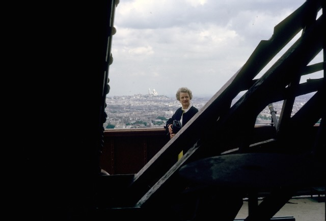

[Peggy McMaster Eesley](/family/margaret-mcmaster-eesley/) abroad, in retirement &mdash; the visible end of the line that the [eulogy](/docs/eulogy-charles-mcmaster-eesley/) named:

> *"It was her wisdom, far-sightedness and patience in investing that inspired him to become a stockbroker, **funded my grandparents' travel in retirement**, and paid for a large part of my education."*

Two frames in particular survive in the album.

**The Amalfi Coast** (lead image above) &mdash; Peggy in a houndstooth blazer over a goldenrod turtleneck, dark handbag in hand, the terraced cliffside town and its waterfront promenade behind her. The architecture and the angle of the sun read mid-to-late afternoon. The Mediterranean is the color the Mediterranean is.

**The Eiffel Tower, Paris**, framed through the iron lattice of the structure itself with the city below and **Sacré-Cœur** visible on the Montmartre hill in the distance:

These are not the largest photographs in the family album, and they are not the most dramatic. They are the ordinary record of a retired couple from Marietta, Ohio doing what investors' returns make possible &mdash; standing on the Eiffel Tower, walking the Amalfi waterfront &mdash; in their seventies, in the years between Charlie's Vietnam tour and his own children's arrivals. The eulogy's claim about her investing is concrete in these two frames. This is what it bought.
