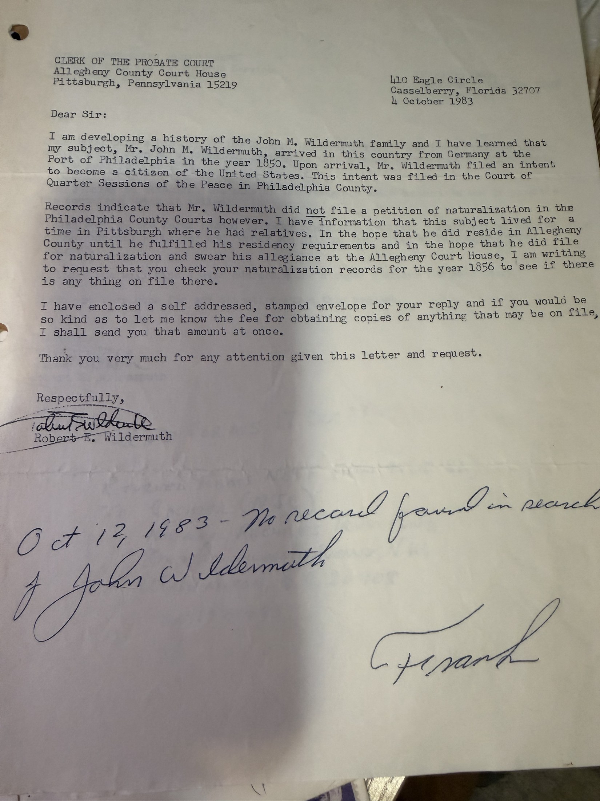
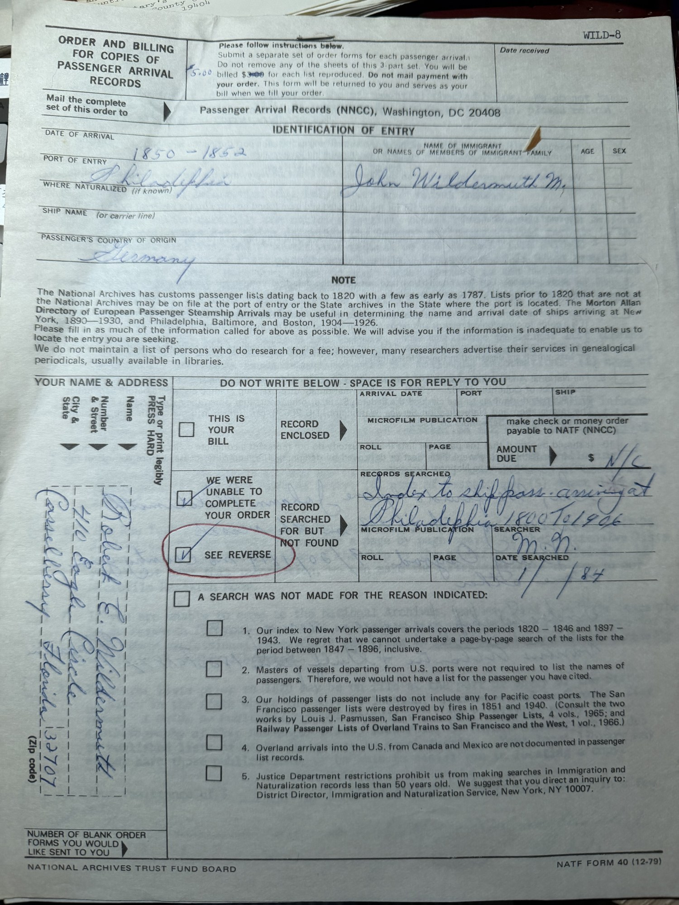

In the autumn of 1983 [Robert Earl Wildermuth](/family/robert-earl-wildermuth/) went after the one thing he never got: **the ship**. He wanted the name of the vessel that carried his great-grandfather [Johann Michael](/family/johann-michael-wildermuth/) to America, and the port it sailed from.

Four offices in eight weeks, and the answer that explains why he failed.

## The wrong port, the wrong year

He was working from a hypothesis the archive can now see was mistaken. To the **National Archives**, 2 October 1983:

> *"Mr. John M. Wildermuth, arrived in this country at the Port of Philadelphia in the year 1850 or 1851. I am seeking to establish the name of the vessel on which he arrived and if possible the port from which it sailed."*

Two days later, to the **Clerk of the Probate Court, Allegheny County Court House, Pittsburgh**:

> *"Upon arrival, Mr. Wildermuth filed an intent to become a citizen of the United States. This intent was filed in the Court of Quarter Sessions of the Peace in Philadelphia County. Records indicate that Mr. Wildermuth did **not** file a petition of naturalization in the Philadelphia County Courts however. I have information that this subject lived for a time in Pittsburgh where he had relatives … I am writing to request that you check your naturalization records for the year 1856."*

Someone in Pittsburgh wrote the answer straight onto the page in a bold hand:

> *"Oct 17, 1983 — No record found in search of John Wildermuth. — Frank"*

He wrote the same letter the same day to **Montgomery County**, at Norristown — and there he names something the file has nowhere else:

> *"I have information that Mr. Wildermuth lived for a time with relatives in either **Pottsgrove or Pottstown, Pennsylvania**."*
>
> *"P.S. The year of allegiance may have been late 1855."*

That is the only clue in the archive to **where in Pennsylvania** Johann Michael spent the year of residence his 1853 petition swears to. Pottstown and Pottsgrove sit on the Schuylkill in Montgomery County, in the heart of the Pennsylvania-German country.

The Prothonotary's reply is typed straight onto the bottom of his own letter, 28 October 1983:

> *"We have made a thorough search of our Naturalization records from 1850 thru 1906 and cannot locate anything on the above. Perhaps you should try surrounding counties such as Bucks, Berks, Delaware, Chester or Philadelphia."*

## What Philadelphia had actually sold him

A month before all this, on **6 September 1983**, the **City of Philadelphia Department of Records** had written back about a copy he had ordered — and returned his cheque for being three dollars instead of two.

> *"The cost for a photocopy of the **declaration of intention** of John M. Wildermuth will be $2.00 payable to the City of Philadelphia. I am returning your check #1501 in the amount of $3.00. Please resubmit your check in the amount of $2.00."*
> — Lee Stanley, Archivist I

**Declaration of intention.** That is how the City catalogued the 1853 sheet — and it is why Robert Earl spent the following month writing to Pittsburgh and Norristown looking for a naturalization he thought must be somewhere else. The document he already owned is headed *"The Petition of John M. Wildermuth"* and ends with the oath sworn in open court; the archivist's label and the paper's own wording do not agree, and the [question is still open](/family/johann-michael-wildermuth/).

## The answer that explains everything

The reply came from the **Federal Archives and Records Center, 5000 Wissahickon Avenue, Philadelphia** — a printed checklist with items ticked, filed by him as **Document 13**, dated **1 October 1983**.

Among the ticked paragraphs, this one:

> *"The passenger lists for the port of New York are in the National Archives in Washington, DC. The National Archives will search their indexes (1820–46 and 1897–1943) for a particular passenger but **unfortunately there is a gap in the index for the port of New York for the years 1847 through 1896.** The National Archives cannot undertake a page by page search of these records for these years."*

**Johann Michael landed at New York in 1847** — the first year of the gap.

He was searching Philadelphia because he thought the arrival was there; had he searched New York instead, the index would still have failed him, by a single year. The record of the crossing exists on microfilm somewhere in the 1847 New York manifests. Nobody in 1983 could have found it without reading the reels page by page, and the Archives would not do that.

The form also gave him the rule that shaped the rest of the hunt:

> *"Before September 27, 1906, an alien could apply for naturalization in **any court of record**, be it county, state or federal. Since each court kept its own records, it is necessary to know where the alien was living to determine the court in which he or she might have applied."*

Which is exactly why he wrote to Pittsburgh.

## What he did next

Pencil on the National Archives letter tracks the follow-through: **"RCVD FORMS 17 OCT 83 … Returned forms NATF Form 40 (10-82) to Cashier, National Archives Trust Fund, 8th & Pennsylvania Avenue N.W., Washington, D.C. 20408 on 17 Oct 83."** Forms received and returned the same day.

Nothing in the file suggests they ever found the ship.

## Worth doing now

The obstacle was an *index* gap, not a records gap. The 1847 New York passenger manifests survive, they have since been digitised and name-indexed by commercial and volunteer projects, and a passenger travelling as **Wildermuth** — or alongside a **Roesser / Roessar / Rossar** family from Baden — in 1847 is now a searchable proposition in a way it simply was not in 1983.

It is the single most findable thing left open on this line.

> *Source: Robert Earl Wildermuth's genealogical research papers, October 1983; photographed 2026. Part of his [letter campaign](/archive/wildermuth-genealogy-letter-campaign/).*
