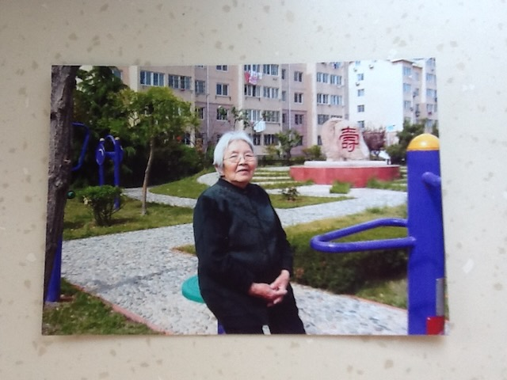
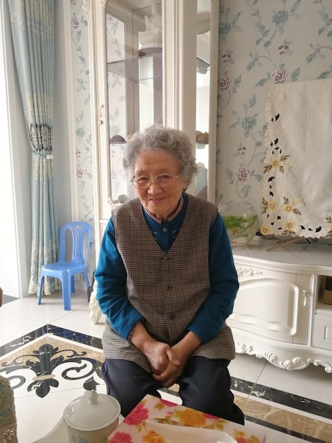
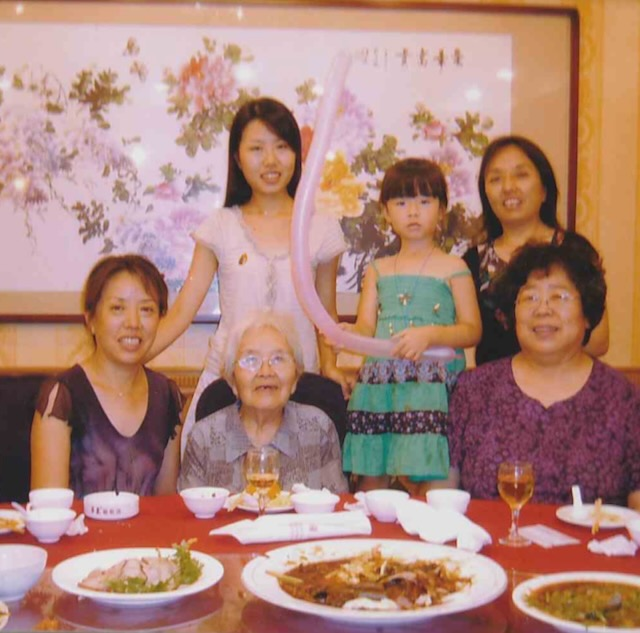
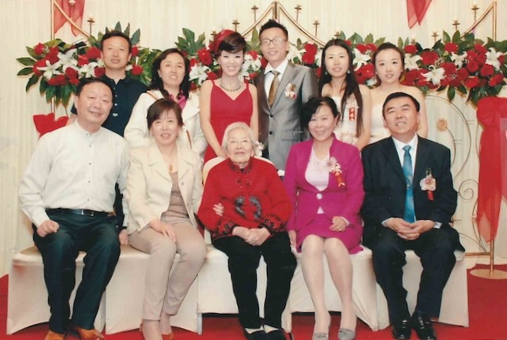

A set of later-life photographs of **[Shang Yaozhen](/family/yaozhen-shang/)** (1921&ndash;2013), [Lijie](/family/lijie-zhou/)'s maternal grandmother — the grandmother who, widowed since 1982, saw Lijie grow up. The formal red-background portrait above is the image her family used for her [FamilySearch](https://www.familysearch.org/) profile.

<aside class="not-prose my-6 border-l-4 border-stone-400 bg-stone-50/70 dark:bg-stone-900/30 px-5 py-4 rounded-r text-sm">

**Identification note.** The grandmother in these frames is identified as Shang Yaozhen by matching her FamilySearch profile photo (grey hair, oval glasses, dark clothing). Per Chuck, this is a working identification on the Zhou–Li side — **to be confirmed and refined by Lijie's mother**, [Li Xun](/family/xun-li/), who can also name the younger family members in the group photographs below.

</aside>

*In a Qingdao residential courtyard, beside the community's 壽 ("longevity") stone.*

*At home in Qingdao, later years.*

*A multi-generation family gathering at a restaurant — Shang Yaozhen seated at center, with daughters, granddaughters, and a great-granddaughter (younger family members to be named).*

*Seated at the center of the family at a grandchild's wedding (the couple and other relatives to be named).*

> *Source: Zhou–Li family photographs; grandmother identified as Shang Yaozhen by FamilySearch profile-photo match (2026); details and the younger family members pending confirmation from Li Xun.*
