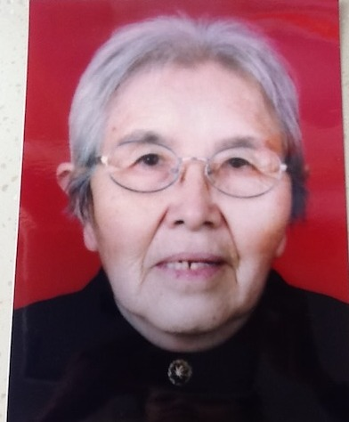
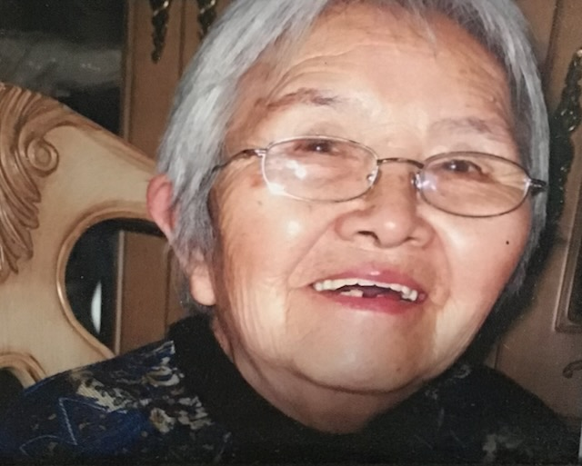

<strong>📖 本页含中文版本 — <a href="#zh">点此跳至中文 ↓</a></strong> &nbsp;·&nbsp; <em>This page has a Chinese version below.</em>

A set of later-life photographs of **[Shang Yaozhen](/family/yaozhen-shang/)** (1921&ndash;2013), [Lijie](/family/lijie-zhou/)'s maternal grandmother — the grandmother who, widowed since 1982, saw Lijie grow up. Her formal red-background portrait — the image her family used for her [FamilySearch](https://www.familysearch.org/) profile, and her thumbnail on this site — is reproduced below.

<aside class="not-prose my-6 border-l-4 border-stone-400 bg-stone-50/70 dark:bg-stone-900/30 px-5 py-4 rounded-r text-sm">

**Identification note.** The grandmother in these frames is identified as Shang Yaozhen by matching her FamilySearch profile photo (grey hair, oval glasses, dark clothing). Per Chuck, this is a working identification on the Zhou–Li side — **to be confirmed and refined by Lijie's mother**, [Li Xun](/family/xun-li/), who can also name the younger family members in the group photographs below.

</aside>

*Her formal portrait — the image her family used for her FamilySearch profile.*

*A warm close-up, smiling, in her later years.*

*At home in Qingdao, later years.*

*A multi-generation family gathering at a restaurant — Shang Yaozhen seated at center, with daughters, granddaughters, and a great-granddaughter (younger family members to be named).*

*Seated at the center of the family at a grandchild's wedding (the couple and other relatives to be named).*

> *Source: Zhou–Li family photographs; grandmother identified as Shang Yaozhen by FamilySearch profile-photo match (2026); details and the younger family members pending confirmation from Li Xun.*

## 中文

**尚耀真晚年 &mdash; 青岛**

一组**[尚耀真](/family/yaozhen-shang/)**（1921&ndash;2013，[Lijie](/family/lijie-zhou/)的外祖母）晚年的照片 &mdash; 她自1982年守寡，亲历Lijie的成长。其正式的红底肖像（家人用作[FamilySearch](https://www.familysearch.org/)头像，也是本站缩略图）见于上方。

其中包括：红底正式肖像、晚年微笑的近照、青岛家中花墙纸客厅中的留影、餐厅中的多代家庭聚会（尚耀真居中，旁有女儿、外孙女及一位曾外孙辈），以及一场孙辈婚礼上的合影（新人及其他亲属待指认）。

**身份说明**：照片中的老人经比对其FamilySearch头像（灰发、椭圆框眼镜、深色衣着）识别为尚耀真。据Chuck，这是Zhou&ndash;Li一侧的初步识别 &mdash; **有待Lijie的母亲[李恂](/family/xun-li/)确认、补正**；她亦可指认下方合影中的年轻家庭成员。
