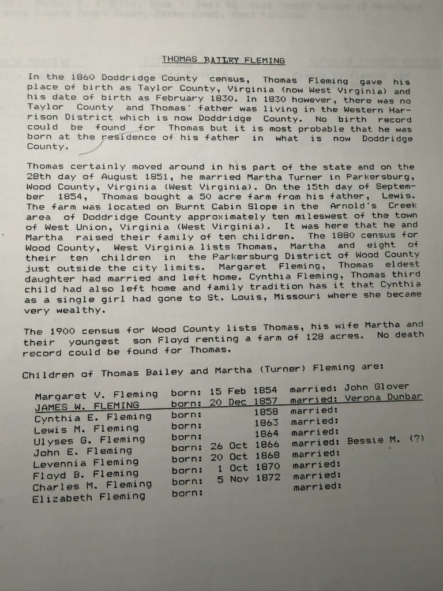

One typed page from **[Robert Earl Wildermuth](/family/robert-earl-wildermuth/)**'s research file, and the most substantial piece of original research anywhere in his papers on this line. It is not a form — it is him **reasoning from records**, showing his work, and saying plainly where the records run out.

## The transcription

> **THOMAS BAILEY FLEMING**
>
> In the 1860 Doddridge County census, Thomas Fleming gave his place of birth as Taylor County, Virginia (now West Virginia) and his date of birth as February 1830. In 1830 however, there was no Taylor County and Thomas' father was living in the Western Harrison District which is now Doddridge County. No birth record could be found for Thomas but it is most probable that he was born at the residence of his father in what is now Doddridge County.
>
> Thomas certainly moved around in his part of the state and on the 28th day of August 1851, he married Martha Turner in Parkersburg, Wood County, Virginia (West Virginia). On the 15th day of September 1854, Thomas bought a 50 acre farm from his father, Lewis. The farm was located on Burnt Cabin Slope in the Arnold's Creek area of Doddridge County approximately ten miles west of the town of West Union, Virginia (West Virginia). It was here that he and Martha raised their family of ten children. The 1880 census for Wood County, West Virginia lists Thomas, Martha and eight of their ten children in the Parkersburg District of Wood County just outside the city limits. Margaret Fleming, Thomas eldest daughter had married and left home. Cynthia Fleming, Thomas third child had also left home and family tradition has it that Cynthia as a single girl had gone to St. Louis, Missouri where she became very wealthy.
>
> The 1900 census for Wood County lists Thomas, his wife Martha and their youngest son Floyd renting a farm of 128 acres. No death record could be found for Thomas.

## The ten children

> Children of Thomas Bailey and Martha (Turner) Fleming are:

| Child | Born | Married |
|---|---|---|
| Margaret V. Fleming | 15 Feb 1854 | John Glover |
| **James W. Fleming** | 20 Dec 1857 | Verona Dunbar |
| Cynthia E. Fleming | 1858 | — |
| Lewis M. Fleming | 1863 | — |
| Ulyses G. Fleming | 1864 | — |
| John E. Fleming | 26 Oct 1866 | Bessie M. (?) |
| Levennia Fleming | 20 Oct 1868 | — |
| Floyd B. Fleming | 1 Oct 1870 | — |
| Charles M. Fleming | 5 Nov 1872 | — |
| Elizabeth Fleming | — | — |

**[James W. Fleming](/family/wesley-fleming/)** is underlined on the page in Robert Earl's hand — his own grandfather, and the line forward. *(The "Bessie M. (?)" entry sits between the Ulysses and John rows; the typewriter alignment leaves which of the two she married slightly ambiguous, though John E. is the better reading.)*

## Why the page matters

**He caught a census error and reasoned past it.** Thomas told the 1860 enumerator he was born in Taylor County — but Taylor County was not created until 1844, fourteen years after his birth, and in 1830 his father was in the Western District of Harrison County. Robert Earl noticed, said so, and concluded Thomas was most likely born at his father's residence in what is now **Doddridge County**. That is the archive's basis for the birthplace.

**It gives Cynthia a story.** The third child left home before 1880 and, by family tradition, *"as a single girl had gone to St. Louis, Missouri where she became very wealthy."* An unmarried woman leaving the Doddridge County hills alone for a river city in the 1870s is a striking thing, and the only account of her the family kept.

**It ends honestly.** *"No death record could be found for Thomas."* The 1900 census has him at seventy, still renting a farm of 128 acres with Martha and their youngest son Floyd, and then he goes out of the record.

## Where it disagrees with FamilySearch

The [family GEDCOM](/docs/dale-eesley-familysearch-tree/) gives the couple **thirteen** children. The overlap is exact: **all ten of Robert Earl's are in it, with matching dates**, and FamilySearch adds three more — **Henrietta** (Jun 1853), **"B. Fleming"** (1859), and **George McClellan Fleming** (5 Jul 1864).

Two of the three are worth a hard look. **Henrietta's June 1853 birth falls eight months before Margaret's** 15 February 1854, which full siblings cannot manage; her recorded birthplace, "Wood, Mason, West Virginia," is also a mangled place-string. **"B. Fleming"** has an initial for a name. Robert Earl's own arithmetic is internally consistent — he counts ten, and reads the 1880 census as showing eight at home with Margaret and Cynthia gone.

There are also two date disagreements, both of exactly two years:

| | Sketch | FamilySearch |
|---|---|---|
| James W. Fleming | 20 Dec **1857** | 20 Dec **1855** |
| John E. Fleming | 26 Oct **1866** | 26 Oct **1868** |

For James, **FamilySearch is probably right**: he died 2 October 1940 recorded as **age 84**, which requires a birth in late 1855, not 1857. See [his page](/family/wesley-fleming/).

> *Source: Robert Earl Wildermuth's research papers, c. 1990; photographed 2026. Companion documents: the [1851 marriage record and 1854 deed](/archive/fleming-marriage-record-and-deed/).*
