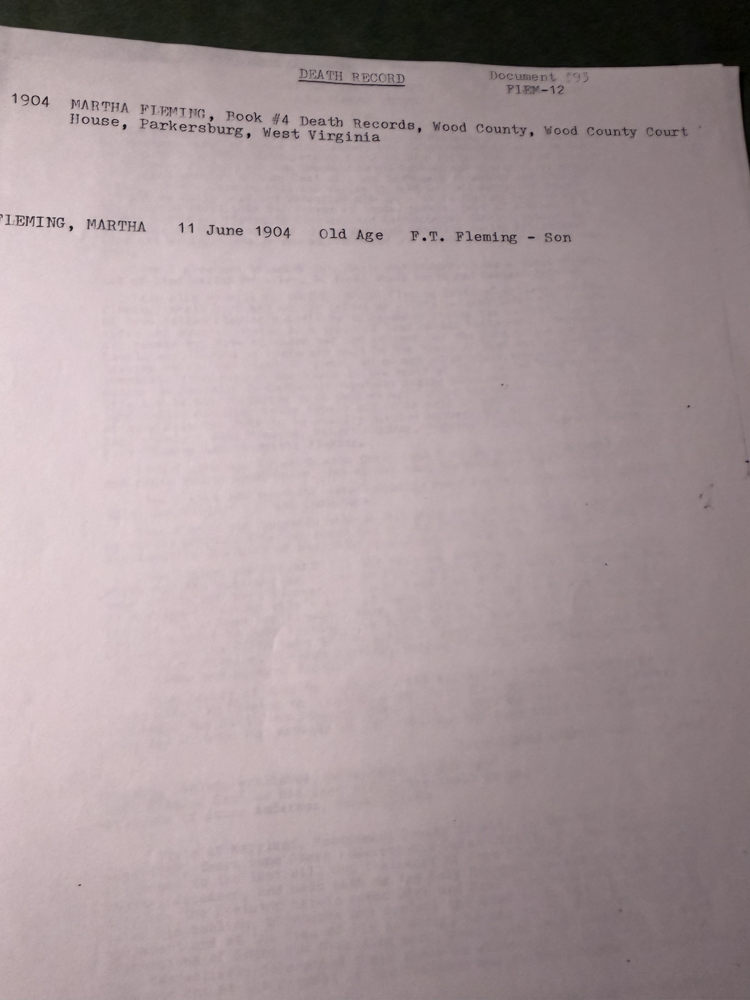

Two typed abstracts, both from Wood County, West Virginia, and between them they correct three things this archive had wrong.

## The 1900 census — Union District

> **FLEMING, THOMAS B.** — Head, White Male, **Feb 1830**, 70 years old, **Married 48 years**, W.Va./W.Va./W.Va., Farmer, **Renting a farm 118 acres**
> **Martha** — Wife, White Female, **Mar 1832**, 68 years old, **12 children born, 9 living**
> **Floyd** — Son, White Male, **Sep 1870**, 29, **Teamster**

**Three corrections.**

**The farm was 118 acres, not 128.** This archive has said 128 on four pages, following a transcription slip. Corrected.

**Martha bore twelve children, not ten.** [Robert Earl's own sketch](/archive/thomas-bailey-fleming-biographical-sketch/) names ten and the GEDCOM offered thirteen; the archive settled on ten and treated three GEDCOM names as bad attachments. **The census asked Martha herself**, and she answered **twelve born, nine living**. So two of the "bad attachments" were probably real children who died young — which is exactly what an enumerator's *"children born / children living"* pair is designed to capture and what a family group sheet compiled a century later would miss.

**Married 48 years** in June 1900 puts the wedding in **1851–52** — independent support for the **28 August 1851** register entry.

**Floyd was a teamster**, not a farm hand. Twenty-nine, still at home, driving a team for wages while his seventy-year-old father rented the ground.

*Also on the sheet, and probably not this family:* a **Margaret Fleming** at 317 Second Street, born Oct 1855, single, housekeeper, **both parents born in Ireland** — a different household from Thomas's daughter Margaret V. And in Steele District a **John Fleming**, b. Aug 1865, farmer renting 169 acres, wife **Rebecca** (b. Nov 1871), children Emma M. and Willie. If that is Thomas's son **John E.**, then his birth is Aug 1865 rather than the typescript's 26 October 1866, and his wife was Rebecca rather than the *"Bessie M.(?)"* the sketch guessed at. Not confirmed.

## Martha Fleming's death record

> **FLEMING, MARTHA — 11 June 1904 — Old Age — F.T. Fleming, Son**
> *Book #4 Death Records, Wood County Court House, Parkersburg, West Virginia*

**This settles the 1903/1904 conflict.** Robert Earl's [thirteen-page typescript](/docs/john-fleming-family-legacy/) says she *"died of (old age) on 11 June **1903**"*; his charts and this archive said **1904**. The register says **1904**, and the register wins. The typescript's 1903 was a slip.

The informant was **F. T. Fleming, her son** — almost certainly **Floyd**, the son still living with his parents in 1900. *(The typescript calls him Floyd **B.** Fleming; the death register makes him F. **T.** One of the two initials is wrong.)*

**Cause of death: old age.** She was seventy-two.

And a small, hard fact sits behind the pairing of these two documents. In 1900 Thomas was alive, seventy, renting 118 acres. By June 1904 Martha was dead and her son, not her husband, reported it. **No death record for Thomas has ever been found** — as Robert Earl wrote, and as remains true.

> *Sources: typed abstracts of the 12th Census of Population, 1900, Wood County, West Virginia, and of Book #4 of the Wood County death records (Document #93 / FLEM-12); both from Robert Earl Wildermuth's research papers, in Chuck's keeping. Photographed 2026.*
