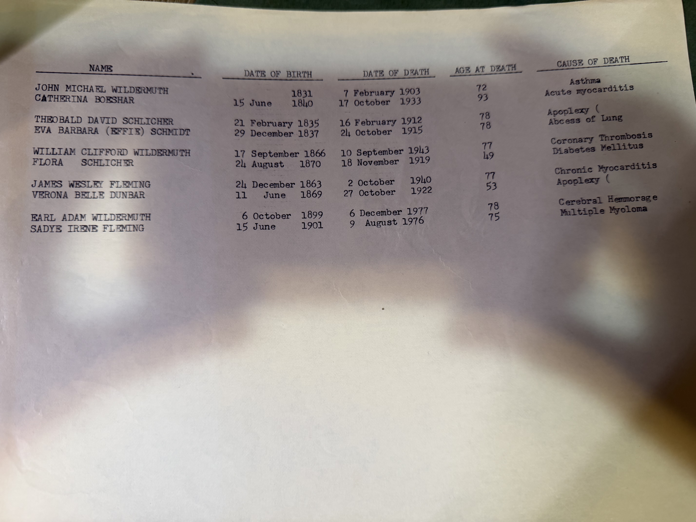

One typed page, five couples, four columns — and the last column is the one this archive has never had. **Causes of death for ten direct ancestors**, evidently copied off death certificates.

| Person | Died | Age | **Cause** |
|---|---|---|---|
| **[John Michael Wildermuth](/family/johann-michael-wildermuth/)** | 7 Feb 1903 | 72 | **Asthma** |
| **[Catherina Boeshar](/family/catharina-boeshar-wildermuth/)** | 17 Oct 1933 | 93 | **Acute myocarditis** |
| **[Theobald David Schlicher](/family/theobald-david-schlicher/)** | 16 Feb 1912 | 78 | **Apoplexy** |
| **[Eva Barbara "Effie" Schmidt](/family/eva-schmidt-schlicher/)** | 24 Oct 1915 | 78 | **Abscess of lung** |
| **[William Clifford Wildermuth](/family/william-wildermuth/)** | 10 Sep 1943 | 77 | **Coronary thrombosis** |
| **[Flora Schlicher](/family/flora-schlicher-wildermuth/)** | 18 Nov 1919 | 49 | **Diabetes mellitus** |
| **[James Wesley Fleming](/family/wesley-fleming/)** | 2 Oct 1940 | 77 | **Chronic myocarditis** |
| **[Verona Belle Dunbar](/family/verona-sheppard-fleming/)** | 27 Oct 1922 | 53 | **Apoplexy** |
| **[Earl Adam Wildermuth](/family/earl-a-wildermuth/)** | 6 Dec 1977 | 78 | **Cerebral haemorrhage** |
| **[Sadye Irene Fleming](/family/sadye-fleming-wildermuth/)** | 9 Aug 1976 | 75 | **Multiple myeloma** |

**The column alignment can be trusted**, and two independent checks show why: **Verona's apoplexy** is already in this archive from her death certificate, and **John Michael's asthma** appears in [the Washington County probate abstract](/archive/marietta-1900-census-and-death-records/). Both land exactly where the table puts them.

## Flora died of diabetes, three years before insulin

[Her page](/family/flora-schlicher-wildermuth/) has said for a long time that the cause was unknown, and speculated — reasonably — about the last wave of the 1918–19 influenza pandemic, since she died in November 1919 at forty-nine.

**It was diabetes mellitus.**

The timing is hard to read without wincing. Insulin was first isolated in 1921 and first given to a patient in **January 1922**. Flora died in **November 1919**. Before insulin, type 1 diabetes in an adult was managed by starvation diets and was essentially always fatal; there was nothing anyone in Marietta could have done.

She left a twenty-year-old son, [Earl Adam](/family/earl-a-wildermuth/), who married the following winter.

## What the rest of the column shows

**Heart disease runs through this table.** Acute myocarditis, coronary thrombosis, chronic myocarditis — and *apoplexy* and *cerebral haemorrhage*, which are both strokes. **Seven of the ten deaths are cardiovascular.**

**And the ages are not bad.** Setting aside Flora at 49 and Verona at 53, the others died at 72, 93, 78, 78, 77, 77, 78 and 75 — a run of late-seventies deaths across three generations of shoemakers, firemen, sharecroppers and factory hands. [Catherina Boeshar reached 93](/family/catharina-boeshar-wildermuth/), having been born in a Palatine village in 1840.

*A note on **Verona's** entry.* Her death is given here as apoplexy, and [her 1922 obituary](/family/verona-sheppard-fleming/) describes *"a twelve weeks' illness of apoplexy"* — the two together are what let this archive reconcile the family story of her collapsing on the courthouse steps with her dying at home three months later.

## Use the causes; do not use the births

**The birth dates in this table are unreliable, and it is worth saying why.** It is an early compilation — probably late 1970s — and three entries are wrong by the archive's later evidence:

| | This table | Better source |
|---|---|---|
| **James Wesley Fleming** born | **24 December 1863** | **20 December 1857** — [certified birth register](/archive/wesley-fleming-birth-certificate/) |
| **Sadye Irene Fleming** born | **15 June 1901** | 15 July 1901 |
| **John Michael Wildermuth** born | **1831** | 23 August 1830 — Großaspach baptismal register |

James Wesley's date is out by six years and Sadye's by a month. This is the same table where his age at death is given as 77, which fits neither 1863 nor 1857 exactly.

**So: an early sheet, superseded on births, and valuable only for the last column** — where the entries came off certificates rather than out of memory.

> *Source: typed table of births, deaths, ages and causes of death for ten ancestors, c. late 1970s, from Robert Earl Wildermuth's research papers; in Chuck's keeping. Photographed 2026.*
