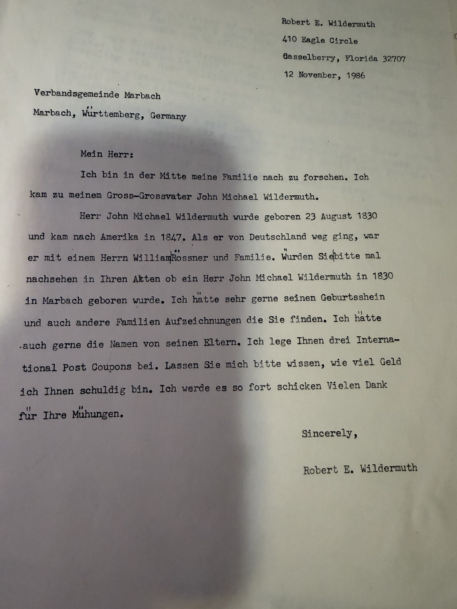
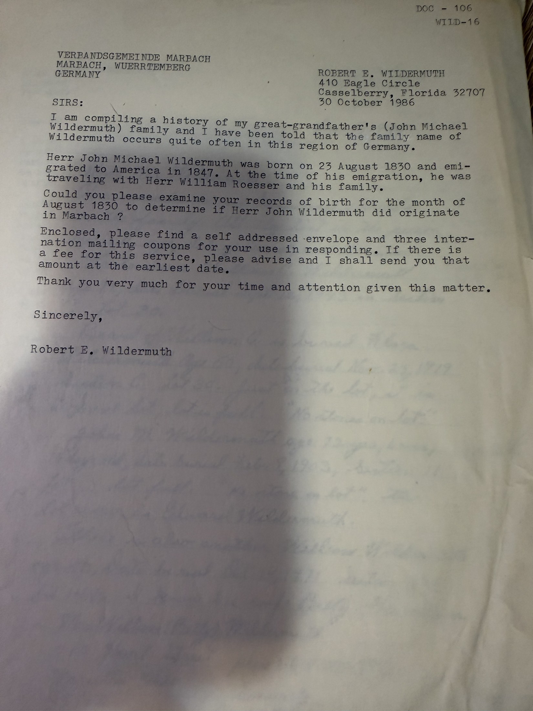

Before there were databases there were **stamps**. This is the working file of [Robert Earl Wildermuth](/family/robert-earl-wildermuth/)'s genealogical correspondence — fourteen years of typed letters from a house in Casselberry, Florida to an Ohio courthouse, two German town halls, a village parish, and a stranger in Phoenix. Nearly everything the archive holds on the German side of the maternal line entered it through one of these envelopes.

Every letter has the same closing move: a **self-addressed stamped envelope**, or **international reply coupons**, or an offer to send money *"post haste."* He was paying strangers' postage for fifteen years to get his family back.

## 1978 — Marietta, and an impossible age

To the **Clerk of the Probate Court, Washington County Court House, Marietta**, attention **Elizabeth Venham**, on **3 January 1978** — thanking her for the certified death record of **[John Wildermuth](/family/johann-michael-wildermuth/)** she had sent on 16 December 1977, and then immediately querying it:

> *"John Wildermuth, the German shoemaker who had a shop on lower Front Street in Marietta, was my great-great grandfather. I have since your letter received a copy of the certificate of death of my grandfather William Wildermuth, John's son. This certificate shows William's age at the time of his father's death to be 38. This of course would rule out John's age at the time of his death as being only 40 years. Do you think there could have been an error in recording John's age? Perhaps he was in this country only 40 years."*

**A man cannot be forty when his son is thirty-eight.** He spotted it, worked out what the clerk had probably done — written years-in-America into the age field — and wrote back to ask. It is the same instinct that later caught Thomas Bailey Fleming's [impossible Taylor County birthplace](/archive/thomas-bailey-fleming-biographical-sketch/).

The letter fixes the citation: **Death Record no. 5467, Volume 2, page 144, record dated 31 March 1903** — Johann Michael died 7 February 1903, so the March date is the recording. It also supplies a detail found nowhere else in the archive: **the shoe shop on lower Front Street**.

And it shows what he did not yet have. He asks for a death record for **[Catherine Wildermuth](/family/catharina-boeshar-wildermuth/)**, John's wife: *"I do not have any idea of the date of her death."* She had died in 1933, forty-five years before he wrote.

*(In this letter he calls John his great-**great** grandfather while calling William his grandfather — which cannot both be true. Johann Michael was his great-grandfather; he has it right in the 1991 letter below.)*

## 1980 — Backnang

To the **Verbandsgemeinde Backnang**, filed by him as **DOC #144, WILD-8**, on **11 November 1980** — German first, English below:

> *"I am compiling a history of my great-grandfather's (John Michael Wildermuth) family and I have been told that the family name of Wildermuth occurs quite often in this region of Germany. Herr John Michael Wildermuth was born 23 August 1830 and emigrated to America in 1847. At the time of his emigration, he was traveling with Herr William Roessar and his family. Could you please examine your records of birth for the month of August 1830 to determine if Herr John Michael Wildermuth did originate in Grossaspach?"*

Enclosed: a self-addressed envelope and **three international mailing coupons**, with an offer to pay any fee.

## 1986 — Marbach

Six years later, the same request to the **Verbandsgemeinde Marbach** — this time entirely in German, and asking for more:

> *"Ich hätte sehr gerne seinen Geburtschein und auch andere Familien Aufzeichnungen die Sie finden. **Ich hätte auch gerne die Namen von seinen Eltern.**"*
> *("I would very much like his birth certificate and any other family records you can find. I would also like the names of his parents.")*

He had written the same request to Marbach in English a fortnight earlier, on **30 October 1986**, filed as DOC-106 / WILD-16 — the German version followed on 12 November, presumably because the first drew no reply.

The names of his parents. In 1986 he still did not have them. He would get them — [Johann Christian and Maria Margaretha](/archive/wildermuth-familienregister-grossaspach/) — from a parish register, years later.

## 1991 — the stranger in Phoenix

**Mrs. Ellen B. Allen**, Phoenix, Arizona, **9 June 1991** — a cold contact from a stranger who had found his card in the Family Registry at her local Family History Library:

> *"I see a connection with the Ebling family which is also my direct ancestor, Johannes Ebling. Enclosed is information on this family. Would you review the information, update it or write me about further research on your connection to this family."*

He replied **five days later**.

> *"As relatively rare as the Wildermuth surname is, Wilhelm is not in my line but he is undoubtedly a cousin of the Wuerttemburg Wildermuths."*

He then gives her his sources, generously and in full:

- **Dr. Hans Wildermuth**, *"Notes on the Ancestry of Johann David Wildermuth,"* Appendix A to **"Johann David Wildermuth and His Descendents — 1752–1964,"** held at the **Ohio State Library, 65 South Front Street, Columbus** — quoting it directly: *"The Wuerttemburg Wildermuths have their origin in the village of **Pleidelsheim** and **Rielingshausen** near the small town Marbach (where the poet Schiller was born) in the Northeast of Stuttgart."*
- A **Wildermuthstrasse in Tübingen**, named for **Ottilie Wildermuth, the poetess**.
- That **Johann David Wildermuth's** clan settled for a while in **Berks County, Pennsylvania** — which is where Mrs. Allen's Eblings were, and almost certainly the "connection" she had spotted.

And his own line, in one sentence:

> *"My original Wildermuth emigree, my great grandfather, … came to the port of New York then moved on to Philadelphia where he stayed until he reached maturity and met the naturalization requirements then moved westward to Marietta, Ohio where he lived until his death in 1903."*

That route — New York, then Philadelphia until he came of age and could naturalize, then west — is exactly what the [1853 naturalization petition](/docs/johann-michael-wildermuth-naturalization-1853/) shows. He had it right in 1991.

**One thing he had wrong:** he tells her Johann Michael *"did not arrive in this country until 1849."* Two independent records say **1847** — the naturalization petition, in Johann Michael's own sworn words, and the Großaspach [Familienregister](/archive/wildermuth-familienregister-grossaspach/): *1847 nach Amerika*. The archive follows 1847.

He signs off: *"Sorry we didn't tie in; for oftentimes that sort of contact starts a whole snowball. Happy hunting."*

## The Erling material she sent

Mrs. Allen enclosed six pages of **Family Group Record 203** for **Johannes Erling and Maria Philippina Yager** of Alsace Township, Berks County, Pennsylvania — sixteen children, with several pages of dense source documentation. It is [filed here](/archive/erling-family-group-record-203/) as it came.

**No Erling, Ebling or Yager appears anywhere in this family's tree.** The material stays in the archive because it was in his file and because it shows how the network operated, not because a connection was ever established. Robert Earl's own verdict was *"sorry we didn't tie in."*

## Elsewhere in the campaign

Two further threads have their own pages:

- **1983 — [the search for the crossing](/archive/search-for-the-crossing-1983/).** Three letters chasing the ship's name, and the Federal Archives reply explaining why he would never find it: the New York passenger index has a gap from **1847 through 1896**, and 1847 is the year Johann Michael landed.
- **1985 — [the cemetery superintendent's reply](/archive/oak-grove-cemetery-burials-1985/).** Where the Marietta Wildermuths lie, and the discovery that most of the graves have no stones.

> *Source: Robert Earl Wildermuth's genealogical research papers, 1977–1991; photographed 2026. Companions: the [Rielingshausen parish correspondence](/archive/rielingshausen-parish-correspondence/) and the [Großaspach Familienregister extract](/archive/wildermuth-familienregister-grossaspach/).*
