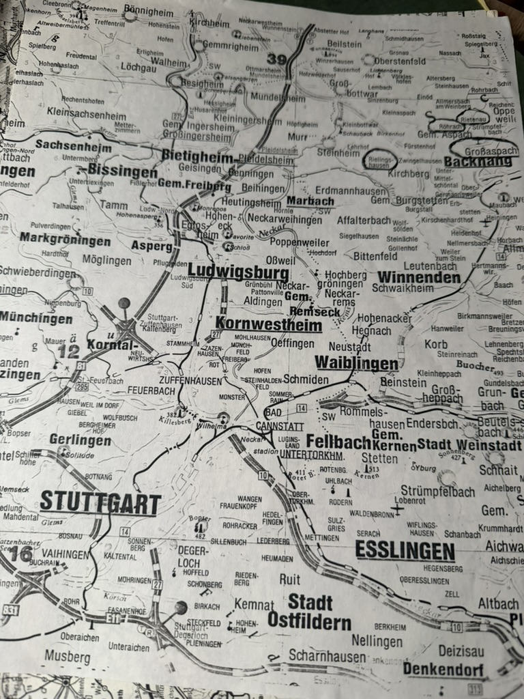
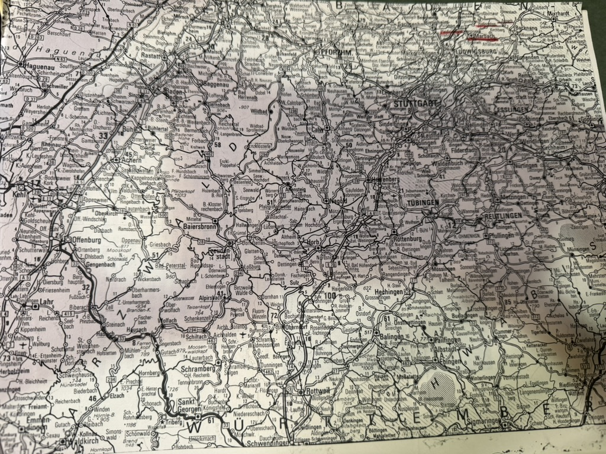

Two pages torn or copied from a German road atlas, with ancestral villages ringed in ink. Not a record of anything — a record of **planning**, and the only object in the papers that shows him working out how to actually get to these places.

The circled and marked places on the closer sheet are exactly the ones this archive has spent years assembling:

- **Rielingshausen** — the ancestral Wildermuth village, [four generations of them](/family/andreus-wildermuth/), and the parish that [wrote back "no entry found"](/archive/rielingshausen-parish-correspondence/) in 1986
- **Rietenau** — where [Johann Christian married on 25 April 1819](/archive/ahnentafel-wildermuth-grossaspach-1988/), the date that took two decades to correct
- **Großaspach** — [Johann Michael's birthplace](/family/johann-michael-wildermuth/), and where Karl Lachenmaier read the church books for him
- **Backnang** — the *Oberamt* the family actually sat in, as against the Marbach district he [first wrote to by mistake](/archive/stadt-marbach-reply-1986/)
- **Marbach am Neckar** — the town whose 1986 reply sent him the [list of twenty-five villages](/archive/stadt-marbach-reply-1986/)

They are all within a few kilometres of one another. The map makes visible what the correspondence only implies: **this entire German side comes out of one small patch of the Rems-Murr and Backnang country**, an hour northeast of Stuttgart. [Reichenberg](/family/balthus-wolf/), where Balthus Wolf was born, is on the same sheet near Oppenweiler.

The second sheet is the region at large — Karlsruhe and Pforzheim across to Stuttgart, down to Tübingen and Rottweil — with the marks again clustered at **Ludwigsburg and Marbach**. Ludwigsburg is where the **Staatsarchiv** holds the [emigration files](/archive/stadt-marbach-reply-1986/) he was pointed to in 1986 and [hired a professional to search](/archive/wollmershauser-ludwigsburg-emigration-file-1989/) in 1989.

So the two sheets together are his itinerary: **the villages, and the archive.**

He got there. Writing to Fleming cousins in 1995 he described [visiting the Stuttgart state archives](/archive/charlotte-fleming-correspondence-1995/) — *"a beautiful, well equipped, modern facility"* whose records were in a German script *"even difficult for most modern day Germans to translate"* — and the village itself, where he *"never saw so many Wildermuths in a phone book and in the old cemetery."*

> *Source: two annotated road-atlas pages from Robert Earl Wildermuth's research papers, undated, c. 1989–1995; in Chuck's keeping. Photographed 2026.*
