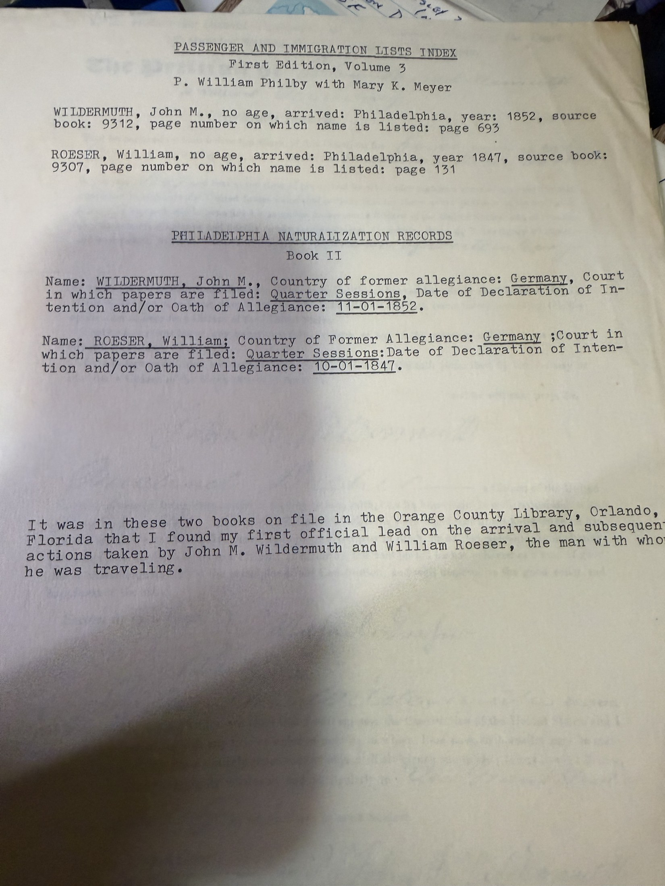

Two typed entries copied out of two reference books on the shelf of a public library in Florida. In [Robert Earl Wildermuth](/family/robert-earl-wildermuth/)'s own words at the foot of the page:

> *"It was in these two books on file in the Orange County Library, Orlando, Florida that I found my first official lead on the arrival and subsequent actions taken by John M. Wildermuth and William Roeser, the man with whom he was traveling."*

## What the entries say

**Passenger and Immigration Lists Index**, First Edition, Volume 3 — P. William Filby with Mary K. Meyer:

> WILDERMUTH, John M., no age, **arrived: Philadelphia, year: 1852**, source book 9312, page 693
> ROESER, William, no age, **arrived: Philadelphia, year: 1847**, source book 9307, page 131

**Philadelphia Naturalization Records, Book II**:

> WILDERMUTH, John M. — former allegiance **Germany** — court **Quarter Sessions** — *Date of Declaration of Intention and/or Oath of Allegiance:* **11-01-1852**
> ROESER, William — former allegiance **Germany** — court **Quarter Sessions** — *Date of Declaration of Intention and/or Oath of Allegiance:* **10-01-1847**

## This is where the wrong premise came from

For years Robert Earl told courthouses and the National Archives that his great-grandfather had *"arrived in this country at the Port of Philadelphia in the year 1850"* — or 1851, or 1852. Here is the source of that belief: **Filby's index says "arrived: Philadelphia, year: 1852."**

But Filby's *Passenger and Immigration Lists Index* is an index to **published lists of names**, and its source books here are the naturalization compilations, not ship manifests. The "arrival" column has taken the **court date** and reported it as an arrival. The same thing happened to Roeser, whose 1847 entry is his declaration date, not a landing.

So the Philadelphia arrival never existed. Johann Michael landed at **New York in 1847**, as his own [1853 petition](/docs/johann-michael-wildermuth-naturalization-1853/) swears. He spent a decade hunting Philadelphia shipping records for a voyage that had docked in another state — because a reference book turned a courthouse date into a port of entry.

## And this is what resolves the naturalization

The Book II entry gives **11-01-1852** — 1 November 1852. The petition in the family's keeping is dated **1 November 1853**, exactly one year later.

Those are two separate court appearances, and together they make the sequence plain:

| | |
|---|---|
| **1 November 1852** | Declaration of intention, Court of Quarter Sessions — indexed in Book II, and the document the City of Philadelphia [sold him a photocopy of in 1983](/archive/search-for-the-crossing-1983/) as *"the declaration of intention"* |
| **1 November 1853** | Petition, witness affidavit, and **oath of allegiance sworn in open court** — the sheet Chuck holds |

The 1853 petition recites that he *"declared on oath before the Clerk of this Court, on the first day of November"* — with the year left blank on the printed form. It is pointing back at **1852**. That blank is what made the two documents look like one, and made a completed naturalization look like an unfinished intention.

**He was naturalized on 1 November 1853.** Robert Earl reached the same conclusion in his [own narrative of his great-grandfather's life](/docs/john-michael-wildermuth-sketch/): *"He took the oath of allegiance that same day and thus became JOHN Michael Wildermuth, AMERICAN."*

*(One caveat kept in view: the Book II column is headed "Declaration of Intention **and/or** Oath of Allegiance," so the index itself does not distinguish which of the two it recorded. The court's own docket for either date would put it beyond argument.)*

> *Source: Robert Earl Wildermuth's genealogical research papers, filed WILD-8; entries transcribed by him from the Orange County Library, Orlando. Photographed 2026.*
