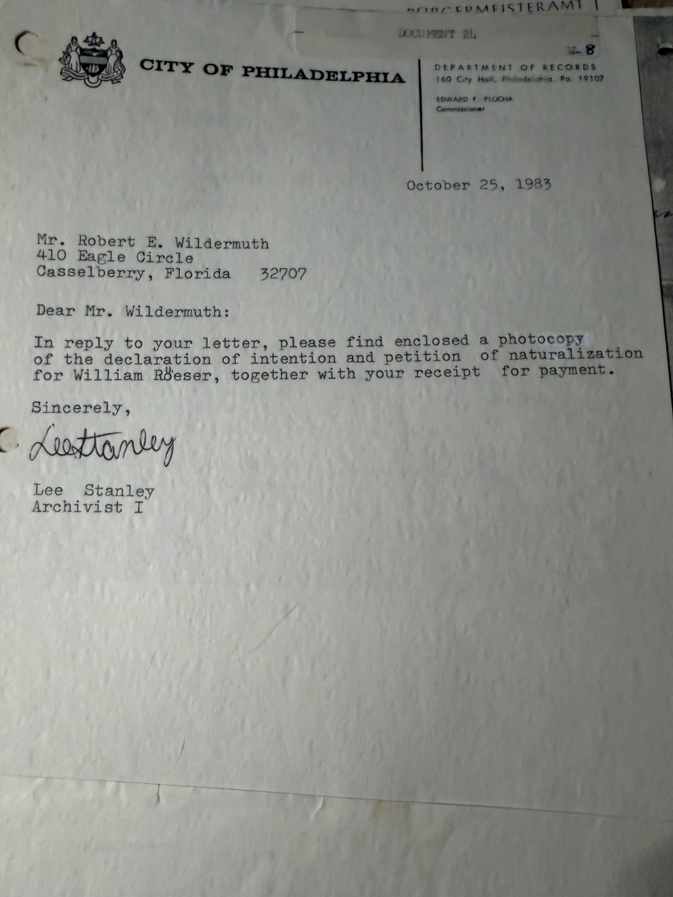

These papers belong to **William Röeser** — the Baden shoemaker [Johann Michael Wildermuth](/family/johann-michael-wildermuth/) crossed the Atlantic with in 1847 and was still living with in Marietta in 1860. They are not Wildermuth documents at all.

They are also the thing that **resolves the question the archive went back and forth on twice**: whether Johann Michael's 1853 sheet was a declaration of intention or a completed naturalization.

## The covering letter

> *"In reply to your letter, please find enclosed a photocopy of **the declaration of intention and petition of naturalization** for William Röeser, together with your receipt for payment."*
> — Lee Stanley, Archivist I, **25 October 1983**

**Two documents, named separately, in the archivist's own words.** The City of Philadelphia held a *declaration of intention* **and** a *petition of naturalization* for each man, as distinct records. That is the structure — and it is why the same office, writing about Wildermuth seven weeks earlier, quoted a price for *"the declaration of intention"* alone. Robert Earl read that as meaning no petition existed. It meant he had only ordered one of the two.

## 1. The declaration of intention

> **United States of America. State of Pennsylvania.**
>
> ***Be it Remembered***, That on this **first** day of **October** in the year of our Lord one thousand eight hundred and forty-**seven**, before me, the Clerk of the Court of General Quarter Sessions, for the City and County of Philadelphia, personally appeared **William Röeser**, who being duly **sworn** according to law, upon his solemn **oath** did declare, depose and say that he is a Native of **Germany**, now residing in the County of Philadelphia, aged **twenty-six** years, or thereabouts, and that it is *bona fide* his intention to become a Citizen of the United States, and to renounce forever all allegiance and fidelity to any foreign Prince, Potentate, State or Sovereignty whatsoever, and particularly to the **Grand Duke of Baden**, of whom he is now a subject.
>
> *Seal of said Court, this first day of October in the year one thousand eight hundred and forty-seven.* — **John Thompson, Clerk**

A one-page form, headed ***Be it Remembered***, sworn **before the Clerk**, signed **by the Clerk**. This is what a declaration of intention looks like.

## 2. The petition of naturalization

> *To the Honourable Oswald Thompson, and his Associates, Justices of the Court of Common Pleas for the County of Philadelphia.*
>
> **The Petition of William Röeser**, a Native of **Germany**, respectfully sheweth, that he declared on oath before the **Clerk of the Court of Quarter Sessions** for the City and County of Philadelphia, on the **first** day of **October** A.D. **1847**, that it was and still is *bona fide* his intention to become a Citizen of the United States … and particularly to the **Grand Duke of Baden**, of whom he was at that time a subject …
>
> *He therefore prays, that on his making the proof, and taking the oath prescribed by law, he may be admitted a Citizen of the United States of America.*
>
> [signed] **Wilhelm Röeser**

A different form entirely — addressed **to the Justices**, headed ***The Petition of***, *reciting the earlier declaration made before the Clerk*, and praying for admission.

## Why this settles the Wildermuth question

Set the two structures side by side and the ambiguity disappears:

| | Declaration of intention | Petition of naturalization |
|---|---|---|
| Heading | *Be it Remembered* | *The Petition of…* |
| Addressed to | the **Clerk** | the **Justices** |
| Signed by | the Clerk | the petitioner |
| Function | states an intention | asks to be **admitted** |

[Johann Michael's 1853 sheet](/docs/johann-michael-wildermuth-naturalization-1853/) is unmistakably the **second** kind: *"The Petition of John M. Wildermuth"*, addressed to Oswald Thompson and his Associates, reciting a declaration made before the Clerk *"on the first day of November"*, praying to be admitted, and carrying the oath of allegiance sworn in open court beneath.

And the [index Robert Earl found in Orlando](/archive/wildermuth-philadelphia-index-records/) supplies the missing year: **11-01-1852** for the declaration. The petition is dated **1 November 1853**. Two documents, one year apart, exactly as with Röeser — whose own pair sits six years earlier and proves the pattern.

**Johann Michael Wildermuth was naturalized on 1 November 1853.** The archive states it plainly.

## Two incidental confirmations

**Röeser was from Baden.** The declaration has him renouncing *"the Grand Duke of Baden"* — matching the [1860 census](/archive/wildermuth-marietta-censuses-1860-1880/), which gives his origin as Baden while his wife Frederika's is Württemberg. Two independent records, thirteen years apart, agreeing on a detail that mattered to Robert Earl because it was the basis for his hunch that Frederika, not William, was the Wildermuth relative.

**And his age.** Twenty-six *"or thereabouts"* in October 1847, so born about 1821; the 1860 census makes him 38, so born about 1822. Consistent.

**He declared on 1 October 1847** — the same year Johann Michael landed, and the year the two men arrived together. Röeser was 26 and married with a child on the way; Johann Michael was 17 and would wait five years to start the same process.

> *Source: City of Philadelphia Department of Records, supplied to Robert Earl Wildermuth 25 October 1983; filed DOCUMENT 21 / W-8. Photographed 2026.*
