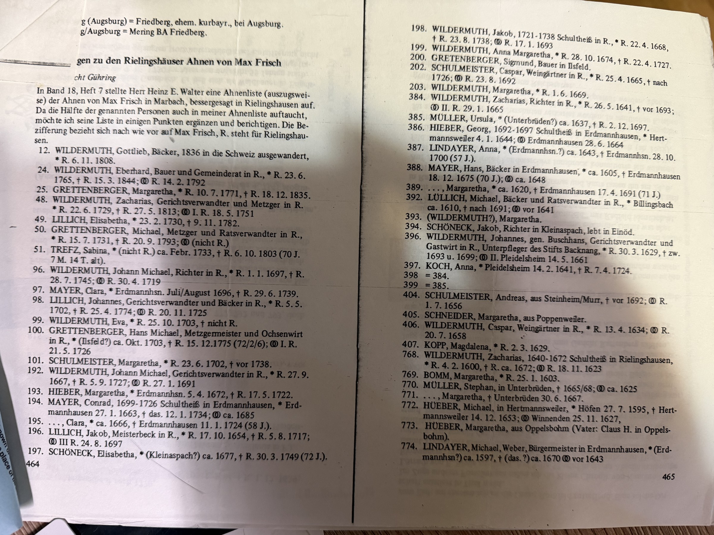
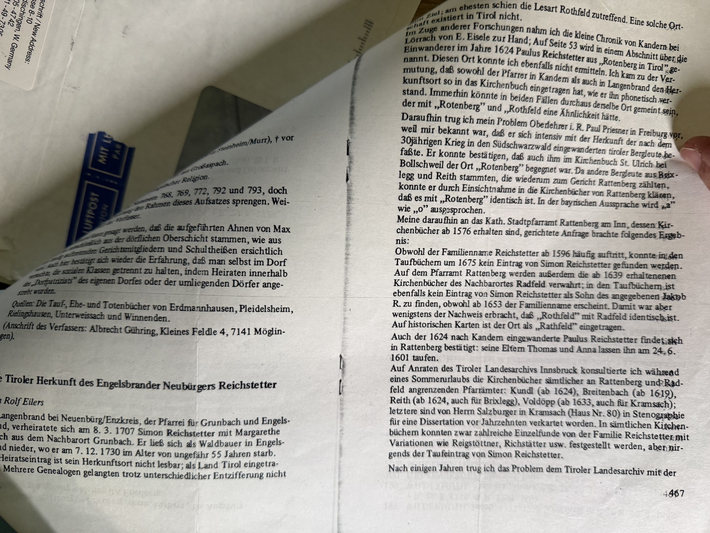

The archive has been calling the **Ludwigsburg emigration files** the best unexploited lead in the whole Wildermuth story, on the grounds that [the Marbach town hall handed Robert Earl the shelf reference in 1986](/archive/stadt-marbach-reply-1986/) and nothing in his papers suggested he followed it.

That was wrong. He followed it, and he hired a professional to do it.

## The letter

> **Dear Mr. Wildermuth,**
>
> Thank you for your letter of 18th February. Enclosed is a paper about my rates, as far as a research in the parish registers is concerned.
>
> **At my next visit to the Ludwigsburg state archives, I shall look for the emigration file of Johann Michael Wildermuth** and then tell you how much a copy and transcript will cost.
>
> Enclosed is a copy of a Wildermuth ancestral list which was recently published in *Südwestdeutsche Blätter für Familien- und Wappenkunde*, vol. 18 no. 9 (March 1987 issue).
>
> Sincerely yours, **Friedrich R. Wollmershäuser**

**Friedrich R. Wollmershäuser, M.A., Accredited Genealogist**, Herrengasse 8–10, 7928 Oberdischingen, West Germany. Written **27 February 1989**, nine days after Robert Earl's own letter of the 18th, and eleven weeks after [Karl Lachenmaier's package](/archive/ahnentafel-wildermuth-grossaspach-1988/) arrived from Großaspach. The German breakthrough of December 1988 sent him straight to a professional.

## The prospectus

The enclosed rate sheet explains the whole enterprise, and it opens with the scale of the thing:

> *"Between 1709 and 1914, more than half a million people left their home towns in Württemberg and emigrated overseas, most of them to America. Today many of their descendants are searching for these places of origin, in order to visit them and to trace their ancestry further back by using German sources."*

For an emigrant of **1815–1870** — Johann Michael's band — the sources listed are exactly the ones the archive has been circling:

> *"Published lists of emigrants; **emigration permits in the Ludwigsburg and Sigmaringen State Archives**; the emigration records in the Stuttgart State Archives (partially indexed); emigration announcements of local and statewide newspapers; military records; church and vital records of the assumed places of origin."*

The fee was **DM 300**, and what it bought is worth listing, because it is precisely what would answer the crossing question:

- a certified copy and English translation of the emigrant's family register entry;
- **a xerox copy, transcript and English summary of the emigration papers**;
- a xerox copy and English summary of the newspaper advertisement announcing the emigration;
- a 1:50,000 topographic map of the area the emigrant came from.

And the pitch, in bold on the sheet: *"There is no risk attached… you only pay for results! That is an offer you can't afford to turn down."*

## What is still open

**Whether Wollmershäuser ever found the file.** Nothing yet in the papers shows a follow-up letter, a quoted price, or a transcript. He promised only to look *"at my next visit,"* so the answer may sit in a later letter, or the search may have come up empty, or the DM 300 may never have been sent.

If the emigration papers were ever copied, they would give the **date of the emigration permit and the stated destination**, which set against the 1847 New York arrival manifests is the closest anyone has come to naming [the ship](/archive/search-for-the-crossing-1983/).

One correction to the earlier note: since Großaspach lay in the **Oberamt Backnang**, the relevant Ludwigsburg holding is Backnang's emigration series and not only the **E 143 Oberamt Marbach** file the town hall named.

## The enclosure: Wildermuths of Rielingshausen back to 1600

Wollmershäuser also sent offprint pages from ***Südwestdeutsche Blätter für Familien- und Wappenkunde*, vol. 18 no. 9, March 1987** — a published, numbered German *Ahnenliste*, and the deepest Wildermuth material in this archive by a century.

The Wildermuths run through it as the leading family of **Rielingshausen**, holding village office generation after generation:

| No. | | |
|---|---|---|
| 768 | **Zacharias Wildermuth** | **Schultheiß** (village mayor) of Rielingshausen 1640–1672 · \* R. 4.2.**1600** · † c. 1672 |
| 396 | **Johannes Wildermuth**, *gen. Buschhans* | court assessor and innkeeper, **Untervogt of the Stift Backnang** · \* 30.5.1629 |
| 384 | **Zacharias Wildermuth** | **Richter** (judge) in R. · \* c. 1636 |
| 198 | **Jakob Wildermuth** | **Schultheiß** of R. 1721–1786 · \* R. 22.4.1668 |
| 192 | **Johann Michael Wildermuth** | butcher and council member · \* R. 27.9.1667 · † 5.9.1727 |
| 92 | **Johann Michael Wildermuth** | **Richter** in R. · \* R. 1.1.1697 · † 28.7.1745 |
| 49 | **Zacharias Wildermuth** | court assessor and **butcher** · \* R. 22.6.1729 · † 27.5.1813 |
| 24 | **Eberhard Wildermuth** | farmer and council member · \* R. 23.6.1765 · † 15.3.1844 |

Mayors, judges, butchers, bakers, vine-dressers and innkeepers, in the same village, across two hundred years. The archive's deepest Wildermuth is currently [Johannes, born about 1650](/family/johannes-wildermuth-1650/); this printed list reaches **1600**.

**A caution worth stating plainly.** This is the ancestor table of somebody else. The header identifies it as *"die Rielingshäuser Ahnen von **Max Frisch**"* — the Rielingshausen ancestors of the Swiss novelist, whose line left for Switzerland when **Gottlieb Wildermuth, baker, emigrated in 1836** (entry 12). These are Rielingshausen Wildermuths and Chuck's are Rielingshausen Wildermuths, so a connection is very likely, but **nobody has yet demonstrated where the two lines join**. Until someone works the parish registers between [Andreas](/family/andreus-wildermuth/) and these numbered entries, the list is a map of the family's village, not a proven extension of the pedigree.

> *Sources: Friedrich R. Wollmershäuser, Oberdischingen, letter of 27 February 1989 with enclosed prospectus; offprint from Südwestdeutsche Blätter für Familien- und Wappenkunde, vol. 18 no. 9 (March 1987). In Robert Earl Wildermuth's research papers; photographed 2026.*
