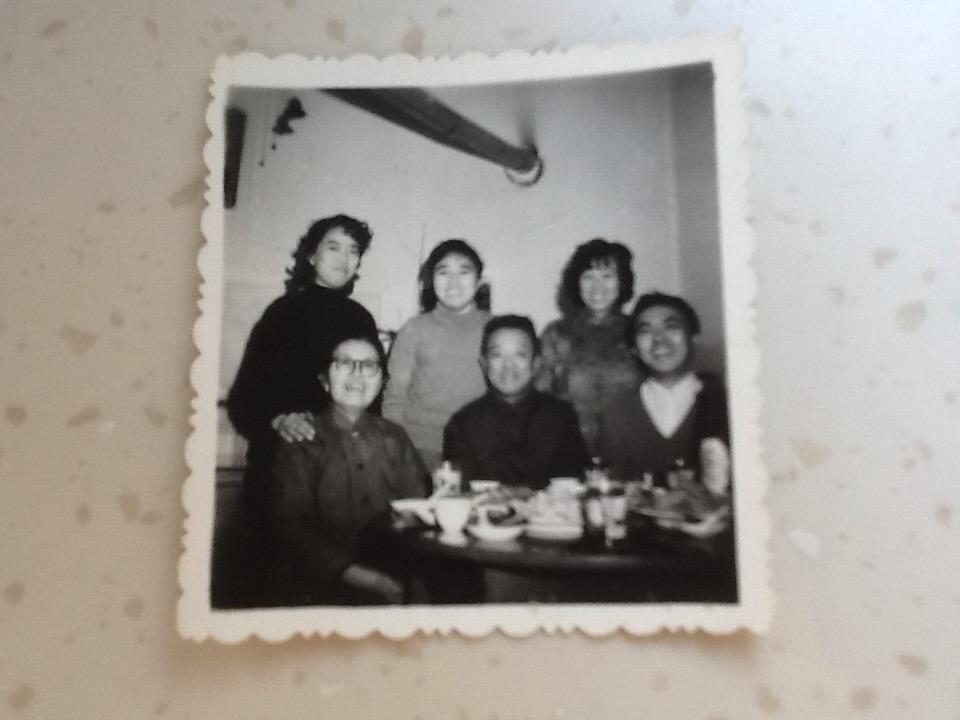

<strong>📖 本页含中文版本 — <a href="#zh">点此跳至中文 ↓</a></strong> &nbsp;·&nbsp; <em>This page has a Chinese version below.</em>

Two older black-and-white prints from [Lijie](/family/lijie-zhou/)'s maternal side, c. 1960s–70s. The first shows two people in a room; the second, a group of four or five gathered at a table. **The individuals are not yet identified in the archive; to be confirmed by [Li Xun](/family/xun-li/)** — these may correspond to the earlier Li-family and Li-siblings photographs from the family's collection.

## 中文

**两张早年的周—李家族黑白照片，约1960—70年代**

两张出自[Lijie](/family/lijie-zhou/)母系的早年黑白照片，约1960—70年代。第一张为室内两人；第二张为围坐桌旁的四五人。**照片中人物身份尚未确认，待[李恂](/family/xun-li/)指认** &mdash; 或与家藏"李家全家福""李氏兄妹"等旧照相关。

> *Source / 来源：Zhou–Li family photographs; identities pending confirmation.*
