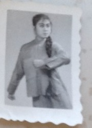

Two black-and-white prints of the same young woman with a long braid, c. 1960s–70s — one standing by a wall map in an office or classroom, one a studio pose. From [Lijie](/family/lijie-zhou/)'s side of the family.

**Not a family member.** [Li Xun](/family/xun-li/) (Lijie's mother) confirmed in 2026 that the young woman in these two prints is **her classmate, not herself** and not a Zhou–Li relative. No family page is wired to these frames. (Lijie may be able to add more about who her mother's classmate was.)

*A studio portrait of the same young woman — a classmate of Li Xun's, per Li Xun, 2026.*

> *Source: Zhou–Li family photographs; identified as Li Xun's classmate (not a family member) by Li Xun, 2026.*
