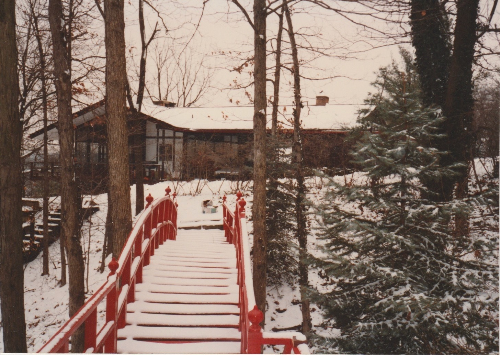
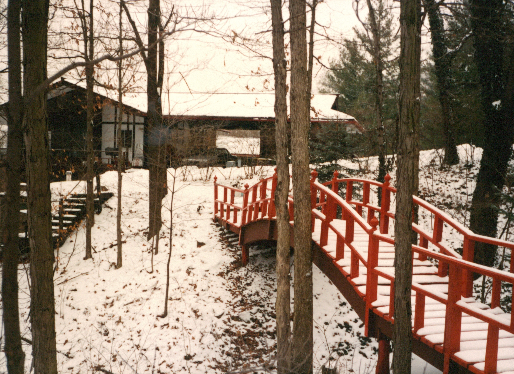
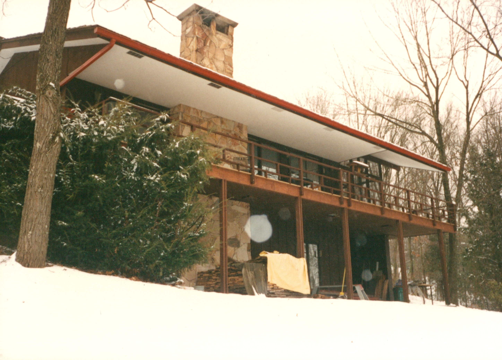
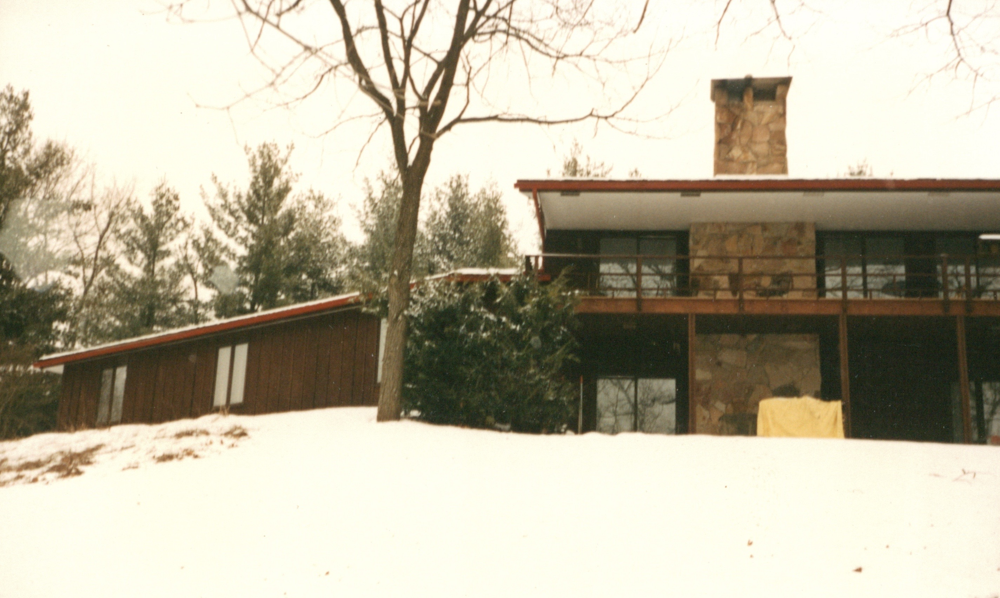
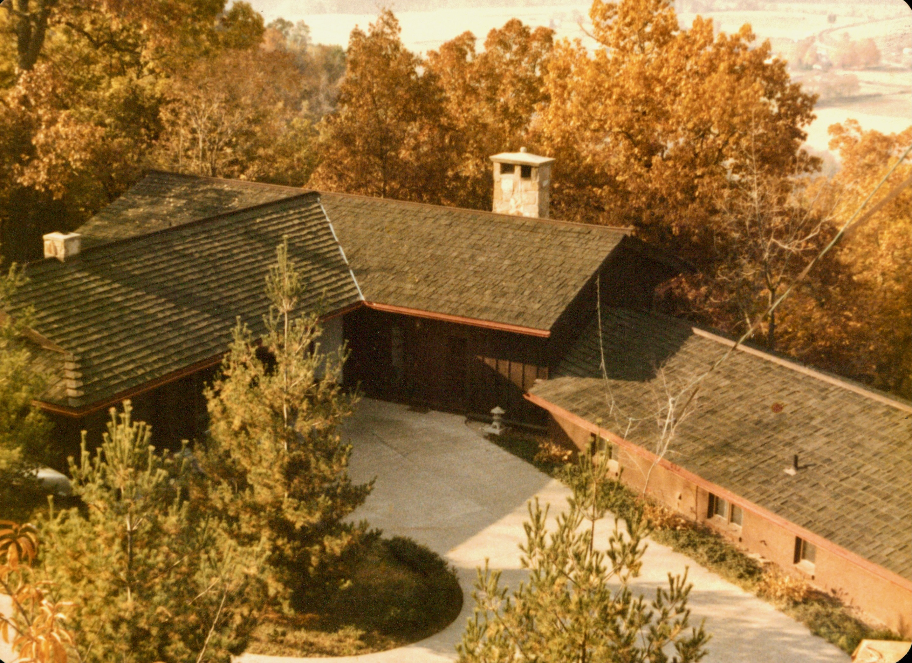
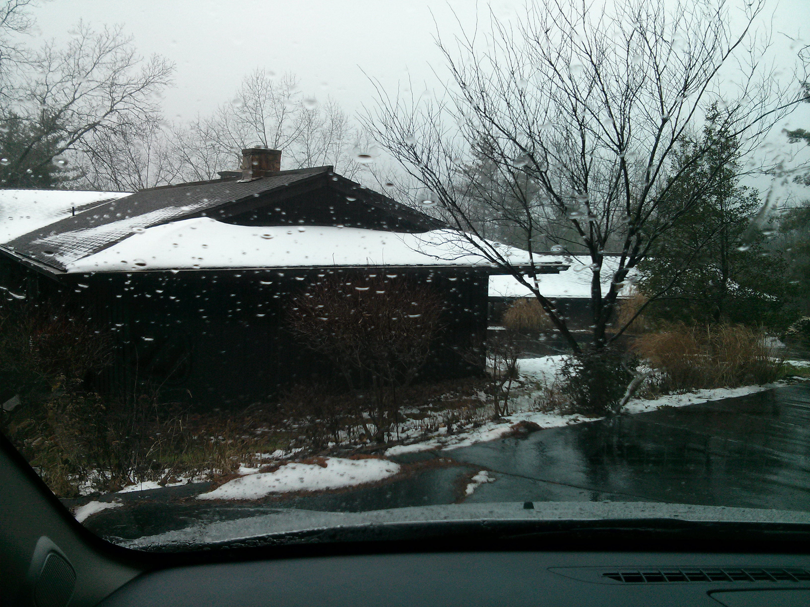
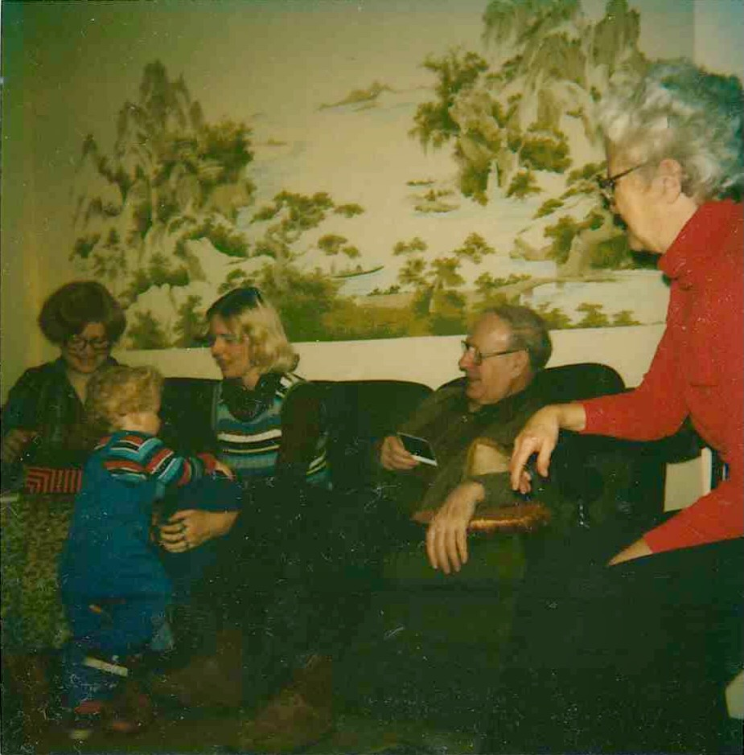
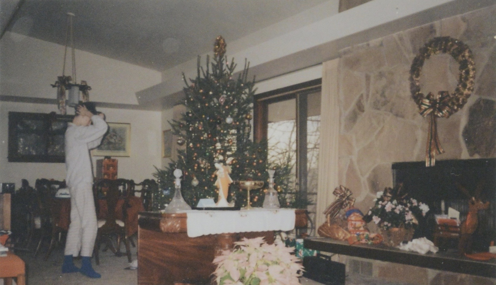

Will traveled through Japan and Hong Kong in the 1970s, and those trips stayed with him. They came home in his architecture, and the house he built on [Highland Ridge Road](/places/highland-ridge-road-marietta/) carries them in plain sight.

The rooflines are the first thing you notice. Low and wide, with deep overhanging eaves that reach out over the decks, they echo the temple and farmhouse roofs he saw abroad. He trimmed the fascia in red, tying the structure to the garden below.

That garden holds the clearest signatures. A red arched bridge, its posts capped with rounded finials in the manner of a Japanese bridge, curves across the low ground between the trees and the house. A stone lantern stands in the courtyard. Post-and-beam framing, dark wood, fieldstone chimneys, and horizontal slatted railings carry the same vocabulary through the building itself.

Inside, the influence turns toward the Chinese landscape he would have seen around Hong Kong. One wall of the living and dining room was given over to a painted *shan shui* scene of mountains and mist, a view that sat behind the family at the holidays and every ordinary day between.

## Figures

*The red arched bridge, its posts capped with rounded finials, with the low roofline of the house beyond.*

*The bridge's curve and slatted railings, echoing a Japanese garden bridge.*

*The deep eave and red-trimmed fascia over the deck, with a fieldstone chimney rising through.*

*Low, wide rooflines with post-and-beam framing and horizontal railings.*

*Aerial view: the wings wrap a courtyard, with a stone lantern set in the drive.*

*The settled horizontal profile of the roof.*

*The shan shui mural on the living room wall, reflecting the Chinese landscape.*

*The living and dining room, Christmas 1992 (the original print's caption band, which carried the street address, has been cropped to keep the archive address-free).*

## Origins of the elements

Highland Ridge is an American interpretation in the Japanesque strain of mid-century design, and the distinction worth keeping straight is *where it borrows*. Some elements are quoted **directly** from what Will saw abroad; some are Asian ideas **inherited already naturalized** through Frank Lloyd Wright and the Craftsman movement; one is **purely American**. It is a synthesis, not a copy, and the layering is the story.

**Red arched bridge** &mdash; *quoted directly.* Two threads meet. The steep arch is the Chinese **moon bridge**, built high enough that the span and its reflection close a full circle on the water (originally so boats could pass beneath). The vermilion is Japanese-Shinto by way of China: cinnabar red (*shu*) marks torii gates and shrine bridges, prized both as an auspicious, evil-warding color and as a genuine wood preservative. Chinese in geometry, Japanese-Shinto in color &mdash; and in a garden the arched crossing itself reads as passage, often toward an island standing for the immortals' paradise.

**Stone lantern** &mdash; *quoted directly.* The *ishidoro* reached Japan from China and Korea with Buddhism around the sixth century, first as votive temple lights. It moved into gardens in the sixteenth century when tea masters in **Sen no Rikyū's** circle set lanterns along the *roji*, the dewy path to the tea house, to light the guest's approach. A stone lantern in a Western yard is about the most legible single quotation of Japanese garden vocabulary there is.

**Low roofline and deep eaves** &mdash; *inherited through an American lineage.* Deep eaves are functional before they are beautiful, shielding earthen and wood walls from rain and tuning the sun (shading high-summer light, admitting the low winter sun); in China the *dougong* bracket system cantilevered them outward, and Japanese temple, *minka* farmhouse, and refined *sukiya* architecture carried the same deep shadow-line. But it reached rural Ohio already naturalized, twice: through the Craftsman bungalow (the Greene brothers' Gamble House openly indebted to Japanese joinery) and through **Frank Lloyd Wright**, whose Prairie and Usonian houses absorbed Japanese spatial ideas after he met the Hō-ō-den pavilion at the **1893 Chicago fair**. The roof is both a direct memory and a form already at home in America.

**Post-and-beam framing** &mdash; *inherited.* East Asian timber architecture puts the load on columns and treats walls as infill &mdash; the opposite of Western load-bearing masonry &mdash; which lets the structure show honestly. The dark posts against lighter infill echo the Japanese *shinkabe* wall, where the frame is deliberately left visible. This too came partly through Wright and mid-century modern, which shared the same structural honesty.

**Horizontal slatted railings.** The wood lattice of the deck rails reads as *kōshi*, the slatted screenwork of Japanese buildings, reinforcing the horizontal line the whole design pursues.

**Fieldstone chimneys** &mdash; *purely American.* The massive rough-stone chimney and hearth are not Japanese; they belong to Wright's Prairie and Usonian houses and the rustic National Park lodge idiom. This is where the house is most clearly of its own country &mdash; and pairing a Wrightian stone core with Japanese roofs and garden is exactly what makes it a personal design rather than a pastiche.

**Shan shui mural** &mdash; *quoted directly.* *Shan shui*, "mountain-water," is the Chinese landscape tradition matured in the Northern Song under painters like **Fan Kuan** and **Guo Xi**. Its conventions are philosophical as much as visual: monumental peaks, water and mist, and large passages of deliberately empty paper (*liubai*, "left-white") standing for cloud, void, and a person small within a vast nature. In 1970s Hong Kong Will would have met the tradition still alive in the **Lingnan school** and in decorative work.

The honest through-line: some elements are quoted directly from what he saw (bridge, lantern, mural), some were inherited through Wright and the Craftsman movement (eaves, post-and-beam), and one is purely American (the stone chimney). Highland Ridge is not a copy but a synthesis &mdash; the layering is the story.
