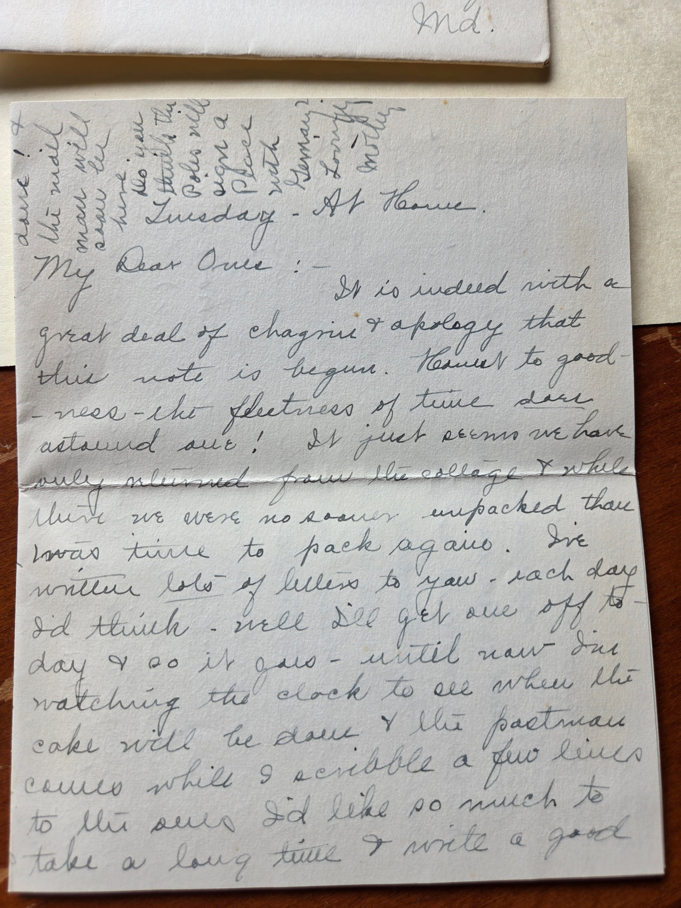

## What this letter is

A handwritten letter from **Lillie Dale Chenoweth Eesley** &mdash; Mrs. C.L. Eesley &mdash; from the Bexley, Ohio house at **230 N. Cassidy Road** to her son **Leonard David Eesley** ("Leonard") and his wife **Helen Bernadine Alspach Eesley** at **107 Sunnyside Road, Silver Spring, Maryland**.

Postmarked **Columbus, Ohio, September 12, 1939 at 2:30 PM**. Three-cent Jefferson stamp. Roberta Burnes annotated the envelope when she filed it: ***"mentions Dale after his death (recent)."***

**Dale Dudley Eesley** &mdash; Lillie Dale and Charles Leonard's son, Leonard's older brother &mdash; had drowned at Black Lake, Michigan on **July 14, 1939**. He had been married to **Thelma Z. Haughn** for **eleven and a half years**. This letter is written almost exactly two months after his death.

## The envelope

The pencil math on the front of the envelope &mdash; *"2 5/6, 38, 31"* &mdash; is Lillie Dale or Charles Leonard's working out of something domestic, possibly travel days, possibly a date span; not interpretable without more context.

## Page 1 — "It is indeed with a great deal of chagrin & apology"

> *Tuesday &mdash; At Home.*
>
> *My Dear Ones:- It is indeed with a great deal of chagrin & apology that this note is begun. Heavens to good- ness &mdash; the fleetness of time sure astound one! It just seems we have hardly returned from the college & while there we were no sooner unpacked than there was time to pack again. I've written lots of letters to you &mdash; each day I'd think &mdash; well I'll get one off to- day & so it goes &mdash; until now I'm watching the clock to see when the cake will be done & the postman comes while I scribble a few lines to this one. I'd take so much to take a long time & write a good*

The opening references *"the college"* &mdash; the Eesley family had connections to Otterbein University in Westerville (the family-Methodist institution, where Lillie Dale's sister Scioto had studied and where she was buried) and the family was newly back from some trip there in early September 1939. The mention of *"the cake"* in the oven and the postman about to come fixes the letter to a particular weekday morning &mdash; Tuesday at home in Bexley.

## Page 2 — Mrs. Earnshaw, the Feathers, and Petoskey

> *letter to once in my life. I wonder when this grand rush will ease up & a certain amount of relaxation can be indulged.*
>
> *Oh Time &mdash; go easy on the babies &mdash; don't let them get to college too soon! I sure would be tickled pink to see Michael crawl. He is so wonderfully developed that I'll bet he can stir up dust when he travels. And Tommy, didn't he have such grand times up here! Tommy McCray took his choler tone (I don't know how to spell it) but he and Cynthia started to school yesterday! Mrs. Earnshaw has had to have time off the past two weeks &mdash; had to stay quiet in bed. Certainly hope she can stay away from an operation &mdash; tumor is supposed to be giving the trouble. The Feathers reported a grand time with you folks &amp; we were so sorry to have missed them here &mdash; we had left Tuesday morning after you folks had gone & Feathers' were here the next day. They were at Petoskey the following Sunday & spent the night with Mother Feathers &mdash; this caused some so much that when it came time to leave for the cottage you could scarcely see across the street. Everyone was so fine everywhere &mdash; it is hard to go back to the lake & no matter how one reasons there is that*

This page is full of detail about the **late summer 1939 family circuit**: Michael (a baby in the family, likely Leonard and Helen's son), Tommy (probably **Tommy McCray** &mdash; a child relative or family friend), and **Mrs. Earnshaw** being out with a possible tumor. The **Feathers** &mdash; another family name &mdash; visited Leonard and Helen in Maryland and then came back through Bexley, with side-trips to Petoskey, Michigan.

The line *"it is hard to go back to the lake"* &mdash; running into the next page &mdash; references **Black Lake**, where Dale had drowned eight weeks before and where the family had owned the cottage that was the gathering place of every Eesley summer for years. *"No matter how one reasons"* is Lillie Dale processing the place that took her son.

## Page 3 — "the involuntary feeling that Dale will come walking in"

> *involuntary feeling that Dale will come walking in. I must tell you that Thelma is moving in with Mrs. Hudson. Papa & Mr. Blair (came Sunday) are over taking the last of the little things down &mdash; Lyle has helped two days with his old car & the trailer. Then tomorrow everything goes. I am expecting Thelma, her sister & brother for supper tonight. Bill & Mary were over for the Labor Day week end & it was such a comfort to have them. Mary was telling about the "shock" she had when she rec'd your telegram for her birthday. She certainly did appreciate it. Let us know when your casts are over Leonard & Helen. I do hope you are back to normalcy now &mdash; just a shame you were so sick! The cake is*

Three things this page records, in the order they appear:

### "the involuntary feeling that Dale will come walking in"

The first line continues from the previous page. The full sentence, spanning the page break, reads:

> *It is hard to go back to the lake and no matter how one reasons there is that involuntary feeling that Dale will come walking in.*

Lillie Dale is **eight weeks past her son's drowning**, in her own house at the kitchen table waiting for the cake to bake, and the lake is the place she cannot quite return to. The line catches what grief does in the early months better than any phrasing a later generation could supply &mdash; the involuntary anticipation, the wait that the conscious mind knows is now permanent and the unconscious mind hasn't accepted.

### Thelma's move into Mrs. Hudson's house — and Lyle's two days

Thelma had been Dale's wife for eleven and a half years. By September 1939 she was packing the household she had built with him and moving into Mrs. Hudson's. The actual physical labor of the move was done by Dale's family:

- **Papa** &mdash; Charles Leonard Eesley &mdash; and **Mr. Blair** &mdash; presumably a neighbor or family friend &mdash; were *"over taking the last of the little things down."*
- **Lyle** &mdash; Dale's twenty-three-year-old younger brother, who had **three years left to live before his death at Cabanatuan POW camp in July 1942** &mdash; spent *"two days with his old car & the trailer"* helping Thelma move.
- **Lillie Dale was hosting Thelma, her sister, and her brother for supper that night** &mdash; the last evening before everything went down.

So the line on Thelma's [page](/family/thelma/) that the family kept her in the circle is grounded right here: after Dale's drowning, his parents and his brother physically moved his widow into her new house. The chosen-family practice the Eesleys carried &mdash; the same impulse that brought [Stella](/family/stella/) into the household during the war &mdash; shows itself in this letter at the granular labor-of-loving level.

That Helen Burnes, fifteen years old in 1939, watched her parents and her brother spend two days helping her sister-in-law of eleven years move out of the house her dead brother had built with her, and twenty years later told her own children that Thelma was "a friend of the family" rather than their aunt &mdash; is the silence the marriage record later filled in. The letter is the record of the bond that the silence later obscured.

### Bill, Mary, Leonard's & Helen's casts

The closing passage:

- **Bill & Mary** &mdash; [Wilbur "Will" Eesley](/family/wilbur-eesley/) (Chuck's grandfather) and **Mary** (likely Will's first wife, **Margaret "Peggy" McMaster Eesley**, mis-named as Mary by Lillie Dale or possibly his sister [Mary Eesley Bean](/family/mary-eesley-bean/)) &mdash; came to Bexley for the Labor Day weekend, and Lillie Dale's framing is *"such a comfort to have them."* The August-September 1939 family circuit visibly orbited the bereaved Bexley parents.
- **Mary's birthday telegram** &mdash; Leonard had sent his sister a telegram for her birthday and Mary was *"shocked"* and grateful.
- **"Your casts"** &mdash; Leonard and Helen had each had some kind of injury serious enough to require **casts**, and were still in recovery in early September 1939. The nature of the injury &mdash; auto accident? two separate accidents? &mdash; is not recoverable from this letter alone, but the Bexley house was clearly tracking a Maryland medical situation while it was also processing Dale's death and Thelma's move.

The letter cuts off at *"The cake is"* &mdash; presumably the cake was done and Lillie Dale had to go to the oven.

## Why this letter matters

Three reasons this is one of the most significant single documents in the Eesley archive:

1. **It is the family's voice in the immediate wake of Dale's drowning** &mdash; the only document this archive holds from the eight-week window after his death. The 1985 Mary Bean register and the GEDCOM give the date; this letter gives the **household reality** of the loss: the involuntary expectation of his return, the practical work of helping his widow move on, the family circuit closing around the bereaved.

2. **It documents the marriage between Dale and Thelma** in a way the marriage license alone cannot &mdash; by showing that Thelma's move out, eight weeks after his death, was being handled by Dale's parents and brother as immediate family work. The line "Thelma is moving in with Mrs. Hudson" is one of the only contemporaneous mentions of Thelma in the archive's holdings; it confirms the marriage record Roberta later surfaced from Ancestry in June 2026.

3. **It catches Lyle alive and well in September 1939** &mdash; the brother who would die in the Pacific three years later, here recorded *"helping two days with his old car & the trailer"* moving his sister-in-law. The last documented act of Lyle's recorded in family letters before his enlistment.

> *Sources: original letter and envelope, three pages, dated "Tuesday &mdash; At Home" (postmarked Columbus, Ohio, September 12, 1939). Provenance: Lillie Dale Eesley → Leonard & Helen Eesley (Silver Spring, MD) → Roberta Burnes Walker (Helen's daughter via the [Helen Eesley Burnes](/family/helen-burnes/) line) → this archive, June 2026. Roberta's transcription provenance: the envelope carries her own annotation "mentions Dale after his death (recent)." Related: [Dale Eesley's page](/family/dale-eesley/) with the marriage record; [Thelma Z. Haughn Eesley's page](/family/thelma/) with the silence Helen left around her; [Lyle Eesley's page](/family/lyle-eesley/).*
