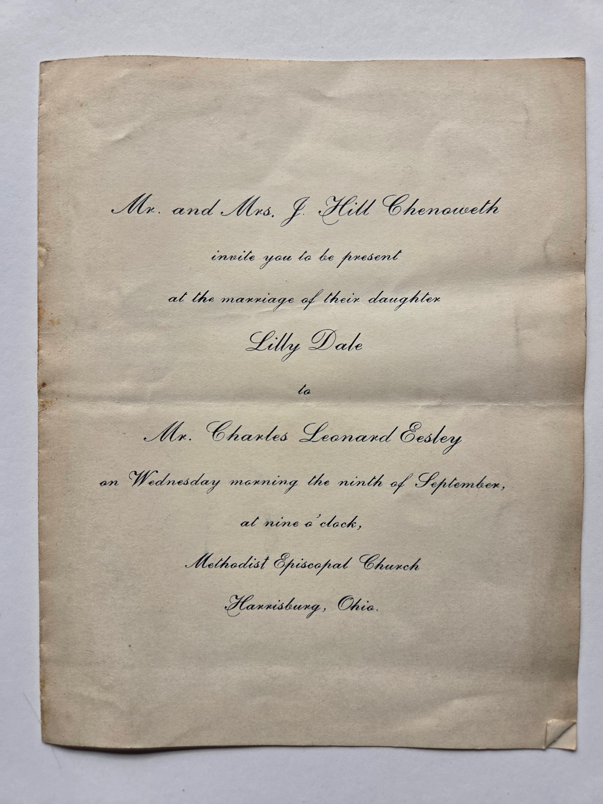

The **original engraved wedding invitation** for the marriage of [Lilly Dale Chenoweth](/family/lillie-dale-chenoweth/) and [Charles Leonard Eesley](/family/charles-leonard-eesley/), shared in June 2026 by [Roberta Burnes Walker](/family/roberta-burnes/) from her Chenoweth family album.

## Transcription

> *Mr. and Mrs. J. Hill Chenoweth*
>
> *invite you to be present*
>
> *at the marriage of their daughter*
>
> ***Lilly Dale***
>
> *to*
>
> ***Mr. Charles Leonard Eesley***
>
> *on Wednesday morning the ninth of September,*
>
> *at nine o'clock,*
>
> *Methodist Episcopal Church*
>
> *Harrisburg, Ohio.*

## What the invitation settles

- **The marriage date: 9 September 1903.** The GEDCOM record had this date as 9 September 1903 at Harrisburg, Franklin County, Ohio; the engraved invitation is the primary-document confirmation. *(Sept 9 1903 was a Wednesday.)*
- **The bride's parents' formal name: *"Mr. and Mrs. J. Hill Chenoweth."*** [Joseph Hill Chenoweth](/family/joseph-hill-chenoweth/) was known as **"J. Hill"** in formal invitations &mdash; the kind of period-formal name shortening that Edwardian-era engraved invitations carried.
- **The bride's family-formal name: *"Lilly Dale,"* not "Lillie."*** The engraved invitation's *Lilly Dale* settles the spelling Roberta's family has carried as the personal name; the *Lillie* variant elsewhere in the archive is a later spelling.
- **The venue: the Methodist Episcopal Church, Harrisburg, Ohio.** A small farming-community church in Pleasant Township, Franklin County &mdash; the same township the Chenoweth family had been rooted in since Elijah Sr.'s 1799 arrival.
- **The time: nine o'clock Wednesday morning.** A morning wedding was a turn-of-the-century convention &mdash; the wedding breakfast followed, with the ceremony itself early in the day.

## Provenance and how it survives

The invitation survived in the **Chenoweth family album** Roberta inherited through the Burnes-Eesley line. It is one of a small number of documents in the album that predate the photographic record &mdash; it sits alongside the 1862 [Mary Timmons teacher's certificate](/family/mary-ohio-timmons-chenoweth/) and the [1860s handwritten Chenoweth family register](/family/elijah-chenoweth/) as the **paper-based documentary spine** of the late-19th-century Chenoweth family. That the engraved card has survived 122 years &mdash; folded along its central crease, slightly yellowed, intact &mdash; is a small documentary miracle.

## What it is, taken together with what came before and after

The Joseph Hill Chenoweth and Mary Timmons family that issued this invitation in September 1903 had already been documented in this archive's [Chenoweth-side photo-album record](/family/mary-ohio-timmons-chenoweth/): the **two tintype portraits** of Joseph Hill and Mary side-by-side from c. 1864 (their own wedding-era pair); the 1862 teacher's certificate for the bride's mother; the [c. 1880 baby portrait of Lilly's younger brother Dwight Kennedy Chenoweth](/family/dwight-chenoweth/) in the embroidered gown Roberta still keeps.

What came after: the **ten Eesley children** of this marriage &mdash; [Leonard David](/family/leonard-david-eesley/), [Mary](/family/mary-eesley-bean/), [Don](/family/don-eesley/), [Dale Dudley](/family/dale-eesley/), [Lyle](/family/lyle-eesley/), Jean Goldie, [Wilbur (Will)](/family/wilbur-eesley/), and [Helen Louise](/family/helen-burnes/) (Roberta's mother), among others &mdash; and the eight grandchildren and the great-grandchildren after them. The marriage announced on this engraved card is the **point in the Eesley-Chenoweth line where this whole branch of the family begins**.

> *Source: Original engraved wedding invitation in Roberta Burnes Walker's Chenoweth family album, shared with Chuck Eesley in June 2026. The marriage date 9 September 1903 at Harrisburg, Franklin County, Ohio is corroborated by the [Eesley/Wildermuth GEDCOM tree](/docs/dale-eesley-familysearch-tree/), family F10.*
