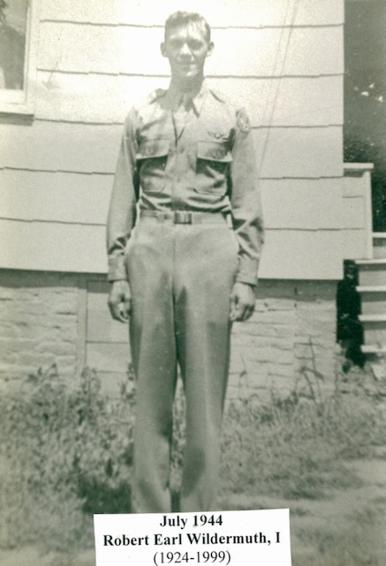
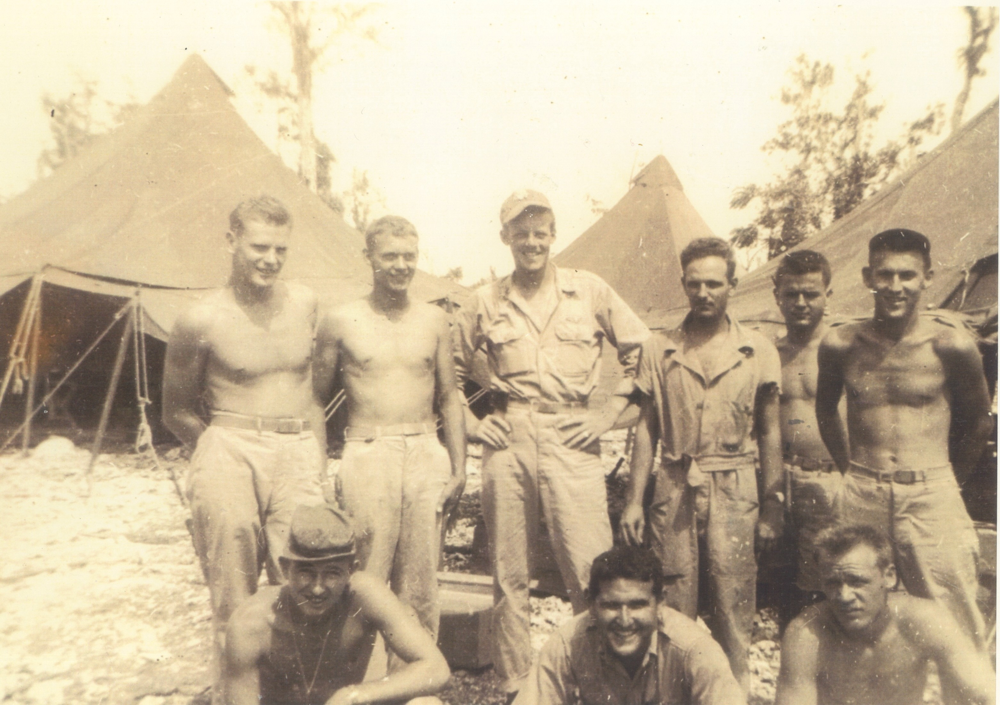
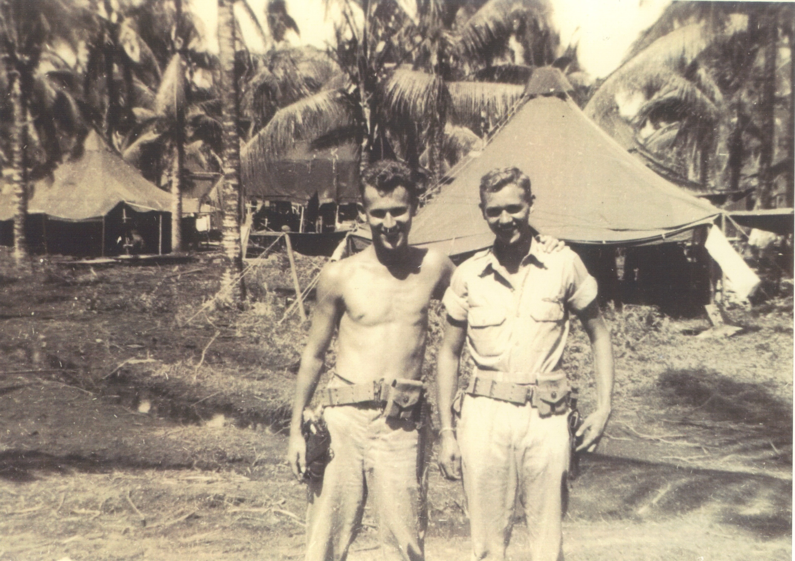

The full original document is available here: **[Read &ldquo;The Big One&rdquo; (PDF)](/docs/Wildermuth-the-big-one.pdf)** &mdash; 20 pages, scanned from Robert Earl's typewritten original, c. 1989.

**Treat dates and target names as his best recollection forty-plus years on, not contemporaneous record.** The wartime AAF Form 5 flight logs and the **400th Bombardment Squadron monthly Operations Reports** at the Air Force Historical Research Agency (Maxwell AFB) would be the authoritative source against which to cross-check.

What this page does: surfaces the mission-by-mission entries he typed up, threads them against the published 5th Air Force operational record, and pulls out the six narrative moments that define the tour. See the companion [90th Bomb Group "Jolly Rogers" unit-context document](/docs/90th-bomb-group-jolly-rogers-context/) for the broader squadron history.

*Robert Earl Wildermuth, July 1944 — twenty years old, before he shipped out. The earliest photograph of him in the archive, and the young navigator who would fly the missions logged below.*

## The crew

Ten men on the B-24 Liberator. The full crew, recovered from a 300-DPI OCR pass through the typewritten "Crew Members and My Recollections" section of the original manuscript:

- **Pilot: [1st Lt. Maxwell Van Valen](/family/maxwell-van-valen/)** &mdash; from Newton, MA. Third-year MIT student before enlisting. *"A quiet man, very intelligent, cool and calm under all stressful situations."* Postcard after the war: living in Paris.
- **Co-pilot: [1st Lt. Robert "Bob" Steckroth](/family/robert-steckroth/)** &mdash; from Hazleton, PA (coal country). Second-year William & Mary student; rumored Little All-American football. *"A physique of a hard-working coal miner and star athlete."* Catcher on the squadron softball team. *"Bob deserved to have his own crew."*
- **Navigator: [1st Lt. Robert E. Wildermuth](/family/robert-earl-wildermuth/)** &mdash; this is Robert Earl. From Marietta, Ohio. *"Not fond of flying, he chose this route as a means to an end"* &mdash; cadet program as the path to officer pay before the GI Bill existed.
- **Radar/Bombardier: [1st Lt. Merwin Adler](/family/merwin-adler/)** &mdash; from Buffalo, NY. Second-year student at Buffalo University. *"He was careless in his duties, lax in his personal hygiene and appearance and often had to be counseled by those with whom he lived. He was over confident and was not much of a 'team player.'"* &mdash; the only frankly-negative review Robert Earl gives any crew member. The same Adler whose over-confidence in radar produced the [memoir's homecoming-nap story](/docs/robert-earl-wildermuth-memoir/): he told Robert Earl he had Tacloban on radar 120 miles out and offered to direct the plane home so Robert Earl could nap. The lock turned out to be wrong.
- **Engineer: [T.Sgt. Lyle Pound](/family/lyle-pound/)** &mdash; from Great Bend, Kansas, a farm boy whose family farmed a thousand-acre wheat farm. Age 22 &mdash; the oldest member of the crew and its *"old man and counsellor."* The only crew member who possessed a driver's license at enlistment (nine of the ten had never driven a car). *"An excellent aircraft engineer and he was always tinkering with the various aircraft systems to make everything as fine tuned as possible."* Re-entered service postwar; survived a Caribbean B-29 crash that made the MGM movie newsreel &mdash; Robert Earl saw him in the survivors' shot from a Marietta theater seat years later.
- **Radio Operator: [T.Sgt. Frederick "Fuzzy" Kuszmaul](/family/frederick-kuszmaul/)** &mdash; from Logansport, IN. Second-year pre-med at the **University of Indiana**. Robert Earl's best friend on the crew despite the no-fraternization rule (*"I was counselled many times by other officers about my association with Sgt. Kuszmaul."*). The radioman who could pick up commercial Big Band stations in San Francisco from the China coast. Discharged at Wright-Patterson alongside Robert Earl; the two had a final Dayton steak dinner where a young woman and her mother (the local preacher's family) brought them home for a movie *"so they wouldn't get in trouble on their last night together."* Robert Earl's closing wish: *"I sincerely hope that at this time, young Fred is Doctor Kuszmaul for he had the right caring and friendly personality to be a good one."*
- **Nose Gunner: [S.Sgt. Charles "Charley" Boyt](/family/charles-boyt/)** &mdash; from Buffalo, NY (same hometown as Adler). The baby of the crew &mdash; *"He had just turned [18 or 19, OCR-cut digit]"*. Fearless &mdash; the nose turret sticks out in front of the plane, doors close behind the gunner, *"and the rest of the airplane couldn't even be seen."* Charley climbed in *"with no qualms."*
- **Top Turret Gunner: [S.Sgt. Orland Young](/family/orland-young/)** &mdash; from Coldwater, Ohio (near Akron). *"Another good old Ohioan. Very quiet and shy; a loner but absolutely dependable."*
- **Ball Turret Gunner: [S.Sgt. Milton Emkow](/family/milton-emkow/)** &mdash; from Columbus, Wisconsin. Also the **assistant engineer and armament supervisor** &mdash; responsible for all .50-caliber ammunition placement, bomb-bay loading, fusing, and release-system function. Eliminated from pilot training in the cadet phase-down; *"always seemed a little resentful of officers."* But *"absolutely trustworthy"* and never hesitated to be lowered into the glass-bubble turret beneath the aircraft to look for Japanese fighters.
- **Tail Gunner: [S.Sgt. Jesse Murdock](/family/jesse-murdoch/)** &mdash; from **Ferris, Texas** per the typewritten Big One manuscript. *"A TEXAN!! &hellip; cowboy boots and all."* Crew photographer; *"Quite often the subject would turn out on film minus his head or perhaps his legs."* Subtle practical joker; *"Let's get on with it"* was his standard line. ([Robert Earl's separate 1989 memoir](/docs/robert-earl-wildermuth-memoir/) spells him "Murdoch" and places him in Tyler, TX, so the two manuscripts disagree on both spelling and town &mdash; preserved here as written in The Big One.)

Robert Earl closes the crew section: ***"These then were the young 'kids' who went to war, defeated the Japs and came back men. They made Tokyo Rose eat her words and proved that she was just a misguided prognosticator."***

*The "young kids who went to war" — Robert Earl's crew and their tent camp in the Pacific.*

## Mission table

Compact reference for the whole tour. Anchored callouts for the marquee moments link below.

| Date | Base | Target | Hours | Note |
|---|---|---|---|---|
| 14 Nov 1944 | Travis AFB, CA | Honolulu, HI | 14:30 | Ferry start, 2,100 mi over water |
| 15 Nov 1944 | Honolulu | Canton Is. (Phoenix) | &mdash; | $50 whiskey on the desolate atoll |
| late Nov 1944 | Canton Is. → Biak | (transit) | &mdash; | Join 400th BS at Mokmer Drome |
| Dec 1944 | Peleliu Air Field | Various night Taiwan missions | 20:30 total | **22nd BG attachment**; sonar-searchlight propeller-pitch trick |
| 16 Jan 1945 | Leyte (22nd BG) | Taiwan | 14:00 | |
| 17 Jan 1945 | Leyte (22nd BG) | Taiwan | 14:10 | **[Strosier-Courtney crash on Samar](#strosier-crash)** |
| 18 Jan 1945 | Leyte (22nd BG) | Taiwan | 15:00 | |
| 19 Jan 1945 | Leyte (22nd BG) | Taiwan | 14:50 | **[Tokyo Rose & the beer bottles](#tokyo-rose-beer-bottles)** |
| 20 Jan 1945 | Leyte (22nd BG) | Taiwan | 12:55 | Last 22nd BG mission; back to 90th BG |
| 2 Feb 1945 | McGuire Field, Mindoro | Corregidor + Bataan, Luzon | 8:15 | First strike back with 90th BG |
| 4 Feb 1945 | Mindoro | Clark Field, Luzon | 8:00 | Roosevelt propaganda leaflets over Manila |
| 10 Feb 1945 | Mindoro | Luzon ground support | 8:00 | Some bombs hit friendly forces |
| 13 Feb 1945 | Mindoro | Japanese Fleet, South China Sea | 10:00 | **[2000-lb bomb dumped in the ocean](#dumped-bomb)** |
| 17 Feb 1945 | Mindoro | Luzon ground support | 3:00 | |
| 19 Feb 1945 | Mindoro | **Koshun**, southern Taiwan | 9:30 | The "Kashung" of the log; sugar mill nuisance raid; shadow interceptor |
| 22 Feb 1945 | Mindoro | Ft. Stotsenburg, Pampanga, Luzon | 9:00 | |
| 24 Feb 1945 | Mindoro | Luzon close-support | 8:00 | Senior crew in 400th BS |
| 25 Feb 1945 | Mindoro | Corregidor | 9:00 | Post-jump close-support |
| 26 Feb 1945 | Mindoro | Kiirun City, Taiwan | 14:00 | 245 AA emplacements; head-hunter route over mountains |
| 1 Mar 1945 | Mindoro | Takao Nippon Aluminum Plant | 7:30 | |
| 2 Mar 1945 | Mindoro | Sydney, Australia | &mdash; | **[Sydney R&R: 10 days → 21 days](#sydney-rr)** |
| 8 Apr 1945 | Mindoro | Luzon (Manila support) | 4:30 | |
| 12 Apr 1945 | Mindoro | Tainan, Taiwan | 8:40 | |
| 16 Apr 1945 | Mindoro | Koshun, Taiwan | 9:10 | |
| 18 Apr 1945 | Mindoro | Target on Taiwan | 10:45 | Phosphorous-gel AA shells |
| 25 Apr 1945 | Mindoro | Saigon submarine target | 9:30 | All bombs missed the sub |
| c. 30 Apr 1945 | Mindoro | (no combat) | &mdash; | **[Commission ceremony &mdash; 2nd Lt](#commission)** |
| 1 May 1945 | Mindoro | (no combat) | &mdash; | Named Flight Leader |
| 4 May 1945 | Mindoro | Saigon Shell Oil Refinery | 10:20 | First mission as Squadron Lead; *"oily river of fire"* |
| 10 May 1945 | Mindoro | Canton, China &mdash; White Cloud Airdrome | 11:00 | First daylight China-proper mission for the crew |
| 14 May 1945 | Mindoro | Shinchu hydroelectric plant, Taiwan | 9:15 | |
| 17 May 1945 | Mindoro | Kiirun hydroelectric plant, Taiwan | 11:00 | **[Lt. Finley parachuted into China](#finley-china)** |
| 31 May 1945 | Mindoro | (no combat) | &mdash; | Promoted to 1st Lt; *"shortest time in grade as 2nd Lt; about 30 days"* |
| Summer 1945 | Ie Shima, Okinawa | (forward move) | &mdash; | 90th BG at Ie Shima for last weeks of war |
| early Aug 1945 | Ie Shima | (cancelled 3x; aborted to Shanghai aerodrome) | &mdash; | The sealed-envelope "suicide" mission; 54 aircraft destroyed at Shanghai instead |
| c. mid-Sep 1945 | Ie Shima | Nagasaki (camera mission) | &mdash; | **[MGM newsreel cameraman over Nagasaki](#nagasaki-mgm)** |
| 30 Nov 1945 | (CONUS) | (separation) | &mdash; | Discharged 1st Lt, Wright-Patterson |

---

## Six marquee moments

The six moments that defined the tour, in his words. Each is a deep-link target.

### 17 January 1945 &mdash; the Strosier-Courtney crash on Samar

Flight Officer John "Jay" Strosier was Robert Earl's Selman Field navigation-cadet classmate &mdash; navigator on Lt. William Courtney's 22nd Bomb Squadron crew, also a Jolly Roger crew on temporary duty with the 22nd BG. They had alternating-day flying schedules and made a ritual of waiting up for each other at breakfast to *"unload the night's events and sort of calm our nerves down."* Jay had always been a pessimist: *"He had told me many times that he didn't think he'd ever return to the United States."*

This was the day. The 22nd BG Operations Staff had changed the route to fool the Japanese: depart Leyte northbound up the coast of Samar, then around the north end of Luzon, then northwest to Taiwan. *"Tokyo Rose was keeping pretty good tabs on us and daily in her propaganda broadcasts she would predict dire things for the Jolly Rogers Bomb Group."*

The Courtney crew flew into *"a huge thunderstorm just off the southern tip of Samar &hellip; a violent storm with updrafts, downdrafts, hail, lightning and thunder."* Caught in an overwhelming downdraft, Lt. Courtney pulled out at 5,000 feet, the engine barely producing thrust, the aircraft *"barely flyable and was just mushing through the air."* He gave the order to abandon ship. The survivor &mdash; the radio man &mdash; was the only one out the door. He floated down, shouted, got no answers. *"Finally he heard and observed a huge explosion and fireball. Lt. Courtney and his airplane and crew had run into a mountain ridge that rises up on the southern tip of Samar."*

The survivor washed up on the beach, made contact with Filipino guerrillas, and was eventually brought back to base. He took himself off flying status; the squadron pressured him; he flew one more mission and grounded himself permanently.

Robert Earl: *"Even with Jay's loss weighing heavily on my mind, I flew that night out to a target in Taiwan wondering about the fate of my friend."*

### 19 January 1945 &mdash; Tokyo Rose and the beer bottles

> *"On this mission, one of the crews threw a case of empty beer bottles out of their airplane. On the next day, Tokyo Rose in her daily broadcast, said that the Jolly Rogers had unleashed a new psychological weapon on the 'poor rice farmers of Taiwan.' She said the weapons emitted shrill shrieks and howls as it fell through the air and harmlessly landed in the rice paddies below. She predicted a dire consequence for the 'killers' of the Jolly Rogers Bomb Group. Our intelligence fellows seemed to think that the 'enemy psychological weapon' was in reality beer bottles that created a whining sound as they tumbled through the air."*

The crew had pranked the Japanese state-propaganda apparatus with empties.

### 13 February 1945 &mdash; the 2000-lb bomb dumped in the ocean

> *"'Loaded for bear' this mission. Each airplane on this strike carried one big, fat 2000 pound bomb. Going after a Japanese fleet trying to sneak back to Japan. Solidly undercast, our naval officers would not allow us to bomb unless we could see the targets. There were U.S. submarines 'tailing' the fleet and we couldn't take a chance on hitting them. Goes to show you how much faith our operations people had in our radar bombing capability. We dumped our bomb into the ocean on the way back home."*

The official record of this strike: *"B-24's of the 90th, 43d, and 22d Bombardment Groups and forty B-25's"* were launched against *"a Japanese force of two battleships, a cruiser, and three destroyers in the South China Sea"* but the force *"evaded interception."* Robert Earl's first-person account is what *"evaded interception"* looks like from the aircraft.

### 2 March 1945 &mdash; Sydney R&R, 10 days that became 21

> *"For a year or two, the Group policy had been for the senior crews as they accumulated a certain number of combat hours, to go on a Rest and Recuperation (R&R) to Sydney, Australia. The Group had leased a big hotel on King's Cross in the center of town. The usual length of an R&R was ten days &hellip; one could go into the kitchen and fix himself any kind of a huge sandwich, all the fresh, cold milk one could drink, cakes, pies and that long forgotten delicacy ---- ICE CREAM. It was paradise after being in the jungle for a while."*

Dorothy Lamour and a Hollywood band-selling drive in 1943 or 1944 had ended with Lamour back in the States describing Australia as *"a land of wanton women"* and recommending US troops be issued *"big sticks to fight off the girls"* &mdash; making her persona non grata in Australia. The Sydney pattern Robert Earl describes:

> *"At about 3 P.M. each day when the offices, banks and shops closed, swarms of young girls would line up at the entrance of the hotel and soldiers exiting had to fight their way through the gauntlet and they would generally end up with a pretty young lady on each arm. It was 'tough' duty but someone had to do it."*

The Van Valen crew was the **last 90th BG crew sent to Sydney** &mdash; the long distances from Mindoro had ended the practice. The Air Transport shuttles had stopped; the crew hitchhiked back; the 10-day trip became 21. *"Got no more combat time in March."*

### c. 30 April 1945 &mdash; the commission ceremony in the jungle

> *"Big day today. Took my commission and became a Second Lieutenant in the Army of the United States."*

He had been graduated from Selman Field as a **Flight Officer** &mdash; a wartime warrant-officer grade for cadets who hadn't yet been 21 or whose squadrons had no Second Lieutenant vacancies. *"At my young age, I doubt if I displayed the proper leadership qualities. After all, who would follow a twenty year old kid 'still wet behind the ears'?"* The Flight Officer pay was actually $75/month *more* than a fresh 2nd Lt's, so the commission was financially neutral-to-down. The symbolic step came first: *"our Commanding General came out in the jungles and at an official ceremony, he pinned the gold bar of a second lieutenant on all of us getting promoted."* By 31 May he was a 1st Lt &mdash; *"shortest time in grade as a 2nd Lieutenant; about 30 days."*

### 17 May 1945 &mdash; Lt. Finley parachuted into China

The strike: hydroelectric plant at Kiirun, Taiwan. Lt. Finley's aircraft lost one engine before the target and turned around. Then on the return leg over the South China Sea it lost a second engine. *"Lt. Finley decided to head for China only 70 miles away. There he would take his chances making it to Chinese held territory."*

> *"At a designated point, all crew members parachuted out safely and they were greeted by friendly Chinese who helped them evade the Japanese. They sat out the rest of the war."*

### c. mid-September 1945 &mdash; the MGM cameraman over Nagasaki

The seventh marquee moment of the tour &mdash; and the one that closes the war. It happens after the 31 May 1945 promotion that ends the dated mission log, after the squadron's move from Mindoro forward to **Ie Shima** (the small coral island off Okinawa where war correspondent Ernie Pyle had been killed by a sniper on 18 April), and after the **6 and 9 August 1945** atomic bombings of [Hiroshima and Nagasaki](https://en.wikipedia.org/wiki/Atomic_bombings_of_Hiroshima_and_Nagasaki) forced the Japanese capitulation. Robert Earl's account in his [1989 memoir](/docs/robert-earl-wildermuth-memoir/):

> *"With the Japanese moving toward surrender, the crew was assigned one more mission &mdash; to fly an MGM newsreel cameraman over Nagasaki to film the bombed city. We flew up to Nagasaki and made several flights over the city from tree top level to 5,000 feet while the camera/newsman hung out the waist window taking pictures. He promised us some one of a kind still pictures of his movie but we never did receive them."*

**The cameraman.** The most famous USAAF cinematographer at Nagasaki in the early postwar weeks was **[Lt. Daniel A. McGovern](https://en.wikipedia.org/wiki/Daniel_A._McGovern)** of the **First Motion Picture Unit / U.S. Strategic Bombing Survey** &mdash; the Irish-born American officer who had shot some of the combat footage William Wyler used in *The Memphis Belle*. McGovern arrived in Nagasaki **on the ground on 9 September 1945** with a group of American press correspondents and became one of the first Americans to document the city from street level, shooting on Kodachrome and Technicolor color stock. But **McGovern was on the ground**. Robert Earl's man was *in a B-24's waist window*. The civilian newsreel commercial-syndicate operators &mdash; principally **MGM's *News of the Day***, one of the five studio-affiliated newsreels of the period that delivered two issues per week to American theaters &mdash; were running a parallel aerial-photography effort. **MGM's *News of the Day* released the first "atom-bombed Japan" newsreel to American theaters on 15 September 1945** &mdash; almost certainly using exactly the kind of aerial footage Robert Earl's crew had flown to capture.

**The window.** The Van Valen crew's MGM cameraman, hanging out the **waist window** of a B-24 Liberator at **tree-top level**, was shooting the ground devastation from inside the bombed-out city itself &mdash; the same kind of low-altitude survey-photography work the AAF was running in coordination with the U.S. Strategic Bombing Survey's [aerial-photography compilation of 2,340 items of Japanese targets](https://www.archives.gov/research/cartographic/aerial-photography/still-pictures-rg326-aerial-photography) through 1945. The Van Valen crew's flight was one small contribution to what would become the U.S. government's documentary record of the atomic-bomb cities.

**The promised stills that never came.** Robert Earl's closing line on the mission &mdash; *"he promised us some one of a kind still pictures of his movie but we never did receive them"* &mdash; sits in interesting company. **All of the U.S. military and commercial aerial film shot at Hiroshima and Nagasaki in the weeks after the bombings was [airtight-suppressed by the United States government](https://apjjf.org/greg-mitchell/1554/article) for years**, partly under the [General MacArthur censorship regime](https://www.wagingpeace.org/hiroshima-cover-up-exposed/) that classified the footage as a security matter. McGovern himself secretly copied his own ground film before turning it in; the copies surfaced decades later. His footage finally appeared in public only in the 1970 documentary [*Hiroshima Nagasaki &mdash; August 1945*](https://www.videoproject.org/Hiroshima-Nagasaki-August-1945.html), twenty-five years after the cameras rolled. Whatever the Van Valen crew's MGM cameraman shot through their waist window went into the same classified pool. The cameraman could not have sent Robert Earl the stills he promised &mdash; even if he had wanted to. Forty-four years on, writing the memoir, Robert Earl still remembered the unfulfilled promise.

**The Hiroshima/Nagasaki question.** Robert Earl's own [1989 memoir](/docs/robert-earl-wildermuth-memoir/) lists Hiroshima (6 August) and Nagasaki (9 August) together as the historical context for the surrender movement, then names the camera mission destination as **Nagasaki only.** Robert Earl's [1999 obituary](/family/robert-earl-wildermuth/) similarly names **Nagasaki only.** The two primary-source documents agree. Any later family-memory shorthand pairing the two cities together as a single MGM camera mission &mdash; "Hiroshima and Nagasaki" &mdash; is a conflation of the two atomic-bomb cities as a single event, common across postwar American memory of August 1945, rather than a separate confirmed overflight of Hiroshima. **This archive treats the mission as a Nagasaki overflight only, per Robert Earl's own pen.**

**The mission that almost happened first.** Before Hiroshima, with the war still being fought, the Van Valen crew had finished their required missions and been assigned a brand-new airplane to fly home &mdash; and then **their names went back up on the operations board for one more mission**. At the briefing tent only the oldest crews were present, the Group Chaplain (who had never attended a briefing before) was there, and **no target was marked on the map.** The target was in a sealed envelope to be opened thirty minutes into the flight. The mission was cancelled three days running. On the fourth day, in the air, it was aborted to the secondary target &mdash; **Shanghai aerodrome**, where the strike destroyed 54 enemy aircraft on the ground. Only after returning was the original target revealed: **the camouflaged remains of the Japanese fleet in the Inland Sea of Japan**, just discovered by reconnaissance. The flight up the inlet, with heavy land-based anti-aircraft on both sides for thirty miles, would have been a **suicide mission**. The Navy ended up sending low-level dive bombers in. Robert Earl's marginal note: *"Hurray for the Navy!!!"* &mdash; the relief of having drawn Shanghai instead of the Inland Sea, surviving to fly the Nagasaki camera mission instead.

---

## Phase 4 &mdash; postscript: Ie Shima, the surrender, and the trip home

The dated combat log stops at 31 May 1945 with Robert Earl's promotion to 1st Lieutenant. The Van Valen crew kept flying through the summer from Ie Shima, the [Nagasaki MGM mission](#nagasaki-mgm) being the last of those flights. The remaining months were peace.

**The Japanese surrender delegation.** Robert Earl watched the delegation land at Ie Shima in **three Betty bombers painted with green crosses**; the door opened and *"the first thing we saw was a hand with a bottle of champagne sticking out."*

**The peace celebration that almost killed him.** The night of the surrender, drunken friends on Ie Shima fired rifles into the air; one officer was killed and another wounded by friendly fire. Robert Earl: *"I took my radio and crawled into a fox-hole and hid. I heard drunken friends during the night saying 'Where's old Wildermuth. Let's go find that so and so and shoot his a---'. All in jest I hope but never the less intimidating."* The closest he came to being killed in the whole war.

**The typhoon.** *"The biggest typhoon on record"* delayed his trip home. The mess hall &mdash; a two-unit Quonset hut anchored on a concrete slab &mdash; *"blew away in one piece and it didn't touch ground until it had flown across a baseball field about 150 feet in distance."* The weather station blew away with winds at **185 knots** (the conventional Saffir-Simpson scale tops out at Category 5 at 137+ knots; 185 knots is at the upper edge of recorded Pacific typhoon wind speeds).

**The trip home.** Three days of repairs to the airplane after the storm, then the long flight back via Hawaii to **McClellan Field, California**. Robert Earl and [Fred "Fuzzy" Kuszmaul](#) rode the train together east to Wright-Patterson and *"had a scrumptious last meal together in the swankiest restaurant in Dayton, Ohio,"* then parted. **On 30 November 1945** he was separated from the Army as a first lieutenant. *"It was now time for me to get on with my life."*

He started Marietta College's winter session for returning servicemen on **2 December 1945** &mdash; two days after separation &mdash; the [GI Bill](https://www.va.gov/education/about-gi-bill-benefits/) covering tuition plus books plus ninety dollars a month. The civilian life that closed the war began the same week. The pre-med program at Marietta would lead two years later to [the Stanford BA](/archive/robert-earl-wildermuth-stanford-ba-1948/) that opens the family's Stanford thread.

---

## Phase 1 &mdash; ferry to the Pacific (November 1944)

*San Francisco, before shipping out — Robert Earl (far left) and fellow officers around a table of beer bottles. The send-off, days before the midnight flight out over the Golden Gate.*

The Van Valen crew flew out of **Travis AFB, California** on the night of **14 November 1944**:

> *"On a dark night in November at precisely midnight, we flew out over the Golden Gate Bridge in San Francisco, California and headed for John Rodgers Field, Honolulu, Hawaii two thousand one hundred miles west in the Pacific Ocean. About fourteen and a half hours later, looking out our right front window, there was the Central Tower at John Rodgers Field about 8 miles away. We had passed our first test of a long over water hop at night enroute to the War in the Southwest Pacific."*

*"Thank heavens &mdash; I don't have much confidence or ability in 'shooting stars' with the sextant."*

The next leg, 15 November, was a 1,100-mile southwest hop to **Canton Island** in the Phoenix Group &mdash; a mile-long atoll with the airstrip running water's-edge to water's-edge. On landing, a grizzled sergeant permanently stationed there poked his head into the nose compartment and asked if they had any whiskey aboard. *"Bottles of whiskey were highly prized on these desolate islands &hellip; many aircrews transiting through these islands brought along from the United States, cartons of whiskey and sold the bottles for as much as $50 per bottle."*

From Canton the route continued through more atolls and finally to **Biak Island (Mokmer Drome)**, the 400th BS's home base since 12 August 1944. Robert Earl joined the squadron there in late November 1944.

## Phase 2 &mdash; the 22nd Bomb Group attachment (late December 1944 &ndash; 20 January 1945)

This phase resolves a long-standing question about The Big One. **The 400th BS lineage is unambiguous &mdash; Biak → Mindoro, with no Leyte base** &mdash; but Robert Earl's log clearly has him at Leyte. The answer is that he was on **temporary attachment to the 22nd Bomb Group** (a 7th Air Force unit) along with at least one other Jolly Roger crew (Lt. Courtney's, with Flight Officer Strosier). The 22nd BG was running night missions over Taiwan first from **Peleliu Air Field** in the Palau Islands, then from **Leyte Air Field at Tacloban** in the Philippines. Robert Earl's crew went with them.

**At Peleliu** the crew flew their first two night missions &mdash; 20:30 of combat time across the pair. The 22nd BG's intelligence officer briefed them that Japanese AA defenses around the navy guns used **sonar-controlled searchlights** &mdash; picking up aircraft by sound rather than radar. The countermeasure: change propeller pitch in flight to change the engine sound signature. *"Sure enough on the next flight, we gave this procedure a try and just as surely it worked. The Japs spent the whole time we were in the target area trying to pick us up."*

A tent-area incident at Peleliu: a crew member who skipped lunch awoke from a nap to find a Japanese soldier rifling crew duffle bags. His yell scared the intruder away. *"There was still heavy fighting going on in the Pelau Islands while we were there and stragglers from the Japanese Army could be anyplace."* The crew slept thereafter with .45s under their pillows.

**The move to Leyte** happened mid-mission. *"We flew a mission on this date from Peleliu to a target on Taiwan leaving late in the afternoon and on our way back we were to land at Leyte Air Field the next morning where we would then be stationed. Thereafter we would stage out of Leyte."* The 22nd BG had moved to Tacloban; the attached crew went with them. *"Heavy fighting was still going on on Leyte Island where I recent landing of 50,000 Japanese troops had just arrived. We got an almost nightly Japanese airraid. They always seemed to bomb the town of Tacloban about ten miles away but we would jump into our fox holes and watch our search lights seek them out."*

The Leyte phase was **16, 17, 18, 19, and 20 January 1945** &mdash; five night Taiwan missions in five days. The 17 January strike took the [Strosier-Courtney crew on the Samar mountain](#strosier-crash). The 19 January strike produced the [Tokyo Rose beer-bottle response](#tokyo-rose-beer-bottles). The 20 January strike was the last night mission with the 22nd BG: *"Praise the Lord!!"*

The crew returned to the 90th BG, which had moved from Biak to Mindoro by ship while they were attached out. *"Some kind souls had taken down our tent on Biak, secured all of our personal property and had even saved our precious and hard to get lumber so we could build another wooden floored tent abode."*

## Phase 3 &mdash; back with the 90th BG at McGuire Field, Mindoro (February &ndash; May 1945)

*The jungle base life of the Mindoro months — Robert Earl and a crewmate among the palms and tents, the "wooden floored tent abode" the crew rebuilt after returning from the 22nd BG attachment.*

The 90th Bomb Group at Mindoro had arrived on **26 January 1945**. The 400th BS along with the rest of the group set up at **McGuire Field** (named for Maj. Thomas B. McGuire Jr., 49th FG, the war's number-two ace with 37 kills, MIA over Negros 7 January 1945; the Mindoro strip was rededicated in his honor in early January). Robert Earl rejoined the squadron there from Tacloban around the same time.

The next four months &mdash; **February, March, April, May 1945** &mdash; were his core 90th BG combat tour. The missions in chronological order: **Corregidor pre-invasion strikes** (2, 17, 25 February); **Luzon close-support** for the southern Bataan campaign, the Ft. Stotsenburg-Pampanga line, and the Lingayen Gulf advance (4, 10, 17, 22, 24 February; 8 April); the **South China Sea fleet mission** that produced [the dumped 2000-lb bomb](#dumped-bomb) (13 February); **repeated Taiwan airfield/industrial strikes** &mdash; Koshun (19 February, 16 April), Kiirun City and harbor (26 February, 17 May), Takao Nippon Aluminum (1 March), Tainan (12 April), Shinchu hydroelectric (14 May), and the phosphorous-gel-AA-shells mission (18 April); the **Sydney R&R** that became [21 days](#sydney-rr) (2 March); and the **Indo-China oil/transport strikes** of late April–May &mdash; the Saigon submarine mission (25 April) and the Shell Oil Refinery strike as the first [as Squadron Lead](#commission) (4 May). The final notable mission was the 17 May Kiirun hydroelectric strike that ended [with Lt. Finley parachuting into China](#finley-china). The 31 May 1st Lt promotion closed the document.

## What the OCR pass settled

1. **Tacloban is resolved.** Robert Earl's crew was on temporary attachment to the 22nd Bomb Group at Peleliu and then at Leyte (Tacloban), late Dec 1944 – 20 Jan 1945. The 400th BS lineage stays Biak → Mindoro.
2. **"Kashung" = Koshun.** The 19 February 1945 Liberator frag strike at Koshun (HyperWar) matches Robert Earl's *"target on southern tip of Taiwan &hellip; sugar mill nuisance raid."*
3. **The Strosier crew loss** on 17 January 1945 in a Samar thunderstorm is documented in the personal record.
4. **The Van Valen crew was the last 90th BG crew to fly the Sydney R&R** before the practice was discontinued in March 1945 due to the Mindoro–Sydney distance.

## What's still open

1. **The bombardier and remaining gunner names** from the crew section — OCR caught these only partially.
2. **The Van Valen crew's specific B-24 tail number, nose-art name, and full roster.** Best path: the [90thbombgroup.org message board](https://90thbombgroup.org/messages); [Flight Crew Photos index](https://90thbombgroup.org/crews.php); James Lefemine's *Unit History of the 400th Bombardment Squadron Jolly Rogers* (ISBN 1505317207); AFHRA microfilm of 400th BS Operations Reports at Maxwell AFB.
3. **The 22nd BG records of the Peleliu and Leyte attachment period** would document the night-mission roster and the Strosier-Courtney crew loss in unit-level detail.
4. **The exact date and aircraft tail number of the MGM Nagasaki mission.** The [marquee moment section](#nagasaki-mgm) places it c. mid-September 1945 against the 15 September 1945 MGM *News of the Day* atom-bombed-Japan newsreel release and the 9 September arrival of Daniel A. McGovern's parallel ground crew &mdash; but Robert Earl's memoir does not give a date, and the AAF mission records for the Ie Shima coverage flights would close the question. The same archive search would locate the actual aerial footage in the U.S. Strategic Bombing Survey holdings at the [National Archives Cartographic & Aerial Photography Branch (RG 326)](https://www.archives.gov/research/cartographic/aerial-photography/still-pictures-rg326-aerial-photography).

## Further reading

- [The 90th Bomb Group "Jolly Rogers" unit-context document](/docs/90th-bomb-group-jolly-rogers-context/)
- [Robert Earl's 1989 memoir](/docs/robert-earl-wildermuth-memoir/)
- [22nd Bombardment Group "Red Raiders"](https://en.wikipedia.org/wiki/22d_Bombardment_Group) on Wikipedia &mdash; the unit Robert Earl's crew was attached to
- [90th Operations Group](https://en.wikipedia.org/wiki/90th_Operations_Group) on Wikipedia
- [400th Bombardment Squadron](https://en.wikipedia.org/wiki/400th_Bombardment_Squadron) on Wikipedia
- [Pacific Wrecks &mdash; 400th Bomb Squadron](https://pacificwrecks.com/unit/usaaf/90bg/400bs.html)
- [HyperWar &mdash; *The Army Air Forces in World War II*, Vol. V](https://www.ibiblio.org/hyperwar/AAF/V/) Chapters 12, 14, 16 &mdash; the source for the operational record threaded above
- [90thbombgroup.org](https://www.90thbombgroup.org/) &mdash; veterans' archive

> *Sources: HyperWar online edition of Craven & Cate, *The Army Air Forces in World War II*, Vol. V, Chapters 12 (Luzon / Corregidor), 14 (Taiwan campaign), and 16 (South China Sea / China / Indo-China); [Pacific Wrecks 400th BS](https://pacificwrecks.com/unit/usaaf/90bg/400bs.html); [Pacific Wrecks San Jose / McGuire Field](https://pacificwrecks.com/airfield/philippines/san_jose/index.html); [Wikipedia 90th Operations Group](https://en.wikipedia.org/wiki/90th_Operations_Group); [Wikipedia 400th Bombardment Squadron](https://en.wikipedia.org/wiki/400th_Bombardment_Squadron); [History of War &mdash; 90th Bombardment Group](https://www.historyofwar.org/air/units/USAAF/90th_Bombardment_Group.html); Maurer, *Combat Squadrons of the Air Force, World War II* (1969/1982), p. 490; Wiley O. Woods Jr., *Legacy of the 90th Bombardment Group "The Jolly Rogers"* (Turner, 1994); James Lefemine, *Unit History of the 400th Bombardment Squadron Jolly Rogers* (ISBN 1505317207). All first-person quotations from Robert Earl Wildermuth, *The Big One: World War II* (typewritten manuscript, c. 1989), full PDF [here](/docs/Wildermuth-the-big-one.pdf).*
