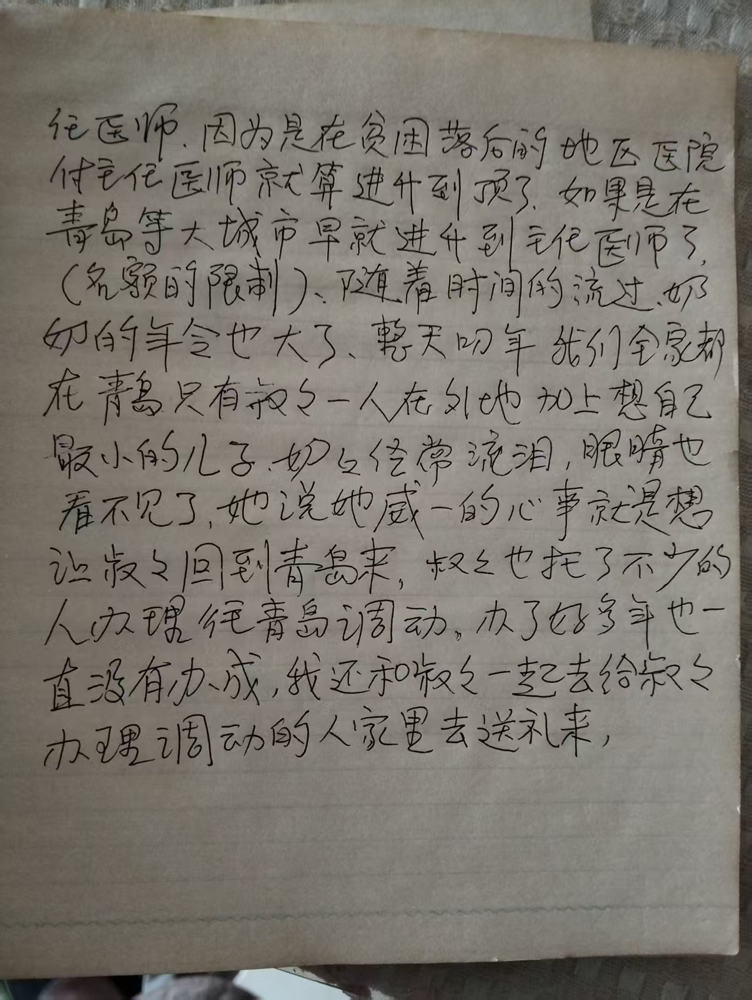
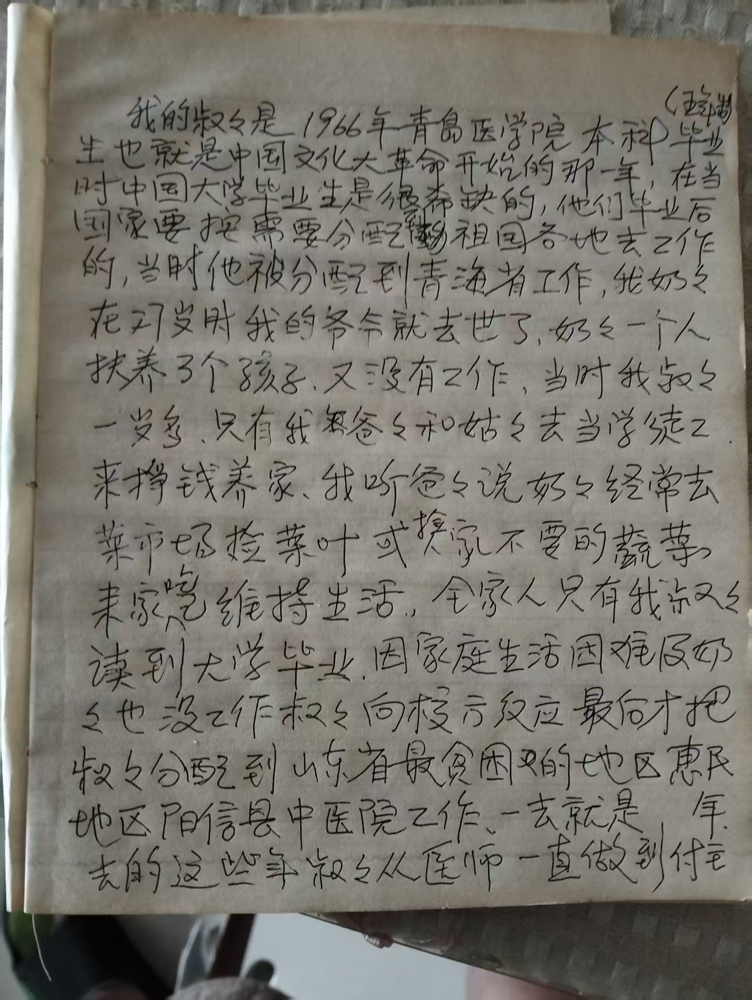

<strong>📖 English version below — <a href="#en">Jump to English ↓</a></strong> &nbsp;·&nbsp; <em>本页中文在上，英文见下方。</em>

## 原文 — 周玲手书两页

*以下按原稿逐句录入，保留原有措辞与用字。个别字迹不清或疑为笔误处，以方括号标出。*

我的叔叔是 1966 年青岛医学院本科毕业生，也就是中国文化大革命开始的那一年。在当时中国大学毕业生是很稀缺的，他们毕业后国家要按需要分配到祖国各地去工作的。当时他被分配到青海省工作。

我奶奶在四十岁时我的爷爷就去世了，奶奶一个人抚养 3 个孩子，又没有工作。当时我叔叔一岁多，只有我爸爸和姑姑去当学徒工，来挣钱养家。我听爸爸说奶奶经常去菜市场捡菜叶或捡人不要的蔬菜来家吃维持生活。

全家人只有我叔叔读到大学毕业。因家庭生活困难及奶奶也没工作，叔叔向校方反应，最后才把叔叔分配到山东省最贫困的地区惠民地区阳信县中医院工作，一去就是〔　〕年。去的这些年叔叔从医师一直做到付主任医师。

因为是在贫困落后的地区医院，付主任医师就算进升到顶了。如果是在青岛等大城市早就进升到主任医师了（名额的限制）。

随着时间的流过，奶奶的年令也大了，整天叨念。我们全家都在青岛，只有叔叔一人在外地，加上想自己最小的儿子，奶奶经常流泪，眼睛也看不见了。她说她惟一的心事就是想让叔叔回到青岛来。

叔叔也托了不少的人办理往青岛调动。办了好多年也一直没有办成。我还和叔叔一起去给叔叔办理调动的人家里去送礼来。

*（第一页右上角有括号内二字，字迹不清，未能辨认。）*

---

## 人物对照

| 文中称谓 | 姓名 | 与周丽婕的关系 |
|---|---|---|
| 我（执笔者） | [周玲](/family/ling-zhou/) | 父亲 |
| 我的叔叔 | [周兆帧](/family/zhaozheng-zhou/) | 叔祖父 |
| 我奶奶 | [庞焕彩](/family/huancai-pang/) | 曾祖母 |
| 我的爷爷 | [周茂礼](/family/maoli-zhou/) | 曾祖父 |
| 我爸爸 | [周兆祥](/family/zhaoxiang-zhou/) | 祖父 |
| 我姑姑 | [周秀珍](/family/xiuzhen-zhou/) | 姑祖母 |

## 与现有家谱的一处矛盾

本文所述与档案已记之日期不能相容，谨记于此，不作臆断：

- 档案记 **周茂礼卒于 1935 年**，**周兆帧生于 1938 年** — **父卒三年之后不可能有子出生**。此一矛盾本已存在，今由此文揭出。
- 文中称爷爷去世时**奶奶四十岁**、**叔叔一岁多**。庞焕彩生于 1908 年，若其时四十岁，则丈夫卒于约 1948 年；然 1948 年周兆帧当已十岁。
- 若以 **周兆帧 1938 年生、“一岁多”** 计，则周茂礼当卒于约 **1939–40 年**，其时庞焕彩三十一二岁 — 与“四十岁”不合，但与 1966 年二十八岁大学毕业相符。

**最可能者：周茂礼的卒年 1935 需要复核。** 待家族确认。

---

## English

*Two handwritten pages by **Zhou Ling 周玲**, Lijie's father, given to Chuck by his father-in-law in August 2026. Translated below; the Chinese transcription is above.*

### The uncle who was sent away

My uncle graduated from **Qingdao Medical College** in **1966** — the year the Cultural Revolution began in China. University graduates in China were very scarce then, and after graduating the state assigned them, according to need, to work anywhere in the country. He was assigned to **Qinghai Province**.

### The household he came from

When my grandmother was forty, my grandfather died. She raised **three children** alone, with no job of her own. My uncle was then just over a year old, so only my father and my aunt went out to work **as apprentices** to earn money for the family.

My father told me that my grandmother would often go to the **vegetable market to pick up cabbage leaves, or vegetables other people had thrown away**, and bring them home to eat so the family could get by.

Of everyone in the family, **only my uncle got as far as graduating from university.**

### The poorest prefecture in Shandong

Because of the family's hardship, and because my grandmother had no work, my uncle appealed to the school authorities. In the end they reassigned him — to the **poorest area in Shandong Province**, the **Huimin Prefecture**, at the **Yangxin County Traditional Chinese Medicine Hospital**. He went, and stayed [number left blank] years.

In those years he rose from physician all the way to **deputy chief physician** *(付主任医师)*. In a poor, backward district hospital, **deputy chief physician counted as reaching the top.** In a big city like Qingdao he would long since have been promoted to full chief physician — it was a matter of **quota limits**.

### The grandmother who went blind waiting

As time passed my grandmother grew old, and muttered about it all day long. **Our whole family was in Qingdao; only my uncle was away.** Missing her youngest son, she cried often, and her **eyes failed until she could no longer see**. She said the one thing still on her mind was to have my uncle come back to Qingdao.

He asked a great many people to arrange a transfer. **He worked at it for years and it never came through.** I even went with my uncle to the homes of the officials handling the transfer, to bring them gifts.

### Who is who

| In the text | Name | Relation to Lijie |
|---|---|---|
| the writer | **[Zhou Ling 周玲](/family/ling-zhou/)** | her father |
| "my uncle" | **[Zhou Zhaozheng 周兆帧](/family/zhaozheng-zhou/)** | great-uncle |
| "my grandmother" | **[Pang Huancai 庞焕彩](/family/huancai-pang/)** | great-grandmother |
| "my grandfather" | **[Zhou Maoli 周茂礼](/family/maoli-zhou/)** | great-grandfather |
| "my father" | **[Zhou Zhaoxiang 周兆祥](/family/zhaoxiang-zhou/)** | grandfather |
| "my aunt" | **[Zhou Xiuzhen 周秀珍](/family/xiuzhen-zhou/)** | great-aunt |

### A date this document breaks

It cannot be reconciled with what the archive already holds, and the problem was there before this page arrived:

- The archive gives **Maoli Zhou died 1935** and **Zhaozheng Zhou born 1938**. **A man cannot father a son three years after his own death.** One of those two dates is wrong, and this document is what brought it to light.
- The text says the grandmother was **forty** when her husband died and the uncle was **just over one**. Pang Huancai was born in 1908, so forty would put the death about **1948** — by which time Zhaozheng would have been ten.
- Taking **Zhaozheng's 1938 birth and "just over a year old"** instead puts Maoli's death around **1939–40**, with Huancai about thirty-one. That contradicts "forty," but it fits a **1966 graduation at twenty-eight**, which is a normal age for a Chinese medical degree.

**The likeliest error is Maoli Zhou's 1935 death year.** Recorded, not adopted — this is a question for the family.

> *Source: two handwritten pages in Chinese by Zhou Ling 周玲, given to Chuck Eesley by his father-in-law, August 2026. Transcribed and translated for this archive.*
