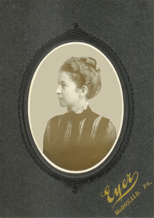
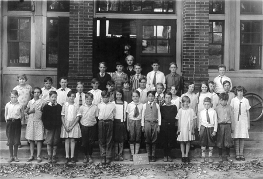
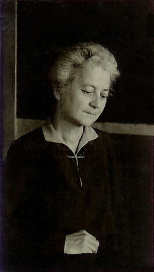

Alice Gertrude Anderson was born **9 July 1871** in Pennsylvania to [Reverend Abraham Ramsey Anderson](/family/abraham-ramsey-anderson/) the Presbyterian minister and [Nancy Jane Shaw Anderson](/family/nancy-jane-shaw-anderson/), two years and three months after her older sister [Margaret Florence Anderson](/family/margaret-florence-anderson/) — the namesake whose given name would pass forward to Alice's own daughter Peggy. She married [Robert Thompson McMaster](/family/robert-thompson-mcmaster/) in **1902** and was the mother of [Donald Anderson "Don" McMaster](/family/donald-anderson-mcmaster/) (1903&ndash;1967) and [Margaret Jane "Peggy" McMaster Eesley](/family/margaret-mcmaster-eesley/) (1914&ndash;2007) &mdash; Chuck's grandmother.

Robert died in **1919**, age 53; Peggy was only five years old. Alice was **forty-eight**, with twenty-six more years of teaching school still to come and two children to finish raising on her own.

## The schoolteacher

Alice ran the **Clifton School** in Pennsylvania. The deck preserves a **1928 class photograph** of her with her students. A second photograph, undated, shows her alone in her schoolroom. Her granddaughter Maggie Eesley's *Four Generations* archive catalogues both, plus a young-woman cabinet card by the **Eyer** studio of **McDonald, Pennsylvania** (late 1880s / early 1890s), plus a 1910&ndash;12 frame of her on a porch with her young son Don.

She died in **1961**, age 90 &mdash; thirteen years before her son Don and forty-six years before her daughter Peggy. The Clifton School where she had taught for decades is the institutional trace of her in the world Maggie's deck preserves.

## The last six years — living with the Eesleys

[Charlie Eesley's 12th-grade autobiography (c. 1964&ndash;1965)](/docs/charles-eesley-12th-grade-autobiography-1965/) records that *"Grandmother died two years ago at the age of ninety. She had lived with us for about six years."* The arithmetic places Alice **moving into the Eesley household around 1955** &mdash; when Peggy and Will's eldest daughter Jeanne was about ten and Charlie was about eight &mdash; and living with the family at their Marietta house through her death in 1961. The household Charlie grew up in had **his great-grandparents' generation present at the dinner table** for most of his childhood. The dry-humor-from-Grandma-McMaster line that the eulogy traces from Alice through Peggy through Charlie was a living transmission, not a memory.

## Photographs in the archive

- **Alice Anderson as a young woman** (Eyer, McDonald PA, late 1880s / early 1890s) &mdash; cabinet card, 2⅞" by 4", in a 5" by 7" frame.
- **Alice on the porch with son Donald A. McMaster** (~1910&ndash;12, Pennsylvania) &mdash; 4" by 3", faded and yellowed.
- **Alice with her Clifton School students** (1928) &mdash; class photograph.
- **Alice in her schoolroom** &mdash; undated.

All four are shown above, reproduced from Maggie's deck; each carries the full archival catalogue (title, medium, measurements) in the deck itself.

She is **Chuck's great-grandmother** through Peggy &rarr; [Charles McMaster Eesley](/family/charles-eesley/) &rarr; Chuck.

> *Sources: Maggie Eesley, *Four Generations of the Eesley Family* (PowerPoint archive); deck IDs `AAM001 en`, `AAM_DAM001 en`, plus the Clifton School and schoolroom frames.*
