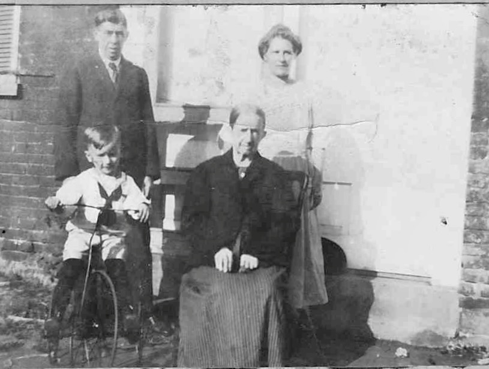

**The wife of [Edward Frederick Wildermuth](/family/edward-frederick-wildermuth/)** — William Clifford Wildermuth's youngest brother and Robert Earl Wildermuth's great-uncle. Born **21 March 1886 in Lawrence Township, Washington County, Ohio** — a rural Ohio-River township in the southern part of Washington County — to the Hayes family of southeastern Ohio. She married Edward Frederick on **15 April 1918** in Washington County, when she was 32 and he was 45. She lived another **forty-nine years**, dying in **Marietta on 15 November 1967** at age 81.

## The c. early-1920s family snapshot — her likeness

Arminda's one identified likeness in the archive is an [outdoor family snapshot](/archive/catharina-boeshar-family-outdoor-portrait/), c. early 1920s, identified by Chuck Eesley's July 2026 face-tagging. She stands at the **right** in a light dress, beside her husband [Edward Frederick](/family/edward-frederick-wildermuth/) (left); her mother-in-law [Catharina Boeshar](/family/catharina-boeshar-wildermuth/) is seated at center, and the couple's young son [William](/family/william-edward-wildermuth/) is on a tricycle in front. The picture postdates the couple's April 1918 marriage.

## Not in the 1896 family group portrait

An earlier reading of the [William Clifford Wildermuth family group portrait](/archive/william-wildermuth-family-group-portrait/) identified Arminda as the young woman standing next to Edward Frederick — but that identification has been withdrawn. The figure next to Edward is now read as **[Emma Schlicher](/family/emma-schlicher/)** (Flora's younger sister, age 22 in 1896), a same-generation cousin-figure photographically natural beside Edward at the unmarried-young-adult tier of the gathering. Arminda, born March 1886, was 10 in 1896 — too young to be the young-woman figure visible in the photograph. She may not appear in this portrait at all, or may be among the small children at the front if the photograph is dated slightly later.

The Lawrence Township → Marietta path was a routine local-community arc of southeastern Ohio in the late 19th and early 20th centuries: rural-township-born young women routinely moved to the river town to marry into established Marietta households.

> *Source: [Dale Eesley / FamilySearch — Arminda Jane Hayes (LTBL-VYD)](https://www.familysearch.org/tree/person/details/LTBL-VYD); the [William Clifford Wildermuth family group portrait](/archive/william-wildermuth-family-group-portrait/) — identification by Chuck Eesley, 2026.*
