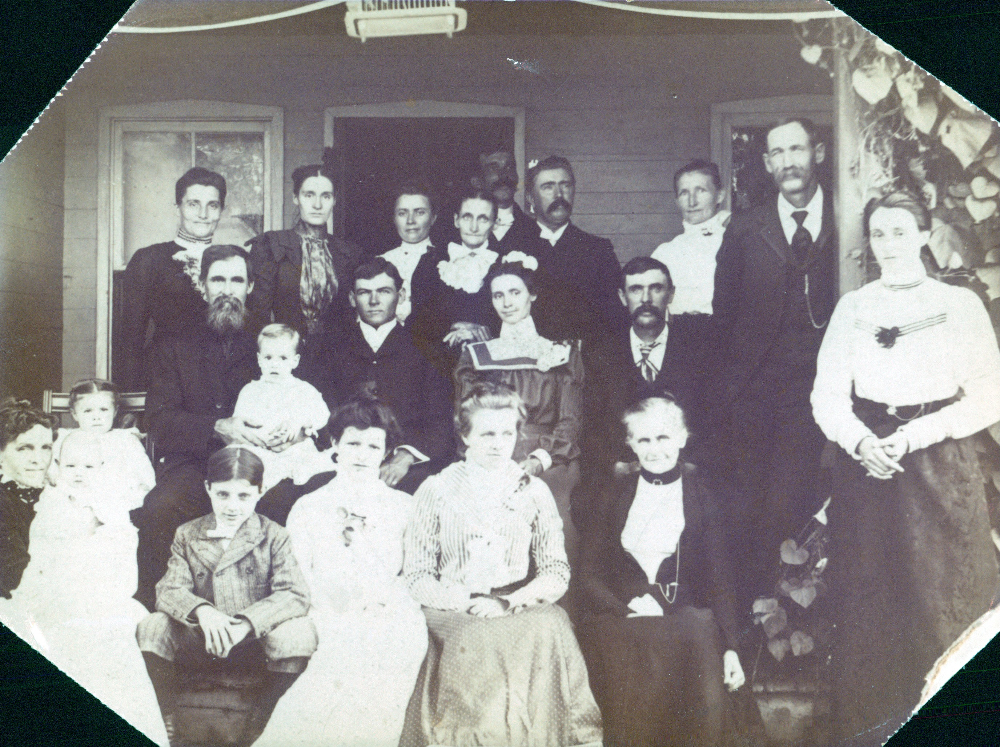

Belsora A. Way &mdash; known in the family as **Belle** &mdash; was the **younger sister of [Victoria Anna Way Davis](/family/victoria-anna-way-davis/)** (Chuck's maternal great-great-grandmother on the Davis line). She was therefore Chuck's **maternal great-great-aunt** through the Way line.

She was born **19 December 1880 at Jackson Township, Noble County, Ohio**, the fifth or sixth of ten children of [Edward E. Way](/family/edward-e-way/) (1851-1924) and [Tacy Elizabeth Matthews](/family/tacy-elizabeth-matthews/) (1848-1902). Her older sisters [Nora Angie Way](/family/nora-angie-way/) (b. 1876), Victoria Anna (b. 1874), and Emma Maude (b. 1883) appear alongside her in the wedding portrait below.

## The 25 September 1901 wedding portrait &mdash; with full ID legend

On **25 September 1901**, age twenty, Belle married **[Howard Edward Wickens](/family/howard-edward-wickens/)** (b. 19 May 1880, Salem Township, Washington County, Ohio) in Noble County. The wedding portrait that survives in the family papers shows the extended Way-Davis-Matthews-Wickens family gathered on the porch of the wedding home in Noble County.

A **numbered identification key** is preserved with the photo &mdash; almost certainly annotated by [Dorothy Marie Davis Wildermuth](/family/dorothy-davis-wildermuth/) (Chuck's maternal grandmother), since the relational labels read from Dorothy's father Homer's perspective (item 11 is given as *"Homer E. Davis (father)"*). The key reads:

1. **Nora Way Hutchens** &mdash; Belle's older sister (b. 23 February 1876, m. ____ Hutchens)
2. **Ernest Hutchens** &mdash; Nora's husband
3. **Belle Way** (the bride) &mdash; Belsora A. Way, 1880-1912
4. **Howard Wickens** (the groom) &mdash; Howard Edward Wickens, 1880-1964
5. **William A. Davis** (grandfather, from Dorothy's perspective) &mdash; [William Armstrong Davis](/family/william-armstrong-davis/), Homer's father, 1859-1931
6. **Anna Way Davis** (grandmother) &mdash; [Victoria Anna Way Davis](/family/victoria-anna-way-davis/), Belle's sister, 1874-1903 &mdash; the line that brings the photo into Chuck's direct ancestry
7. **Tacy Matthews** (great-grandmother) &mdash; [Tacy Elizabeth Matthews](/family/tacy-elizabeth-matthews/), Belle and Anna's mother, 1848-1902
8. **Edward E. Way** (great-grandfather) &mdash; [Edward E. Way](/family/edward-e-way/), Belle and Anna's father, 1851-1924
9. **Emma Way Parker** &mdash; another Way sister or cousin
10. **Wallace Hale** &mdash; ID guide partial; relationship to be researched
11. **Homer E. Davis** (father) &mdash; [Homer Edward Davis](/family/homer-davis/), Belle's nephew &mdash; one year and seven months old at this wedding, born 8 February 1900. He is in the photograph as a toddler &mdash; Chuck's great-grandfather as a baby.

The annotation *"Picture taken at the home of Mr. and Mrs. ____"* trails off at the bottom of the legend.

The wedding portrait is therefore an **extraordinary five-generation document of the Davis-Way line**: Edward E. Way and Tacy Matthews (the great-grandparents of Chuck's line), their daughter Victoria Anna Way Davis with her husband William Armstrong Davis (Chuck's great-great-grandparents), and their son Homer Edward Davis as a toddler (Chuck's great-grandfather). It is the **only known photograph that gathers four generations of Chuck's direct maternal Davis-Way line in one frame** &mdash; and very nearly the last opportunity: Tacy Matthews died **29 January 1902**, four months after the wedding, and Victoria Anna Way Davis died **26 June 1903**, less than two years later.

## A short married life &mdash; 1901 to 1912

Belle and Howard appear to have moved to Granville Township, Licking County, Ohio after the wedding. She died there on **13 April 1912 at age 31** &mdash; only ten and a half years into the marriage, with no surviving children recorded in the GEDCOM (though her FAMC and Howard's FAMS records both point to the same family record F171 of this marriage, with no listed children). She was buried two days later, on **15 April 1912 at Crooked Tree Cemetery, Noble County, Ohio** &mdash; back on the Way family ground, beside her parents Edward E. Way and Tacy Matthews and her sisters.

Howard Edward Wickens, widowed at 31, eventually relocated to Oklahoma. He died **21 January 1964** at Enid City, Garfield County, Oklahoma, age 83, and was buried at Enid Cemetery, Oklahoma &mdash; ending his life **sixty-three years after the wedding**, more than a thousand miles from the Crooked Tree ground where Belle was buried.

## See also

- [Victoria Anna Way Davis](/family/victoria-anna-way-davis/) &mdash; her older sister, Chuck's maternal great-great-grandmother
- [Edward E. Way](/family/edward-e-way/) &mdash; her father
- [Tacy Elizabeth Matthews](/family/tacy-elizabeth-matthews/) &mdash; her mother
- [Howard Edward Wickens](/family/howard-edward-wickens/) &mdash; her husband
- [Homer Edward Davis](/family/homer-davis/) &mdash; her nephew, in the wedding photo as a toddler

> *Sources: [Eesley/Wildermuth GEDCOM tree](/docs/dale-eesley-familysearch-tree/) (June 2026 trace) &mdash; FamilySearch tree ID LWYK-G8W for Belsora A. Way confirms birth 19 Dec 1880, marriage 25 Sep 1901 to Howard Edward Wickens, death 13 Apr 1912 Granville Township Ohio, burial Crooked Tree Cemetery. Wedding portrait and identification legend from Chuck's keeping, shared June 2026; the ID legend is in a hand that reads as Dorothy Marie Davis Wildermuth's (since item 11 names Homer E. Davis as "father").*
