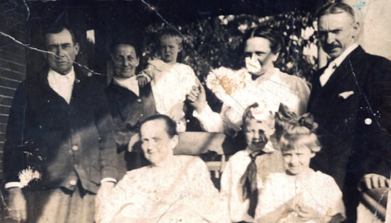

She was born **15 June 1840 in Breitenbach, Pfalz, Bavaria** — a Rhineland Palatinate village in what is now southwestern Germany, in the historical region the family called the **Pfalz**. Her christening followed within a week, on **21 June 1840 at the Breitenbach BA. Homburg parish church**, Bayern. The Rhineland Palatinate was a Catholic-and-Protestant patchwork in the 1840s, with strong American-emigration patterns toward Ohio, Pennsylvania, and Iowa — communities of Pfalzer immigrants settled in Washington County, Ohio, in numbers, and Catharina's eventual Marietta life fits that pattern.

## The Atlantic crossing and the Ohio marriage

The German village she was born in — **Breitenbach** — sits about **250 miles northwest** of her future husband's Württemberg birthplace at **Grossaspach**. That she and [Johann Michael Wildermuth](/family/johann-michael-wildermuth/) met and married in Washington County, Ohio (on **7 September 1862** per the @F57@ family record) means **both had to have emigrated separately and converged in Marietta** — two German-speaking emigrants from regions 250 miles apart at home who found each other in a Pfalzer-and-Württemberger immigrant community on the Ohio River.

Her parents were **[Christian Boeshar](/family/christian-boeshar/)** (1810–1843), a Breitenbach miner, and **[Maria Margaretha Jung](/family/maria-margaretha-jung/)** (b. 1814) of nearby Frohnhofen, who married in Breitenbach in 1836; Catharina had an older brother, **Jacob** (b. 1837). Her father **died in May 1843, when she was not yet three**, so she grew up in a widowed household — context that sits behind a young Pfälzerin leaving for Ohio.

Johann Michael's [1853 Philadelphia naturalization petition](/docs/johann-michael-wildermuth-naturalization-1853/) documents him arriving at the **Port of New York in 1847** as a boy under eighteen, and being in Pennsylvania by 1852. Catharina's own crossing is still undocumented — the date, the port and the route are open research — but she had to be in Washington County by 1862. The Pfalz-to-Ohio path in those years typically went through **New York or Baltimore** and then overland to the Ohio Valley.

### She was coming to Boeshars, not to strangers

The **[1860 census for Washington County](/archive/boeshar-1860-washington-county-census/)**, abstracted in Robert Earl's papers, finds **three Boeshar households** in Salem and Aurelius Townships two years before her marriage:

- **Thobald Boeshar**, 27, a **farmer** at Lower Salem with $1,200 in land, born in **Bavaria**, with an Ohio-born wife and three small children
- **Louisa Boeshar**, **50, a widow**, born in Bavaria, with sons **Christian** (22, a carpenter, born 1838) and **Jacob** (16, apprenticed, born 1844) — both **born in Bavaria**
- **Jacob Boeshar**, 42, a farmer in Aurelius Township with $2,000 in land, from the **Rhine** country

**And Jacob's children map the route.** Their birthplaces run **Rhineland → Pennsylvania → Ohio**: the eldest two born in Germany, one son born in **Pennsylvania** about 1850, and everyone from the eight-year-old down born in **Ohio**. That family crossed around 1849, paused in Pennsylvania, and reached Washington County about 1852 — **the same path Johann Michael took.**

**This changes the shape of the question.** A girl orphaned of her father before she was three, leaving a widowed household in the Pfalz, did not step off a boat into an Ohio river county at random. **There were Boeshars here already.**

*None of them is yet demonstrated to be her kin.* The widow **Louisa** is the household to check first — born about 1810, she is [her mother's generation](/family/maria-margaretha-jung/) exactly, and her son Christian (1838) is close to Catharina's own brother Jacob (1837). But Louisa is not Margaretha, and the names are common ones. **Which Boeshar household she was coming to is now the live question** — and a passenger list carrying a family group is far easier to find than one carrying a lone young woman.

## The long Marietta life

Johann Michael made the marriage application on **3 September 1862** and they were married four days later, on the 7th, by **the Reverend A. H. Seipels**. She married him at age 22; she gave birth to three documented sons over the next eleven years — **John Charles** (b. September 1865), **[William Clifford](/family/william-wildermuth/)** (b. 17 September 1866 — the patriarch of the [c. 1896 family group portrait](/archive/william-wildermuth-family-group-portrait/)), and **Edward Frederick** (b. 17 February 1873, lived to 1964 in Marietta) — and she raised them at Marietta. She was widowed in **February 1903** at age **62** when Johann Michael died at their house at **611 Washington Street** and was buried at Oak Grove Cemetery.

## Thirty years a widow

The [Marietta city directories](/archive/marietta-city-directories-wildermuth/) follow her through it, and she is never alone: her youngest son **[Edward Frederick](/family/edward-frederick-wildermuth/)** is in every entry.

- **1914–15** — head of her own household at **717 East Greene Street**, with Edward, then a **butcher**. Her son [William Clifford](/family/william-wildermuth/) and his family were eleven houses along at **739**.
- **1919–20** — **710 Second Street**, listed as **retired**, living in Edward's household with his wife Jane.
- **1928–29** — **115 South Third Street**, still with Edward and Jane, and recorded as **88 years old**.

She had come from Breitenbach in the Bavarian Palatinate, married a Württemberger in an Ohio river town, and ended up on a third street with a son who kept her for the last twenty-five years of her life. She was buried 19 October 1933.

She lived another **thirty years** as a widow.

She died on **17 October 1933 in Marietta** at age **93**.

## What she meant to Robert Earl

[Robert Earl Wildermuth](/family/robert-earl-wildermuth/), born **2 May 1924 at 123 Franklin Street in Marietta**, was **nine years and five months old** when his great-grandmother Catharina died. He would have known her as the family elder through his first nine years — the great-grandmother in the house, the German-accented voice at family gatherings, the Pfalzer matriarch who had been a young woman in 1850s Bavaria.

In his **1989 memoir** Robert Earl closed his Germany travelogue with the line:

> *"I hope to return to the home towns of grandma Catherina Boeshar and hopefully that of Johann Peter Schlicher at some later date."*

The **"grandma Catherina Boeshar"** of that sentence is this great-grandmother — Robert Earl using *"grandma"* in the everyday-family form he had grown up with, even though strictly the relationship was great-grandmother. The hometown he was still trying to visit at age 65 was **Breitenbach** — sixty-five miles from Stuttgart, in the Rhineland Pfalz near the French border. The 1993 follow-up trip he and Sandra eventually made got to the Württemberg side of the family (Rielingshausen, Grossaspach, Marbach); the Pfalz side he never reached. Catharina's hometown remained the open research thread when he died.

## Her clearest likeness — an outdoor family snapshot

The archive's **clearest image of Catharina's face** is an [outdoor family snapshot](/archive/catharina-boeshar-family-outdoor-portrait/), c. early 1920s, in which she sits front and center as the matriarch — elderly, in a dark high-necked dress with a long striped skirt over her lap, against the brick-and-stone wall of a house. With her (per Chuck's July 2026 face-tagging) are her youngest son [Edward Frederick Wildermuth](/family/edward-frederick-wildermuth/) standing at left, his wife [Arminda Jane Hayes](/family/arminda-jane-hayes-wildermuth/) at right, and their small son [William](/family/william-edward-wildermuth/) on a tricycle — her grandson. She would have been in her early eighties.

## In the 1896 family group portrait — her earlier likeness

The **[c. 1896 family group portrait](/archive/william-wildermuth-family-group-portrait/)** is the archive's earlier likeness of Catharina: she is the **elderly woman standing second from the left**, beside her son [William Clifford Wildermuth](/family/william-wildermuth/) and near her three-year-old granddaughter [Emma](/family/emma-wildermuth/), who is held up at her shoulder. She was about 56. This is the face of the Pfalzer matriarch Robert Earl remembered as *"grandma Catherina Boeshar."*

She is also the **figure in the back row of the [William Clifford Wildermuth family group portrait](/archive/william-wildermuth-family-group-portrait/) holding her three-year-old granddaughter [Emma Wildermuth](/family/emma-wildermuth/) high on her shoulder** — confirmed by Chuck Eesley 2026. The grandmother–granddaughter pose at the center of the family portrait is **the only known visual record of her** in this archive. She was 56 in 1896 — or 59–63 if the photograph dates to the revised c. 1899–1903 range that the Arminda Hayes identification would imply. The "grandma Catherina Boeshar" of Robert Earl's 1989 memoir is no longer just a name; her face is in the family record.

She is **Chuck's great-great-great-grandmother** through Catharina → **William Clifford Wildermuth** (b. 1866 — Robert Earl's grandfather, confirmed June 2026 against Dale's tree) → Earl Adam Wildermuth → Robert Earl → Terrie → Chuck.

## Robert Earl's 1989 sketch

The fullest single piece of writing about Catharina in this archive is the chapter Robert Earl wrote about her in his 1989 [*"Little Histories"*](/docs/robert-earl-wildermuth-little-histories/) project &mdash; the *Whistler's Mother, peeling apples in her rocking chair* passage. It is the most affectionate single page in the entire memoir, written by an eighty-five-year-old man remembering a great-grandmother he had visited at *Uncle Ed's* house when he was three. The sketch also reproduces the German-script birth certificate Marlis Smith's roundabout France-and-Germany chain of contacts eventually translated &mdash; the document that confirmed both Christian Boeshar's miner-by-trade occupation and Margaretha Jung's name. Read in full at [Robert Earl Wildermuth's "Little Histories"](/docs/robert-earl-wildermuth-little-histories/).

> *Sources: [Dale Eesley / FamilySearch — Catharina Boeshar (KLPR-G45)](https://www.familysearch.org/tree/person/details/KLPR-G45); [Johann Michael Wildermuth's 1853 naturalization petition](/docs/johann-michael-wildermuth-naturalization-1853/); [Robert Earl Wildermuth's 1989 memoir](/docs/robert-earl-wildermuth-memoir/) — the "grandma Catherina Boeshar" line; [Robert Earl Wildermuth's "Little Histories"](/docs/robert-earl-wildermuth-little-histories/) — the full Catharina sketch.*
