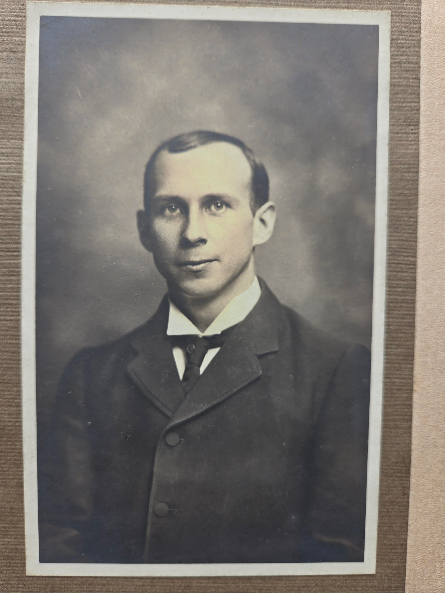
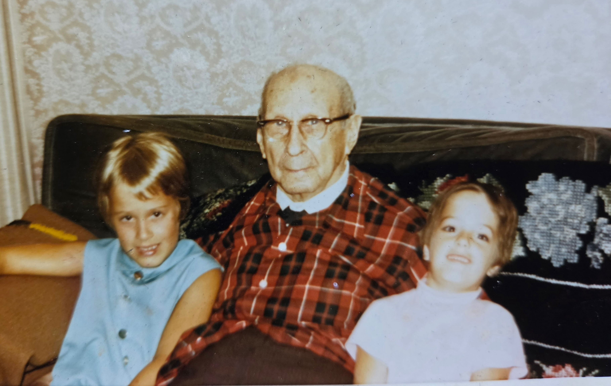

Charles Leonard Eesley was born **September 26, 1879**, the ninth of ten children of [Albert Robert Eesley](/family/albert-robert-eesley/) and [Jeanie Goldie](/family/jeanie-goldie/). He married **[Lillie Dale Chenoweth](/family/lillie-dale-chenoweth/)** (b. August 9, 1877). Their family home was in **Bexley, Ohio** — the leafy independent municipality embedded in eastern Columbus, at **230 North Cassidy Road** per [Charlie's 1965 autobiography](/docs/charles-eesley-12th-grade-autobiography-1965/) — and the house often took in boarders.

## A portrait from his young manhood

A studio portrait of Charles Leonard as a young man &mdash; from [Roberta Burnes's keeping](/family/roberta-burnes/), shared June 2026 &mdash; arrived in this archive in June 2026. It is a head-and-shoulders studio frame, his dark coat buttoned, white shirt and dark bow-tie at his throat, his hair parted in the period style. The look on his face is calm and steady. He is most likely in his late twenties to early thirties, which places the portrait between roughly 1907 and 1912 &mdash; the years his children were starting to arrive (Leonard 1904, Thomas 1906, Dale 1906, James 1908, Donald 1908, Will 1910) and he was establishing himself in the Ohio milling-and-trade life. It is the first portrait of him as a young man in the archive.

## Charlie's grandson-view of his early life

[Charlie Eesley's 12th-grade autobiography (c. 1964&ndash;1965)](/docs/charles-eesley-12th-grade-autobiography-1965/) carries the family memory of Charles Leonard's pre-Ohio life as the grandchildren had heard it:

> *"My grandfather, Charles Leonard Eesley, was one of ten children. He was born and reared in Canada where his father was a flour miller. Because his family moved often he only attended school through the fourth grade. When he was nine years old he worked as an elevator boy in a department store. Later, after holding a variety of odd jobs he worked for his older brother, Alfred, in a mill."*

The new details surfaced: **only a fourth-grade education**, an **elevator-boy job at age nine** in a Canadian department store, and **working for his older brother [Alfred Robert "Alf" Eesley](/family/alfred-eesley/) in a mill** before going independent. The Alfred-mill connection is a small but important documentary anchor &mdash; Alf was one of the six miller-brothers of the William Eesley obituary, and Charles Leonard worked for him before becoming a journeyman miller in his own right.

Charlie also notes that **Charles Leonard retired at age forty-four** &mdash; about 1923 &mdash; and the family moved to Bexley after that retirement. *"After Grandpa retired he and his family moved to 230 North Cassidy Road, Bexley, a suburb of Columbus, Ohio. Here their eighth child, Helen Louise, was born."* Charlie's count of eight children differs from the ten Mary Bean's 1985 register documents (Charlie may not have known about, or counted, brothers who died as infants or very young children).

## Christmas at 230 North Cassidy Road

The same autobiography surfaces what Christmas at the Bexley grandparents' house looked like through the grandchildren's eyes:

> *"Christmas was always the best time. The whole Eesley family, now consisting of five children and fifteen grandchildren, would come. There was always a big Christmas tree with presents galore under it. I was still at the age when I believed in Santa Claus. On Christmas Eve, we grandchildren would hang our stockings over the woodburning fireplace and fix Santa's snack of coca-cola and cookies before we went to bed. To make things seem more realistic, I learned later, Grandpa would go outside and ring sleigh bells. Christmas day was always an exciting one. Grandpa, being a great story teller and jester, was always the life of the party. He was forever setting off firecrackers, throwing them into the fire, explaining that they were used to scare away the 'evil spirits.'"*

**Charles Leonard ringing the sleigh bells outside on Christmas Eve to keep his grandchildren believing in Santa**, and **throwing firecrackers into the fire on Christmas Day to scare away the "evil spirits"** &mdash; the Bexley Christmas tradition the grandchildren grew up in. The dry-and-jesting humor Chuck would later eulogize in his own father is visible here as the same humor working the previous generation back through the grandfather.

## The miller

Per [William Eesley's c. 1916 obituary](/docs/william-eesley-obituary-college-corner/), **all six of Albert Robert Sr's sons in this generation became millers** — John R., William, Robert, A. R. Jr., **C. L.** (Charles Leonard), and Garfield, "all of whom became millers." Charles Leonard was one of them. The Eesley milling identity ran continuously from John Eesley the Hanwell, Oxfordshire journeyman miller (Charles Leonard's great-grandfather) through Albert Robert Sr in Stratford-on-Avon, Newark, Ayr, and Toronto, into his ten children across Ontario, Michigan, and Ohio — six brothers, one trade.

The geography of his ten children's birthplaces is itself a journeyman miller's career map:

- **Geneva, Ohio** (Leonard David, 1904)
- **Lebanon, Ohio** (Dale Dudley, 1906)
- **Shelby, Michigan** (Mary Elizabeth, 1913)
- **Grove City, Ohio** (Lyle, 1916)
- **Columbus, Ohio** (Helen Louise, 1924)

Each move is consistent with a milling assignment at a different mill. By the late 1920s he had settled the household permanently in **Bexley**, by which time he was likely managing a Columbus-area milling operation rather than moving as a journeyman.

Together they raised **ten children**, with two losses along the way:

- **Leonard David** (1904, Geneva OH – 1976, Silver Spring MD)
- **Thomas Leonard** (1906)
- **James Michael "Mike"** (October 26, 1908)
- **Donald Stuart "Don"** (September 24, 1908 – May 15, 1975, Tulsa OK)
- **Wilbur "Will" Chenoweth** (October 6, 1910 – 1986)
- **[Jean Goldie](/family/jean-goldie-eesley/)** (October 28, 1912 – 1924) — died at age 12 in Columbus
- **[Mary Elizabeth](/family/mary-eesley-bean/)** (August 25, 1913, Shelby MI), who married William Thomas Bean and wrote the 1985 family history
- **[Lyle](/family/lyle-eesley/)** (August 12, 1916, Grove City OH – July 25, 1942, Cabanatuan Prison Camp, Luzon, Philippines) — died as a Japanese POW at age 25
- **[Dale Dudley](/family/dale-eesley/)** (August 5, 1906, Pleasant Township, Franklin OH – July 14, 1939) — died at age 32; engaged to Thelma Haughn. (Bean's 1985 register gives his middle name as "George" and his birth year as 1916; the GEDCOM and FamilySearch MCZ8-WYX correct both to "Dale Dudley" and 1906.)
- **[Helen Louise](/family/helen-burnes/)** (January 16, 1924, Columbus OH), who married Edwin William Burnes — Roberta Burnes's mother

## The two acts that define him

**1942 — losing Lyle, sheltering Stella.** In July 1942 his son [Lyle died in a Japanese prison camp on Luzon](/family/lyle-eesley/). In the months that followed Charles Leonard brought [Stella Sunn](/family/stella/) — a Chinese-American teenager from Honolulu at risk of West Coast Japanese-American internment — across the country and into the Bexley house. The two events are almost certainly connected: cousin Roberta's 2019 note that Stella *"may have joined the scene after Lyle died"* puts them within months of each other. Charles Leonard's grief did not turn into a grievance against any East-Asian face that crossed his door. The opposite. He took her in.

Aunt Maggie's recollection from a 2019 family email confirms the disposition: *"They were Chinese, not Japanese. Grandpa felt very protective of them."* Aunt Jeanne's: *"Grandpa Eesley brought her over to live with them during the war and she became part of the family at that time."*

**1950s — the depression after Stella left.** Stella lived in the Bexley house *"until sometime in the 50s,"* by Roberta's account, by which point all his own children had grown and left. When Stella left too — by then in her own marriage and her own household — Roberta writes that *"Grandpa fell into a deep depression."* The house had been full for forty years; suddenly it wasn't.

## A mental-health episode and the Harding Hospital stay

A third documented piece of the difficult side of his life surfaces in [Roberta Burnes](/family/roberta-burnes/)'s June 2026 email, transmitting the story as her mother [Helen](/family/helen-burnes/) had carried it across the rest of her life. At some point in Helen's childhood or teenage years &mdash; the date is not yet pinned down &mdash; Charles Leonard suffered what Roberta describes as *"a schizophrenic episode."* He threatened violence at home; Lillie Dale *"wasn't having it"* and arranged for him to be admitted to **[Harding Hospital](https://en.wikipedia.org/wiki/Harding_Hospital)** in Columbus &mdash; the well-known Methodist-affiliated psychiatric hospital operating in Worthington (the Columbus suburb) from 1916 to 1999, where many central-Ohio families of the period went for inpatient mental-health treatment. After the episode resolved, Lillie took Helen on a train trip out west; on that trip Helen met [Chauncey "Chant" Chenoweth](/family/chauncey-chenoweth/) &mdash; the same California cousin Lillie had asked her son Leonard to visit two decades earlier in the [3 September 1922 letter](/docs/letters/lillie-dale-to-leonard-1922-09-03/).

The story is part of the documentary record now because Roberta sent it. It sits alongside the wartime-shelter and the post-Stella-depression on the same page because it belongs to the same composite picture: a man who took strangers into his house, lost a son to a Japanese prison camp, and went through a serious enough mental-health crisis to require hospitalization. The diagnosis *"schizophrenia"* in mid-20th-century psychiatric practice was applied more broadly than the modern DSM criteria, so the specific clinical picture is open; what is documented is the episode, the threat, the hospitalization at Harding, and the family's response. The episode does not change anything about the [1942 sheltering of Stella](/family/stella/) or the [Christmas-Bible-reading routine](/family/charles-leonard-eesley/) that Charlie's autobiography records. It sits beside them.

## Charles Leonard in his last years — with cousin Stephanie Kamiab

A late-life color photograph of Charles Leonard arrived in June 2026 from [Roberta Burnes Walker](/family/roberta-burnes/)'s family album. He sits on a green velvet couch against patterned wallpaper, in **a red plaid flannel shirt with a black bolo or bow tie at the collar**, his hair fully white and his round glasses still on. Two young girls flank him: on the left, a girl of about six or seven in a turquoise sleeveless dress with a yellow pencil tucked behind her ear; **on the right, a girl of about four or five &mdash; per Roberta, "surely cousin Stephanie"** &mdash; in a white tee-shirt collared dress with a small red bow at the neck.

**[Stephanie Kamiab](/family/stephanie-kamiab/)** is the daughter of Charles Leonard's granddaughter [Jeanne Eesley Kamiab](/family/jeanne-eesley-kamiab/) and Joe Kamiab (who married 1965). Stephanie was the young child Charlie's 1970 Vietnam letter mentions as already calling Terrie *"Aunt Terrie"* before the August 1971 wedding. By age in the photograph, Stephanie would be **about 4-5**, putting the frame at **c. 1970-1972** &mdash; the last year or two of Charles Leonard's life. He died **around October 1972**. The girl on the left is one of Stephanie's first cousins or another young Eesley great-grandchild &mdash; her specific identification is open.

The photograph is the latest documented image of Charles Leonard alive. His expression &mdash; head tilted slightly, mouth set in a small smile, gaze direct at the camera &mdash; matches the inward-and-warm register of his older years.

He died around October 1972, two years after Lillie Dale. The Chongs, by then on the East Coast, **sent flowers from Hawaii** for the funeral &mdash; **anthurium**, the heart-shaped vivid-red tropical bloom that Hawaii grew throughout the twentieth century. Per [Roberta Burnes Walker](/family/roberta-burnes/) (June 2026): *"I had never seen anything like them, Anthurium I think is what they are called."* A twelve-year-old Roberta in central Ohio in 1972 had never seen anthurium; [the Chongs](/family/stella/), reaching across the Pacific from the family they had married into Stella's wartime shelter and out again, sent the flower their adopted Hawaiian home grew best. It was the last and quietest of the threads connecting the wartime shelter to the rest of his life.

## At Aldine Sinclair's wedding reception, Toronto, c. 1960s — with brothers

A black-and-white labeled photograph from the same album captures Charles Leonard in his early eighties at the Toronto wedding reception of **Aldine Sinclair** &mdash; a descendant of his sister [Bessie Eesley](/family/bessie-eesley/), who had married a Sinclair and remained in Toronto. The handwritten label below the print reads: **"Dad, Goldie, Uncle George &mdash; Toronto &mdash; 196_ &mdash; At Aldine Sinclair's wedding reception."** Three older men in suits are seated together on a low couch with a coffee table of cocktail glasses and dessert plates before them; a small Toronto-era 1960s gathering of well-dressed wedding guests is visible behind them.

The label gives Roberta's mother Helen's perspective &mdash; *"Dad"* is Charles Leonard, **at left in a dark suit with a bow-tie**, his characteristic forehead-and-nose profile visible. *"Uncle George"* &mdash; **[George Henry Eesley](/family/george-eesley/)** (b. 1893, Charles Leonard's youngest brother) &mdash; sits on the right in a dark suit and vest. *"Goldie"* &mdash; **the brother in the middle** &mdash; is the open question on the cast: *Goldie* is not a documented given name or known nickname among the ten Eesley siblings (Hannah Goldie was their sister, dead by 1932; the surname *Goldie* came in through their Scottish-Canadian mother [Jennie Goldie](/family/jeanie-goldie/)). Most plausibly *"Goldie"* is the family nickname of one of the Toronto-Eesley brothers &mdash; possibly **[John Franklin Eesley](/family/john-f-eesley/)**, **[William Eesley](/family/william-eesley-college-corner/)**, or **[Alfred Robert Eesley](/family/alfred-eesley/)** &mdash; with the *Goldie* nickname carrying the Scottish maternal-line honor as a personal sobriquet across his lifetime. The specific identification is open for the family to refine.

What the photograph carries: **three of the surviving Eesley brothers together in Toronto in the mid-1960s**, at the wedding of a niece-or-grand-niece (Aldine Sinclair) on the Bessie-Eesley-Sinclair branch of the Toronto Eesleys. It is one of the very few documented frames of Charles Leonard with two of his own brothers in the same place, and a documentary trace of the **Toronto-Eesley continuing connection** the [Toronto thread](/family/albert-robert-eesley/) carries forward from the immigrant generation.

He appears in the [family group portrait](/archive/eesley-family-group-portrait-late-1940s/) — taken at his own home in Bexley — behind his wife Lillie Dale, the matriarch at the center of the frame.

> *Sources: Mary Eesley Bean, *[Eesley Family History](/docs/eesley-family-history-1985/)*, March 1985, p. 8; July 2019 family email exchange among Chuck, Aunt Maggie, Aunt Jeanne, and cousin Roberta; the [1940s letter collection Roberta still holds](/docs/charles-leonard-letter-collection/).*

## See also

He is the **first of [the three Charleses](/docs/the-three-charleses/)** — the grandfather whose first name skipped Will's generation and was carried forward by Charles McMaster ("Charlie") in 1947 and Charles Eric ("Chuck") in 1979. A short essay reads the naming chain across the three.

> *Structured record: [Dale Eesley / FamilySearch — Charles Leonard Eesley (LY6G-W9Y)](https://www.familysearch.org/tree/person/details/LY6G-W9Y).*

## Further reading

On the two histories Charles Leonard's 1942 found himself between:

- [*Ghost Soldiers: The Epic Account of World War II's Greatest Rescue Mission*](https://www.goodreads.com/book/show/94799.Ghost_Soldiers) by Hampton Sides &mdash; the camp where his son Lyle died.
- [Densho](https://densho.org) &mdash; the archive of the Japanese-American internment Stella was at risk from.
- [*Bexley (Images of America)*](https://www.arcadiapublishing.com/products/bexley-9781467112178) by the Bexley Historical Society (Arcadia Publishing, 2014) &mdash; the neighborhood the wartime household kept itself together in.

## See also — family threads

Charles Leonard is an anchor for **Thread #5 (Service, stewardship, and giving)** in the [**Family threads**](/docs/family-threads/) synthesis essay — specifically the *"brought [Stella](/family/stella/) from Hawaii during WWII to keep her clear of the West Coast Japanese-American internment camps"* act of stewardship-of-another-person's-life. *"Sent macadamia nuts back from Hawaii for years"* is the rest of that thread told from Stella's end.
