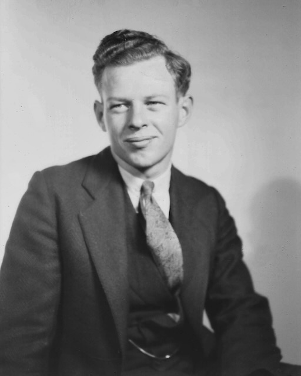
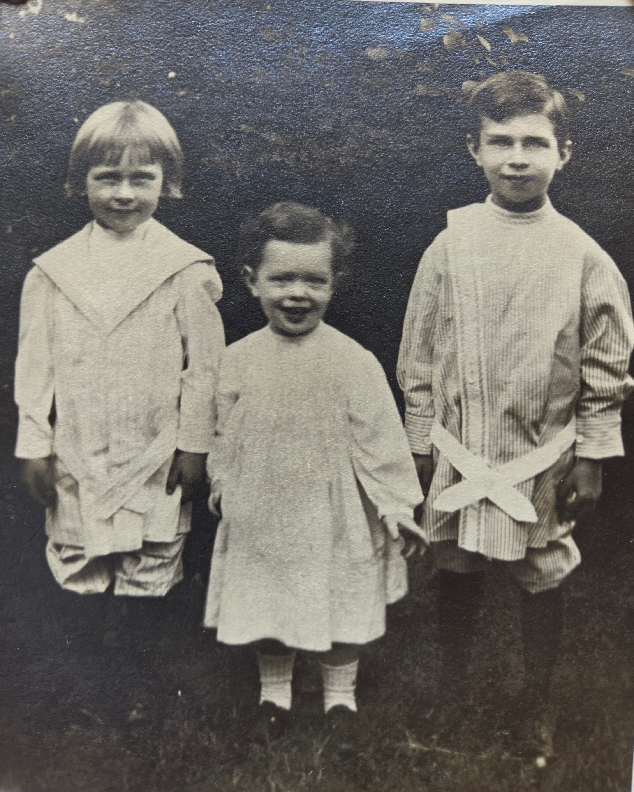
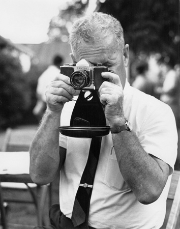

Donald Stuart Eesley was born September 24, 1908 in Lebanon, Ohio — the third of Charles Leonard and Lillie Dale's sons, between [Dale Dudley](/family/dale-eesley/) (1906) and [Wilbur "Will"](/family/wilbur-eesley/) (1910) — and died May 15, 1975 in Tulsa, Oklahoma. He married **Margaret Adelyne Youman** (born June 24, 1913) — and so the Eesleys of this generation had **two Peggys** in the family by marriage: Will's wife Peggy McMaster and Don's wife Margaret Adelyne Youman, both called Peggy.

Per Bean's 1985 register, Don and Margaret had **three children** (generation V):

- **[Lyle Stuart Eesley](/family/lyle-stuart-eesley/)** (b. January 9, 1948) — named for Don's brother who died at Cabanatuan; married Linda Cash, with three children of his own (Danielle Elizabeth, Charles Stuart, and Donald Steven).
- **[Robert Douglas Eesley](/family/robert-douglas-eesley/)** (b. December 1, 1950) — married Roxie Mucklerath; children Amelia (1977) and Douglas Stuart (1979).
- **[Marilyn Eesley](/family/marilyn-eesley-elkins/)** (b. December 24, 1951) — married James Elkins; children Emily Elkins (1977) and Peter Donald Elkins (1979).

He appears with Margaret in the [late-1940s/'60s Eesley family group portrait](/archive/eesley-family-group-portrait-late-1940s/), taken at his parents' home in Bexley.

## The Aunt Ota anatomy lesson — c. 1929

The most charged family story Don is at the center of: in c. 1929, when Don was twenty-one and considering a medical career, his aunt [Dr. Scioto "Aunt Ota" Chenoweth Smith](/family/scioto-mafry-chenoweth/) &mdash; in the last year of her life, dying of radiation cancers from her early X-ray work &mdash; took him upstairs at a Eesley family dinner and used her own dying body as the anatomy textbook. From Roberta Burnes's June 2026 email, transmitting the story as Don's younger sister [Helen](/family/helen-burnes/) had passed it down across the rest of her life:

> *Apparently, Uncle Donald was considering going into medicine, so Ota used her own medical condition to educate him. Don would have been 22 when Ota passed, and the following story probably happened during that last year of her life. One night, as the family was finishing dinner, Ota spoke to Don &mdash; Mom says it was more of a "Let's go" or "It's time, Don" &mdash; and the two of them got up from the table and went upstairs.*
>
> *My mother, being a very curious child, followed them upstairs, where Don and Ota went into a bedroom. Mom described herself peeking through the door and watching as Ota calmly undressed herself, unwrapping the bandages around her abdomen and pointing out her internal organs to Don as if in an anatomy class. Mom never forgot this experience and would tell this story often. Ultimately, Don did not go into medicine, but imagine getting such a lesson from your own aunt!*

Don was twenty-one or twenty-two at the time of the lesson. Aunt Ota would die on 9 February 1930 surrounded by family at the Bexley house on Cassidy Avenue, still narrating her own decline in the clinical voice she had used her whole career. Don did not become a physician &mdash; the lesson may have dissuaded him, or simply put the moral cost of medicine vividly in front of him. Either way the chain of family memory it generated runs from Aunt Ota to Helen (Don's younger sister, who was five at the time and watched it through the door) to Roberta (Helen's daughter) to this archive.

> *Sources: Mary Eesley Bean, *[Eesley Family History](/docs/eesley-family-history-1985/)*, p. 8; Roberta Burnes, email June 2026 (the Aunt Ota anatomy lesson). Structured record: [Dale Eesley / FamilySearch — Donald Stuart Eesley (MCZ8-WYV)](https://www.familysearch.org/tree/person/details/MCZ8-WYV).*

## Portrait, April 1932

A studio portrait of Don as a young man of about twenty-three &mdash; dark suit and patterned tie, hair combed and waved, an easy half-smile &mdash; taken **April 1932**. It is the archive's first adult likeness of him, and now the portrait at the top of this page.

## At Sault Ste. Marie with Aunt Ota and Helen, 1929

Don with his aunt **[Sciota "Ota" Chenoweth Smith](/family/scioto-mafry-chenoweth/)** &mdash; his mother Lillie Dale's sister, the physician &mdash; and his sister-in-law **[Helen Bernadine "Big Helen" (Alspach) Eesley](/family/helen-bernadine-alspach-eesley/)** (Leonard's wife), on a waterfront at **Sault Ste. Marie in 1929**. (The "Helen" of the label is Big Helen, *not* Don's youngest sister [Helen Burnes](/family/helen-burnes/), who was only five in 1929.) See the [artifact](/archive/don-aunt-ota-helen-sault-ste-marie-1929/).

## With his brothers c. 1912

A sepia outdoor portrait from [Roberta Burnes](/family/roberta-burnes/)'s keeping, surfaced June 2026: the [three Eesley brothers — Don (left, ~4), Will (middle, ~2), and Len (right, ~8) — standing on a patch of grass c. 1912](/archive/eesley-three-brothers-c1912/). One of the earliest frames of any of the three in the archive.

## With his camera, c. 1960s

A candid from Charlie's photographs, surfaced 2026: Don in mid-life, **raising a 35mm SLR to his eye to take a picture** at an outdoor family gathering &mdash; grey-haired, short-sleeved shirt and tie, a man in his fifties or sixties. See the [artifact](/archive/donald-eesley-with-camera-c1960s/). It is the photographer photographing, in the family whose visual record is the reason this archive has pictures.

