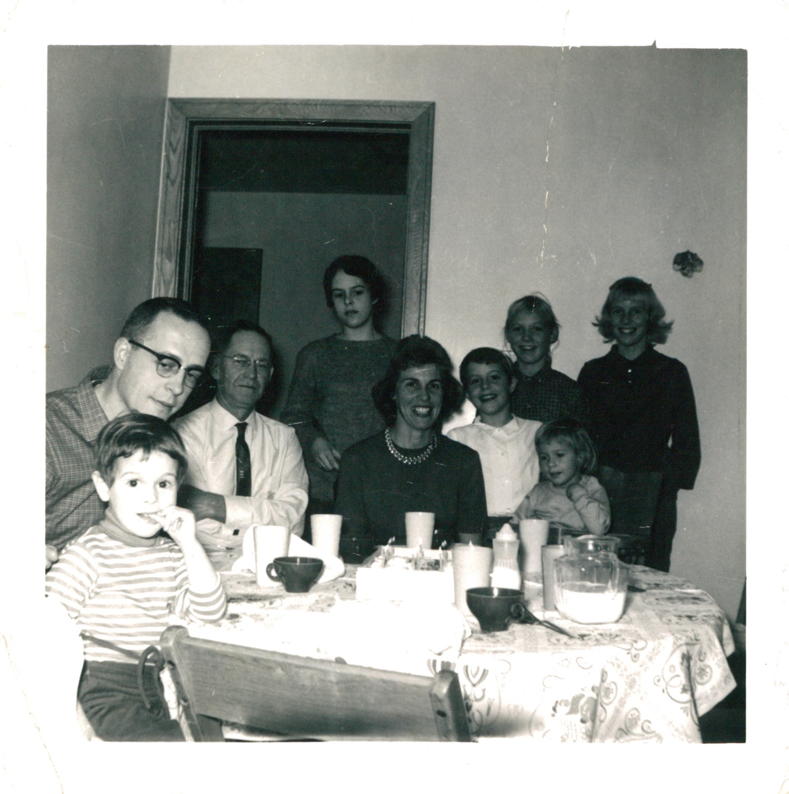

Dorothy Marie Davis was born at **11:15 a.m. on 24 February 1925** in **Waterford Township, Washington County, Ohio**, daughter of **[Homer Edward Davis](/family/homer-davis/)** (then twenty-five, a truck driver) and **[Bessie Marie (Hill) Davis](/family/bessie-hill-davis/)** (then nineteen). She was the second of three Davis sisters — older sister Mary (b. ~1923) and younger sister Betty (b. ~1926). Her birth certificate, registered 10 May 1925 by H. S. Dickson, is one of the documents reproduced in [Robert Earl Wildermuth's 1990 Wildermuth/Fleming Heritage](/docs/wildermuth-fleming-heritage-1990/).

## The Waterford home and the Unionville fire

The family lived first in **Waterford, Ohio**, where Dorothy was born; the home is one of the photographs in the 1990 Heritage. They later moved to **Unionville, Ohio**, where:

> *While the parents were away from home, they suffered a tremendous calamity. The house caught fire and burned to the ground. This was a real tragedy but with the help of friends and neighbors, they recovered, moved into a small shed not damaged in the fire while their parents lived in a poorly insulated one-room garage throughout the cold winter that followed.*

Dorothy was still a child. She and Mary started school at **Unionville Grade School** and later transferred to **Marietta High School**, where Dorothy graduated in **June 1943**.

## Bookkeeper at Citizen's Bank, then libraries across the country

Upon graduation Dorothy took a position as **bookkeeper at Citizen's Bank in Marietta**, where she would work even after her marriage. The working-life habit ran the rest of her life across the moving household: she would later work at the **South East Bank in Orlando**, the **[Hoover Library](https://www.hoover.org/library-archives) at Stanford University**, and the **Maitland Public Library in Maitland, Florida** (per her 2010 funeral program).

## At the Hoover Library — 1947 to 1948

The Stanford-years job is named explicitly in **[Robert Earl's 1989 memoir](/docs/robert-earl-wildermuth-memoir/)**, in the passage describing the young couple's first year at Stanford after Robert Earl's conditional admission to undergraduate pre-med in 1947:

> *"They rented a house on the [Stanford golf course](/places/stanford-university/). Dottie worked at the Hoover Library."*

The **[Hoover Institution Library and Archives](https://www.hoover.org/library-archives)** &mdash; built on the holdings Herbert Hoover assembled to document the First World War and its aftermath &mdash; is one of Stanford's signature research libraries, then as now housed under the Hoover Tower on the western edge of campus. **Dottie, the Marietta High School graduate who had been keeping Citizen's Bank's books just three years earlier, was now working at one of Stanford's research libraries** to support the family while Robert Earl finished pre-med. The marriage and the move had taken them straight from a Marietta bank to a Stanford research library inside two years.

The job appears to have been **1947 through Robert Earl's October 1948 BA**. When Robert Earl's medical-school applications were again denied, he took the Bio Sci degree and took a Container Corporation trainee job in Oakland; Dottie moved with him to Richmond, California, where their first daughter **[Terrie Lee](/family/terrie-lee-eesley/)** was born **13 January 1949**. The Hoover Library chapter closed when Dottie became a mother and the family left Palo Alto for the East Bay.

## Marriage and the Air Force years

On **20 April 1946** Dorothy married Robert Earl Wildermuth not long after his return from the Pacific theater of WWII; the [1949 Christmas card](/archive/dot-and-bob-christmas-card-1949/) signed *Love, Dot + Bob* is their first surviving photograph together. She is the *Dot* of that signature, the *Dottie* of family memory, the matriarch holding her youngest child &mdash; Chuck's [Uncle Rob](/family/rob-wildermuth/), the toddler &mdash; at the [Stanford fountain on 24 August 1965](/places/stanford-university/), and the *Dorothy Marie Davis Wildermuth* who appears in her daughter Terrie's obituary in full.

She and Robert Earl raised four children: **Terrie Lee** (Chuck's mother, b. Oakland, CA 1949 during Robert Earl's Stanford years), **[Sandra Sue](/family/sandra-sue-wildermuth-clement/)**, **[Robert E. Jr.](/family/rob-wildermuth/)**, and **[Debra](/family/debbie-wildermuth/)**. Robert Earl's career took the household across the country — **Florida, California, Oklahoma, Ohio, Colorado, Texas, Maryland, and Japan**, per Dorothy's 2010 funeral program.

## The family-of-six photographs

Two newly placed photographs show Dottie at the center of the household she ran across the Air-Force postings:

- [**The Wildermuth family portrait, mid-1960s**](/archive/wildermuth-family-portrait-1960s/) &mdash; Dottie with Robert Earl and all four children: Terrie and Sandy as teenagers, Debbie school-age, Rob a toddler.
- [**Terrie's high school graduation in Japan, c. 1967**](/archive/terrie-high-school-graduation-japan/) &mdash; Dottie in a pale jacket with a leaf brooch at the lapel, on the other side of her daughter from Robert Earl in dress blues. The diploma frame, the family at the end of the Japan years.

Biography otherwise pending &mdash; she's a figure most fully seen here through her children's records and the photographs the family kept.

## The Unionville house fire

Dottie's childhood carries one small but vivid catastrophe that survives only because her son Robert Earl wrote it down decades later in the [1990 Wildermuth/Fleming Heritage](/docs/wildermuth-fleming-heritage-1990/). Dottie was a small child in Unionville, Ohio when the family home **caught fire and burned to the ground while her parents were away**. The recovery he describes is itself a small piece of the *"showing up — in small, daily, unglamorous ways"* thread in the [family-threads essay](/docs/family-threads/):

> *In Unionville, while the parents were away from home, they suffered a tremendous calamity. The house caught fire and burned to the ground. This was a real tragedy but with the help of friends and neighbors, they recovered, moved into a small shed not damaged in the fire while their parents lived in a poorly insulated one-room garage throughout the cold winter that followed.*

Two generations later, Dottie's daughter Terrie would have her own version of *"close relatives by way of long entertainment of visiting family"* in her 2017 obituary &mdash; the Wolfes named explicitly. The Unionville fire is the earliest documented instance of that same Davis-and-Wildermuth practice of **kinship-as-mutual-aid in a crisis**, run on the Davis side, one generation before Dottie herself would carry it across into the Wildermuth household.

## At the birthday table with Uncle Norm

A late-1950s or early-1960s color print from the [Maggie Eesley archive deck](/docs/dale-eesley-familysearch-tree/) shows **Dottie at a birthday or family-dinner table with [Norm Wolfe](/family/norman-graham-wolfe/) and family** &mdash; the *Uncle Norm* of Chuck's childhood and one of the **"Betty and Norm Wolfe"** named in [Terrie's 2017 obituary](/family/terrie-lee-eesley/) as *"close relatives by way of long entertainment of visiting family."* Nine people around the table, including children; a tablecloth, a cake, a pitcher, the texture of a multi-generation gathering. The print is one of the earliest photographic records of the **Wolfe-Wildermuth kinship that Terrie's obituary names from the other end of the same decades-long relationship** &mdash; the visiting-family tradition that ran from this birthday table all the way into the [Wolfes' inclusion in her own obituary](/family/terrie-lee-eesley/) a half-century later.

## The memorial program

The fullest single document on Dottie that this archive holds is the [**printed program from her memorial service**](/archive/dorothy-wildermuth-memorial-program-2010/), held Friday 13 August 2010 at the Church of Christ on Sixth Street, Marietta &mdash; five months after her death in Brookhaven, Georgia at 85. The program's biographical panel is the single most complete sketch of her career (bookkeeper at Citizen's Bank Marietta → Southeast Bank Orlando → **Hoover Library at Stanford** → Maitland Public Library), her faith (Methodist), her interests (flowers, singing, square-dancing, quilting and needlework), and the names of all four children and all six grandchildren as of August 2010.
