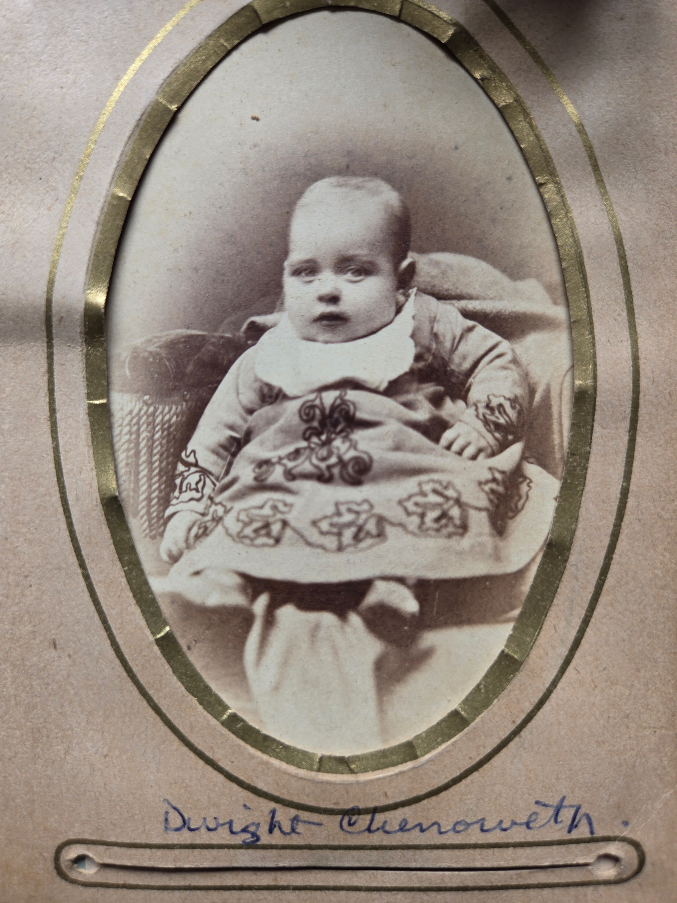

Dwight Kennedy Chenoweth was the **youngest of Lillie Dale's four siblings** &mdash; one of the five children of [Joseph Hill Chenoweth](/family/joseph-hill-chenoweth/) and [Mary Ohio Timmons Chenoweth](/family/mary-ohio-timmons-chenoweth/) of Pleasant Township, Franklin County, Ohio. The full sibling order (per [Roberta Burnes Walker](/family/roberta-burnes/)'s June 2026 reconstruction): **Howard Glen, Elsie, Scioto Mafry, Lillie Dale, Dwight Kennedy.** He was born **1880 in Ohio** and died **1957 in Biloxi, Mississippi**, age 77.

## The baby portrait — c. 1880, in the embroidered gown Roberta still has

A studio portrait of baby Dwight in an elaborate embroidered christening gown arrived in this archive in June 2026 from Roberta Burnes Walker's Chenoweth family album. The image is an oval-framed cabinet card on heavy card stock with a gold-bordered cutout; the print is captioned in blue ink at the bottom: **"Dwight Chenoweth"** in cursive.

The baby in the frame is **about six months to a year old**, with a thin wisp of pale hair, large alert eyes, and a slightly open mouth. He sits propped against what appears to be a soft cushioned chair, his legs in white stockings stretched out toward the camera. The christening gown is the centerpiece: an ankle-length cream-white fabric with **dense scrolling vine-and-leaf embroidery** across the front panel and along the lower hem, the kind of needlework a family would have invested weeks in for a first-or-only photo session of a baby of that period.

**The single most remarkable detail Roberta provided (June 2026): she still has the gown.** *"I actually have the little gown he is wearing in the photo."* A 145-plus-year-old textile artifact &mdash; a baby's christening gown worn by a brother of Chuck's great-grandmother &mdash; preserved in Roberta's keeping from the 1880 sitting all the way to the present day. The combination of the photographic frame and the surviving garment makes this one of the **most complete object-and-image preservation chains in the entire archive**.

## The c. 1890s teen diptych with Lillie Dale

Dwight also appears in the [c. 1890s double portrait with his sister Lillie Dale](/family/lillie-dale-chenoweth/) &mdash; the studio frame of the two siblings in their teens or early twenties, taken around the time one of them was leaving the household. He is on the right in the image, in suit and tie; Lillie is on the left.

## Adult portrait — c. 1910-1920, on a brick porch

A third photograph of Dwight arrived in this archive in June 2026, again from Roberta Burnes Walker's keeping. The image was labeled in blue ink at the bottom &mdash; *"Dwight"* &mdash; the same caption convention Roberta's mother Helen used across the family album.

He sits in a **simple wooden side chair against a brick wall** &mdash; almost certainly a porch &mdash; with his left leg crossed over his right knee, ankle resting on top. The frame catches him in his **late twenties to mid-thirties**, putting the photograph somewhere between roughly **1908 and 1915**. He is in a tieless or thin-tied dress shirt, sleeves slightly rolled, the relaxed dress of a man at home on a Sunday afternoon rather than at a studio sitting.

The three Dwight portraits the archive now holds &mdash; the **1880 baby in the christening gown**, the **early 1890s teen diptych with Lillie Dale**, and this **c. 1910-1920 adult porch portrait** &mdash; span roughly thirty years of his life, from infancy through young manhood. **Helen's caption hand** on this print connects the family memory chain through to the Burnes archive that ended up with Roberta.

## The two portraits-and-a-survival-record together &mdash; the baby in 1880 in the embroidered gown, the young man in the early 1890s, and the adult on the brick porch &mdash; bracket about thirty-five years of his life and are the documentary frame the archive currently carries.

## What's open

- **The Biloxi years** &mdash; what brought him from central Ohio to Mississippi, his marriage(s), his work, his children. Open research.
- **The specific year-and-month of birth** &mdash; the GEDCOM gives 1880; a Franklin County, Ohio birth record would tighten it.
- **The 1957 death** &mdash; the Biloxi place of burial, his obituary if any survives.

> *Sources: [Roberta Burnes Walker](/family/roberta-burnes/), June 2026 email batch with the baby-portrait scan and the note *"I actually have the little gown he is wearing in the photo."* Egge's Chenoweth-site structured record names Dwight Kennedy Chenoweth (1880-1957) as the fifth child of Joseph Hill + Mary Ohio Timmons Chenoweth.*
