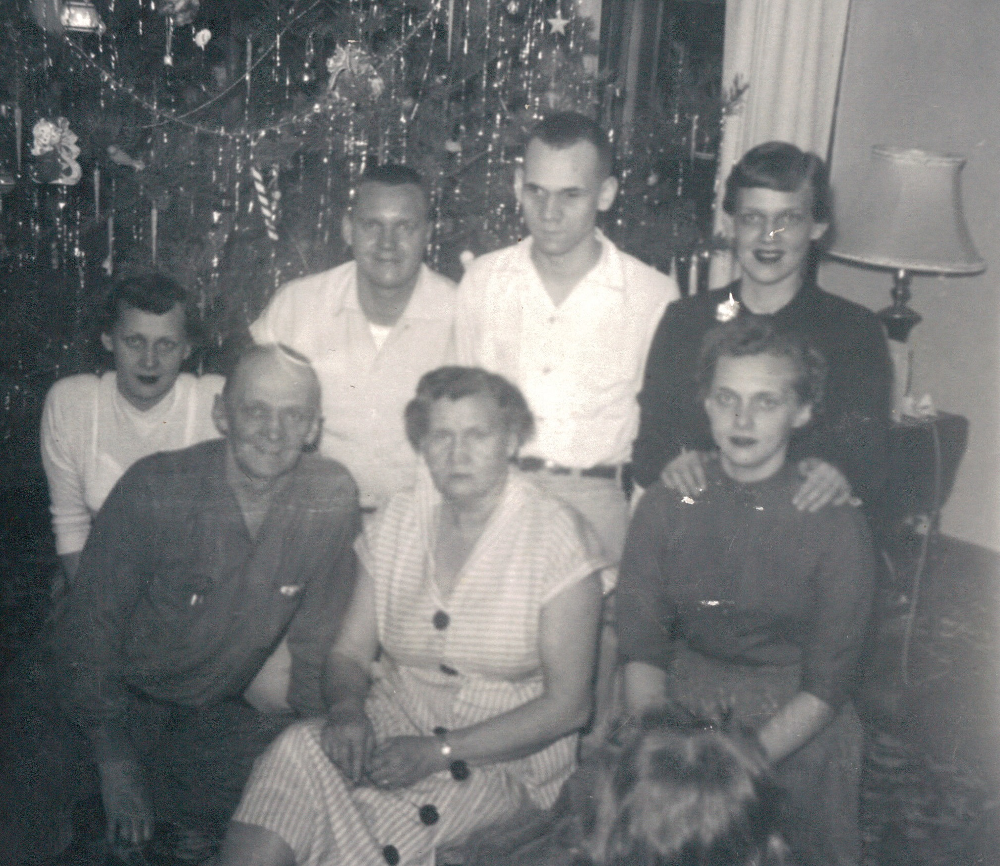

Earl A. Wildermuth married **[Sadye Irene Fleming](/family/sadye-fleming-wildermuth/)** on **31 December 1920** in Marietta, Ohio. Together they raised five children:

- **[Robert Earl Wildermuth](/family/robert-earl-wildermuth/)** &mdash; Chuck's grandfather, the B-24 navigator and 1948 Stanford BA.
- **Carl E. Wildermuth** &mdash; of Marietta.
- **Ruth I. (Wildermuth) Ridenour** &mdash; of Newark, Ohio.
- **Betty J. (Wildermuth) Haddox** &mdash; of Newark, Ohio.
- **Norma J. (Wildermuth) Gault** &mdash; of Hebron, Ohio.

He outlived Sadye, who died at 75 c. 1976 at Marietta Memorial Hospital. Their household at that point was at **320 Harmar Street** in Marietta.

The Wildermuth lineage on Earl Adam's side, settled against Dale's tree (June 2026): **[Johann Michael Wildermuth](/family/johann-michael-wildermuth/)** (b. 23 August 1830 Großaspach, Württemberg — the 1847 emigrant shoemaker, naturalized in Philadelphia 1853) → **[William Clifford Wildermuth](/family/william-wildermuth/)** (b. 17 September 1866 Marietta, d. 10 September 1943 — Earl Adam's father) → **Earl Adam** → Robert Earl. Earl Adam's mother was **[Flora Schlicher Wildermuth](/family/flora-schlicher-wildermuth/)** (b. 24 August 1870, d. 18 November 1919 Marietta), of the Marietta-Ohio German-immigrant Schlicher family. Earl Adam was the **sixth** of his parents' nine children — older sister Mae Clara (1886) and elder siblings Charles Daniel (1889), Margaret Zelma (1891), Emma (1893), William (1896) all preceded him; Pearl (1899), George D (1902), and Blanche followed.

Robert Earl's [1990 Wildermuth/Fleming Heritage](/docs/wildermuth-fleming-heritage-1990/) refers to his grandfather as **"John Wildermuth"** — that reference is now an open question: William Clifford's GEDCOM-confirmed paternal line through his father Johann Michael does not include a "John" at Earl Adam's father-generation. The William-Clifford / John-Charles confusion may originate in Robert Earl's research method (his grandfather was William Clifford; "John Charles" was his great-uncle, William Clifford's brother). Reconciliation queued.

## The workplace portrait

The portrait at the head of this page is **Earl Adam at his factory workplace** &mdash; a black-and-white group photograph showing him among **ten working men in mid-century factory clothing** (overalls, work shirts, billed caps) standing around a large piece of industrial machinery (a punch press, by the look of the heavy flywheel). One of the seated men in the front row holds a **framed certificate** &mdash; very likely a service-anniversary or retirement award. The setting reads as **1950s–60s American industrial floor**, the kind of mid-century Ohio-valley factory work that this generation of Marietta-area Wildermuth men did before retirement. The fact that this print survived in the family album, with the certificate front-and-center, suggests the photograph was taken to mark a milestone &mdash; Earl Adam's own retirement, or a close colleague's.

It is the **only photograph of Earl Adam in this archive that places him in the working life he led for forty years**, and it gives a concrete texture to the "extremely family oriented" man Robert Earl describes &mdash; the Marietta factory floor on weekdays, the Wildermuth-sister Sunday basket-dinners on weekends.

## Earl Adam and Sadye at Christmas with their five children

A mid-20th-century color print from the [Maggie Eesley archive deck](/docs/dale-eesley-familysearch-tree/) shows **Earl Adam and [Sadye](/family/sadye-fleming-wildermuth/) at Christmas with their five children** in front of a tinseled tree &mdash; the nuclear family the [1976 obituary](/family/sadye-fleming-wildermuth/) for Sadye listed in single-line form *("two sons, Robert A., Castleberry, Fla., Carl E., Marietta, Mrs. Ruth I. Ridenour and Mrs. Betty J. Haddox, both of Newark, and Mrs. Norma J. Gault, Hebron")* photographed together in one frame. Seven people total: Earl Adam and Sadye as the parents, plus the five children &mdash; [**Robert Earl**](/family/robert-earl-wildermuth/) (Chuck's grandfather), Carl E., Ruth, Betty, and Norma &mdash; gathered at the Marietta household for the holidays. The tree, the tinsel, and the children's clothing read mid-20th-century; the exact year still to be confirmed by the family.

*This is the only photograph in this archive that holds Earl Adam together with his wife and all five of their children in one frame* &mdash; the Marietta household at its complete moment, before any of them moved on to Florida, to Newark, to Hebron, or to the Air Force career that would carry Robert Earl to Stanford and beyond.

## The 17 January 1972 letter

Robert Earl's [1990 Wildermuth/Fleming Heritage](/docs/wildermuth-fleming-heritage-1990/) records that the project began in **December 1971** when Robert Earl wrote his parents asking for everything they could tell him about their ancestors. **Earl Adam wrote back on 17 January 1972** with what Robert Earl describes as *"an excellent rundown on his side of the family and an excellent starting point."* (Sadye, by contrast, *"could offer nothing, saying that she just didn't know anything of her family since there was seldom ever any discussion of her relatives by her family."*)

That letter is the **founding document of the eighteen-year Wildermuth genealogical project**. Robert Earl describes Earl Adam as *"extremely family oriented"* &mdash; the source of every basket-dinner Sunday visit to a Wildermuth sister's family that Robert Earl remembered from childhood. The 1990 Heritage includes a copy of the 17 January 1972 letter; that page is queued for placement here as its own document.

## The "hard-headed Dutch" memory

Robert Earl recorded his father's framing of the German origin:

> *My father always said he was from the "hard-headed Dutch" and that they had come from the Rhine River area of Germany.*

The actual origin proved to be **Württemberg, in southwest Germany around Stuttgart** &mdash; the small villages of [Rielingshausen](/places/rielingshausen-church/), [Grossaspach](/places/grossaspach/), and Pleidelsheim where the [Wildermuth line](/family/andreus-wildermuth/) goes back to **Andreus Wildermuth (b. ~1748)**, a *Gartner* (vineyard gardener). Württemberg is in the upper Neckar drainage, not directly on the Rhine, but the Neckar flows into the Rhine 80 km north of Stuttgart, so Earl Adam's "Rhine River area" framing was a rough but not unreasonable folk-geography of the actual region.

> *Sources: [The Wildermuth/Fleming Heritage by Robert Earl Wildermuth, 1990](/docs/wildermuth-fleming-heritage-1990/); [Robert Earl Wildermuth's 1989 memoir](/docs/robert-earl-wildermuth-memoir/); Sadye I. (Mrs. Earl) Wildermuth obituary, Marietta Times, c. 1976; family collection.*
